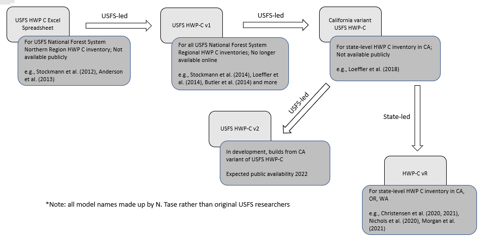

# Introduction  {#int}

## Structure of this document {#int-struc}

We wish to provide users with a document that will enable users to step into the HWP-C vR model to the degree that they find comfortable and useful.  This could range from manipulating pre-loaded California and Oregon data from the web app to downloading all of the code onto their machine and modifying it to their purposes.  We laid out the sections to reflect this progression.

* Chapter \@ref(sum): This section provides a brief overview of the model, a list of abbreviations, an explanation of units used, and acknowledgements.  
* This chapter (Chapter \@ref(int)): Here we provide some background on the model including a bit of history and a description of how it functions.  We also discuss some of the model's assumptions and future work.  

The next three sections describe options for interacting with the model in progressively technical ways:  

* Option 1: Chapter XX. Basic - Users can explore and view pre-laoded HWP C data in the R Shiny web application.   
    + Users can view a, interact with, and download a variety of graphical outputs from the California and Oregon default data sets  and manipulate the figures to a degree.
    + Outputs that can be viewed in or downloaded from the web application are described in section 5.7.  
* Option 2: Chapter XX.  Intermediate - Users can provide their own data to run in the R Shiny web application to generate HWP C estimates.
    + Users can use the full functionality of the app on their own data, including generating HWP carbon storage and emissions estimates, producing, viewing, and downloading the same sorts of figures, and runing the Monte Carlo uncertainty analysis.  
    + This is a good option for users that would like to produce their own results but are unfamiliar with R or R Studio.
* Option 3: Chapter XX.  Advanced - Users can download the Shiny web application and R code to run the model on to their own computer.  
    + Allows the user to run the Shiny web app locally on their own machine.  
    + Also allows the user to operate the stand-alone version of the model using the R code in R or R Studio without needing to rely on the web app.
    + Users can use existing datasets for California, Oregon, and Washington or provide their own input datasets to generate cumulative estimates of harvested wood product carbon storage and emissions.

Chapter \@ref(model) describes in detail the operation of the HWP-C vR model as well as the Monte Carlo simulation.  Chapter \@ref(ft) contains frequently asked questions and troubleshooting advice. Following Chapter \@ref(ft) is the bibliography.  Although each HTML chapter contains a bibliography, the PDF version only has this final bibliography section.


## General purpose and utility of the HWP C model    {#int-purp}

The HWP C model was originally created for U.S. Forest Service (USFS) National Forest System Regional HWP carbon inventories, and later modified for state-level inventories in California, Oregon and Washington. The history of this model is described in more detail in Section \@ref(int-hist). The current iteration of this model supports state-level carbon inventories but could be used by any jurisdiction or landowner.   

This HWP C model (and associated visualizations) is a long-term accounting tool for carbon emissions and storage from harvested wood products. Users can easily understand how harvest levels have changed over time, by ownership and in total. Given changes in disposal methods and the assumed lifetime use of wood products, users can examine what proportion of harvested wood products remain in use, in disposal sites, or as biogenic carbon emitted to the atmosphere.   

The model may also be useful for planners and decision-makers to explore hypothetical wood utilization scenarios and understand the long-term storage and emissions consequences of differing harvest levels or promoting wood products with different use lifespans.  


## General description of the HWP C model    {#int-gen}

An overview schematic of the HWP model is provided in Figure \@ref(fig:overview-fig). The model estimates cumulative HWP carbon stocks and emissions from current and historic harvests using the [Tier 3 Production Approach](https://www.ipcc-nggip.iges.or.jp/public/2006gl/pdf/4_Volume4/V4_04_Ch4_Forest_Land.pdf) carbon estimation guidelines developed by the [Intergovernmental Panel on Climate Change](https://www.ipcc.ch/).  For each year of consideration, the model allocates annual harvest volumes in thousand board feet (MBF) to timber products (e.g., sawlogs, non-sawtimber, pulpwood, fuelwood, etc.) and primary products (e.g., lumber, plywood, panels, pulp, etc.) using timber product ratios (TPR) and primary product ratios (PPR). Total harvest volumes or volumes partitioned by ownership can be analyzed. Conversion factors are used to convert harvest volumes in thousand board feet (MBF) to cubic foot (CF) volumes. Primary product volumes in cubic feet are then converted to units of carbon using conversions from @smith2006. Primary products are then distributed to end-uses using ratios (EUR) from @mckeever2009 and @mckeever2011, such as lumber in single family homes versus lumber in packaging and shipping materials. The carbon associated with primary products in each end-use comprises the “products in use” (PIU pool) HWP carbon pool. Approximately 8% of the carbon immediately enters discard pathways to reflect a loss factor when primary products enter the PIU pool. Each end-use has a different functional lifespan, or half-life, which determines the amount and rate at which harvested wood products are retired from the PIU pool to various discard pathways each year.   

Retired HWPs are transferred to a solid waste disposal site (SWDS), recycled, composted, or burned with or without energy capture using discard disposition ratios. Discard emissions pathways with immediate oxidation include discarded products that are burned (with or without energy capture) or composted. Discard storage pathways include products that are recycled (products re-enter the in-use pool) or disposed into landfills and dumps, which comprise the SWDS pool. The landfill fixed carbon ratio determines the portion of carbon that remains permanently inert in the anaerobic environment of landfills. Decay half-lives are applied to carbon in dumps and the decaying portion in landfills of the SWDS pool to determine the quantity and rate at which carbon is emitted from this pool. All data sources for harvest volumes, timber and primary product ratios, board foot to cubic foot volume conversions, primary product volume to carbon conversions, loss factors, the distribution of HWPs to end-uses, the functional life span of wood products, distribution of HWPs to the various disposal pathways, landfill fixed carbon ratios and decay half-lives are provided in the individual state-level reports (e.g., @loeffler2019, @morgan2021, @nichols2020), and are also described in Section \@ref(own-prov-input). 

With each year of harvest more carbon enters the cycle. Some carbon is immediately oxidized as fuelwood, enters the products in use pool, or is discarded immediately. However, some carbon from the previous harvest year can remain stored as carbon in products in use, dumps, landfills, or recovered products, while some is emitted through decay from dumps, the decaying portion of landfills, compost, or waste incineration.  The model provides cumulative carbon storage and emissions for all harvest years analyzed. All carbon emission estimates from this model are for the biogenic carbon content of the harvested wood only and do not include emissions in the form of other carbon-containing greenhouse gasses such as methane. Intermediate outputs (i.e., arrays) and some figures allow users to explore outputs from single harvest years.  

Lastly, the model provides a Monte Carlo analysis of uncertainty in the estimates for carbon stored in both the PIU and SWDS pools and both pools combined, as well as carbon emitted with or without energy capture. 


```{r overview-fig, echo = FALSE, fig.cap = "General schematic for calculations to quantify HWP storage and emissions, based on Figure 7 in Stockmann et al. 2012.  Note that in this version Compost is not connected to SWDS, an arrow to SWDS has been added for emissions from Recovered, and that the code calculates end-use C distribution in one step after organizing TPO, PPR, EUR, and conversion factors.", fig.asp = 0.7, fig.width= 6, out.width = '100%'}
knitr::include_graphics("images/OverviewModelSchematic.png")
```


## HWP model assumptions    {#int-assump}

The HWP model follows the IPCC Production Approach for carbon estimation; therefore, HWPs exported from the area of analysis are included but imported HWPs are excluded. In this way, the model is closed and tracks only carbon harvested within a specified area. Therefore, at a state level, carbon storage in and emissions from HWP consumed within the state boundaries may be greater than expected from timber harvested within the state if the state imports timber or timber products. Currently, the model assumes timber or timber products exported to other jurisdictions or countries experience the same utilization parameters, disposal rates and pathways, and decay processes as those of the area of analysis. For example, California-origin harvest that is exported is subject to California parameters. If exported wood experiences different utilization parameters, disposal rates and pathways, or decay processes, results could be erroneous. The potential magnitude of errors depends on both the overall quantity exported as well as the magnitude of differences in the parameters. 

The model relies on many different data types. The model assumes that all underlying datasets, such as harvested timber volume and ratios such as timber product ratios (TPR), primary product ratios (PPR), end-use product ratios (EUR), discard ratios, end-use product half-lives, and decay rates are valid. Citations for all datasets are provided; however, there is inherently some level of uncertainty in the precision or accuracy of the datasets as they rely on a number of other analyses, datasets, are in areas of active research, are provided at national or international scales rather than local or regional, or have not been updated recently. The model results can be expected to be precise or accurate to the extent the underlying datasets are precise and accurate. 

The model also provides certain pathways, such as for recycling or disposal to landfills. These pathways are assumed to adequately represent reality. In the model, recycling is represented through a simplified process where a portion of PIU are recycled once and then subject to a single, very short half-life. In reality, products may be recycled multiple times into potentially long-lived uses. The representation of recycling in this model may result in an underestimation of the amount of recycling and continued storage of carbon in PIU that occurs and an overestimation of recycled products emissions. Similarly, PIU disposed to landfills enter a generic landfill pool with a single landfill decay rate, whereas in reality there are many types of landfills with varying landfill decay rates. Additionally, when primary products enter the PIU pool, the loss factor is currently only applied to solid wood products. However, literature supports a loss factor for paper as well. Though paper is already a short lived product, this may result in an overestimation of emissions earlier than they might otherwise occur in reality. Several other pathways and processes in the model exist that have an unknown set of implications depending on how closely they mimic reality. For example, the model represents decay through a first order decay function while other decay functions may be more appropriate. The model also omits certain pathways that may result in additional carbon storage and emissions associated with harvested wood. For example, in some jurisdictions substantial bark utilization occurs. While bark is not considered a harvested wood product by traditional definitions and is rather considered a byproduct, utilization of this material typically results in additional fuelwood emissions. However, given the focus on carbon storage through the IPCC Production Approach, this is less of a concern.

The Monte Carlo analysis attempts to explore the range of possible outcomes given different levels of certainty in the data. There are potential limitations to the Monte Carlo analysis itself. As the degree of uncertainty has not currently been quantified for most datasets, uncertainty parameters have been provided for each variable based on expert opinion. Additionally, the Monte Carlo analysis takes a specific approach towards varying the ratios, constraining all ratios to sum to one. Given the selected range of possible values for each variable, the resulting randomly selected values may not be independent from one another and may be unintentionally biased. That is, within a ratio type that must sum to one and for a particular model iteration, if one value is randomly selected to equal 1.0, the remaining values for that ratio set must equal 0 (see Section \@ref(model-mc-res)). Lastly, the Monte Carlo analysis does not include a parameter for the accuracy of the processes and pathways represented in the model as a whole, for example, how recycling, or landfill disposal, or decay is represented. 

Currently, the model does not estimate emissions for other carbon-based greenhouse gases. For example, it does not differentiate between carbon in landfills that is emitted as methane vs. CO$_2$. Methane is a much more potent greenhouse gas than CO$_2$, albeit with a shorter residence time. Consequently, greenhouse emissions associated with HWPs are likely much higher than the estimates based only on the carbon-content of wood provided by this model. Though landfill methane emissions would be accounted in the IPCC Waste sector, this information is still valuable for determining the potential climate benefits, impacts and mitigation opportunities associated with HWPs.

For a full discussion on the underlying data sets, sources, represented HWP pathways and processes, and potential limitations, and implications, please refer to @lucey202X. 

Finally, this model does not include any method for overall model validation. Estimates for individual, underlying datasets feeding into the model, or certain pathways and processes can still be improved. But, like all models, the HWP model simplifies reality and hopefully provides users with useful insight by tracking and summarizing complicated calculation outputs in a reasonable way.


## Model history   {#int-hist}

The HWP model began as an Excel macro originally created by the U.S. Forest Service (USFS) for National Forest System Northern regional HWP carbon inventory [@anderson2013; @stockmann2012].  The Excel version was updated to one programmed in C++ for the remaining USFS regional HWP carbon inventories (USFS HWP-C; e.g., @stockmann2014).  The model was then modified in 2017 by the USFS for use in the California Forest Ecosystem and Harvested Wood Product Carbon Inventory [@loeffler2019] and is given the label here as the CA USFS HWP-C variant.  This history is depicted in Figure \@ref(fig:hist-fig). Though names for the USFS versions of the model did not exist, they are given here for clarifying purposes. However, in 2020 when Oregon and California were trying to establish or update HWP C inventories, no version of the model was available publicly due to older coding languages used in previous iterations of the model.     

Building from the previous USFS-led versions of the model, Groom Analytics LLC undertook programming the model in R for the Oregon Department of Forestry (ODF) and California Department of Forestry and Fire Protection (CAL FIRE), and subsequently deployed the R version as a [web application](https://groomanalyticsllc.shinyapps.io/HWP_Shared_Test/).  This version of the model (HWP-C vR) described in this document largely functions the same as the original USFS Excel-based model and the v1 tool.   A few changes exist and are described more fully in Christensen et al. [-@christensen2020; -@christensen2021]. These  changes include:  

* Modification of lag times built in the original tool, in order to allow users to more easily verify calculations.  
*	The CA USFS HWP-C variant of the tool used for the state-level inventory in California resulted in narrower confidences intervals than expected based on the parameters set for the Monte Carlo Uncertainty Analysis. This tool has established a new Monte Carlo simulation that has succeeded in introducing variability into the HWP C estimates.  

The USFS is currently updating their original tool, including the improvements made in the CA USFS HWP-C variant, with public availability expected in 2022/2023. This version (HWP-C vR) is not intended to compete with or contradict the original or ongoing USFS work, but rather complement the original work by being available in a different platform and coding language. This version also includes new data visualizations.     


```{r hist-fig, echo = FALSE, fig.cap = "Schematic of the HWP model development pathway.  The version described here is the state-led HWP-C vR variant.", fig.asp = 0.7, fig.width= 6, out.width = '100%'}

```


## Future work    {#int-future}

HWP carbon estimation is an area of active research. Efforts currently underway to improve the functionality of this model include updating the model so that user-controlled loss factors can be applied to paper in addition to solid wood products, as well as adding new and improving upon existing data visualizations. Efforts to provide a module to estimate carbon storage and emissions associated with bark utilization is also being explored.   

Other directly related research underway at the University of Massachusetts explores the representation of landfill disposal pathways in the model, estimation of landfill methane emissions, improvements to the recycling pathway, and improvements to disposal parameters specifically for California, with the hope of expanding these improvements more generally in the model. 

Users can improve the model’s utility by researching and altering model input datasets with their own regional information.  Updates and improvements to underlying international, national and regional or local datasets should be explored.
