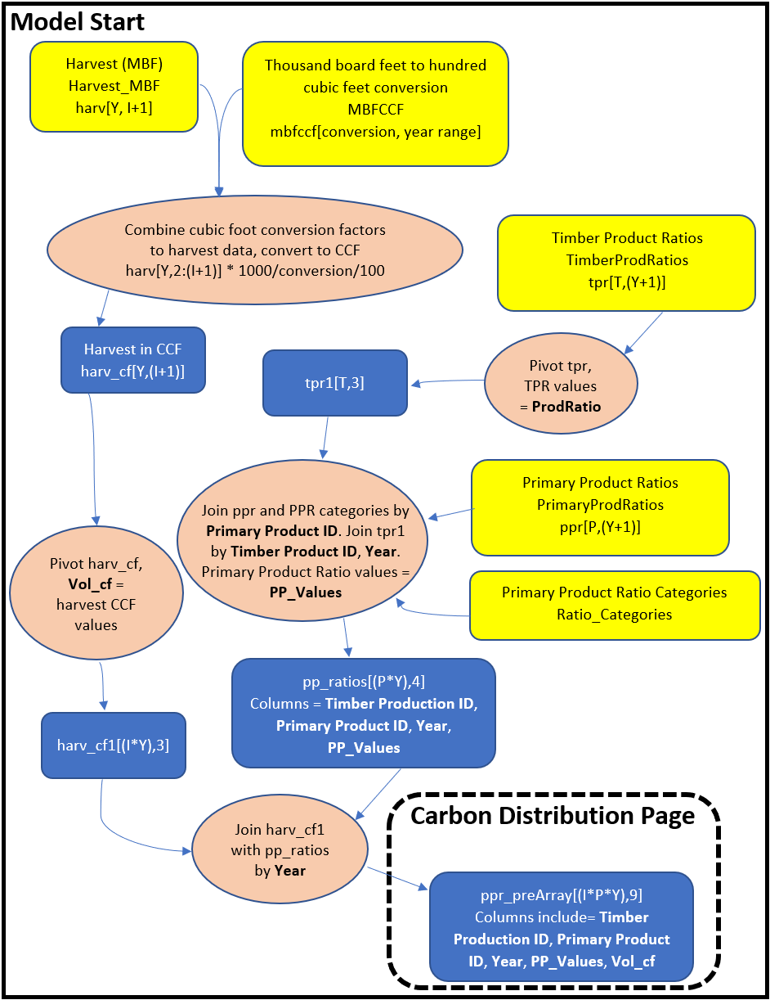
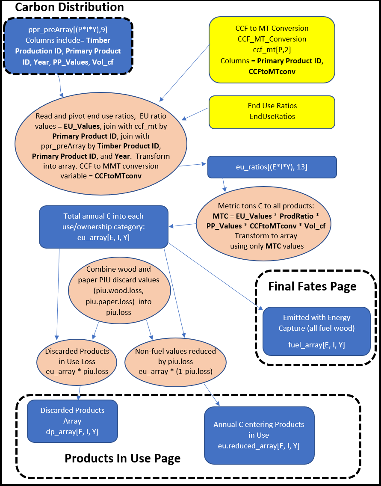
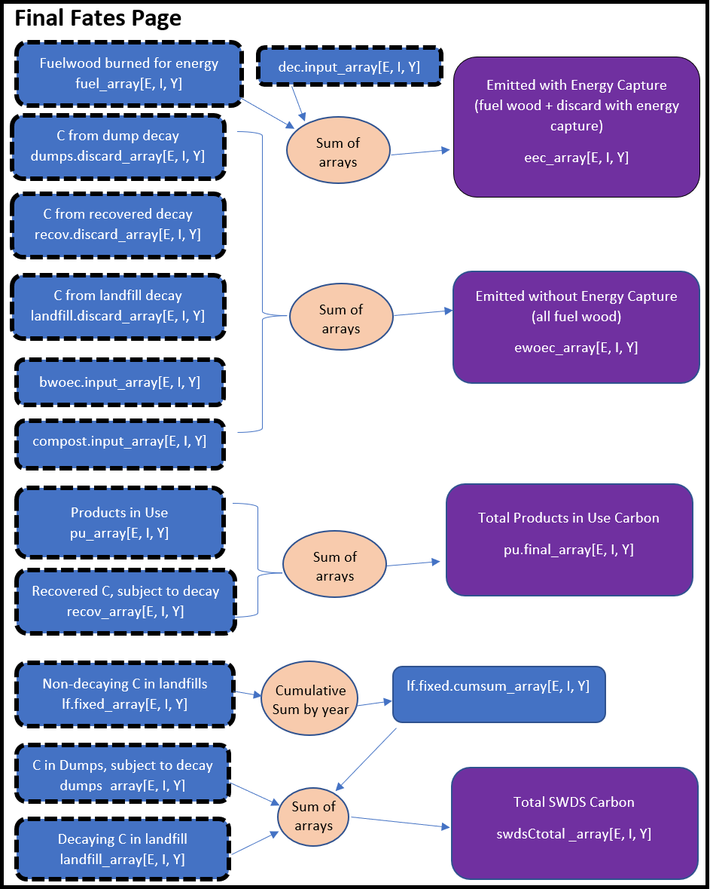
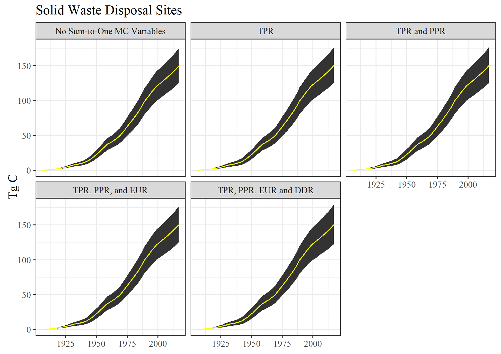

# HWP Model Operations

## HWP model function

### Model inputs

The HWP model is a deterministic model which relies on optional and required user-supplied information.  The user must supply annual timber harvest volumes in board feet (BF) by ownership, annual timber product ratios (TPR) that allocate harvest to different timber product classes, annual primary product ratios (PPR) that allocate timber products to different primary products and residue uses, and annual end-use product ratios (EUR) which are subcategories of PPR that represent the final products produced.    

The user may, at a minimum, provide timber harvest volumes and then rely on default California and Oregon values.  These include a board foot to cubic foot conversion factors for sets of years and conversion factors between hundred cubic feet (CCF) and metric tons of carbon (MT C) or teragrams of carbon (Tg C) for the primary products.  The model uses end-use half-life values to determine how long carbon resides in Products in Use (PIU) before becoming discarded.    

The user may also provide ratios for discard fates.  These ratios determine, by year, what fraction of discarded paper and wood are channeled into one of six discard categories: burned (Emitted without Energy Capture, EWOEC), burned with energy capture (BWEC), composted, sent to a dump, enter the non-decaying portion of a landfill, or become landfill subject to decay.  Users may also adjust half-life values for paper and wood discards in landfills and dumps and the fraction of material entering landfills that is subject to decay or remains permanently. 

### Summary of model operations

In the next section I provide a detailed schematic of how the HWP model code operates.  A more general schematic of the process, very similar to Figure 7 in @stockmann2012, is presented in the Introduction (Figure 1).  Here I provide a written description of the code’s actions.  We start out with data sets and variable information that are arranged by different combinations of year, ownership, and ratio types.  First the model combines (i.e., performs a database join function) harvest data (units = BBF) with board feet to cubic feet conversion factors. The model combines Primary Product Ratios (PPR) with Timber Product Ratios (TPR) and then joins those with the timber harvest volume in cubic feet by year.  These are then joined with conversion values for cubic feet to metric tons of carbon, and the End Use Ratios (EUR).  The result is a data set called eu_ratios, and values for EUR, TPR, PPR, the harvest amount, and the cubic foot to metric tons of carbon conversion factor are multiplied together to produce a variable called MTC for Metric Tons of Carbon.  This variable serves as the carbon input into the model and has the correct units of carbon input per year for each EUR category.    

For each year, some of the carbon, fuel wood, is immediately burned and is Emitted with Energy Capture (EEC).  A certain percentage (8% for California and Oregon data) of the carbon allocated to each of the remaining EUR categories is discarded and enters the Discarded Products process and the remaining 92% become the annual carbon addition to the Products in Use (PIU) process.  The model currently assumes that 100% of pulp wood becomes paper with no loss.    

The Products in Use process calculates, for every year, the amount of carbon remaining from the year prior and the amount of carbon entering the process as new PIU.  A decay function considers the previous year’s carbon amounts in each EUR/ownership category, applies a decay calculation, adds the result to the amount of incoming PIU carbon, and saves the value as the amount of PIU carbon for that year.  It also records the amount of carbon that was discarded from the process and sends that carbon to the Discarded Products process.  

The Discarded Products process uses proportions to divide incoming discarded products among six fates: burn, burn with energy capture, compost, dump, landfill, and recover (recycle).  Burned and composted proportions are treated as EWOEC.  The proportion that is burned with energy capture will be treated as EEC (for California and Oregon all carbon is currently modeled as BWOEC).  Discarded Products that are recovered or sent to dumps are processed with the same decay function used for Products in Use, but with different half-life values.  The outputs that do not decay in a given year are treated either as Products in Use (recovered) or Solid Waste Disposal Site (SWDS) material (dumps).  Discarded Products that are sent to Landfill are treated like Dumps, except that a proportion of the landfill is not subject to decay.  That amount will become one of the carbon pools that comprise SWDS.  The remainder of carbon in the landfill decays and is treated as EWOEC or remains in the landfill and is counted as another SWDS carbon pool: landfill material subject to decay.    

The HWP code’s outputs are EEC and combined versions of EWOEC, PIU, and SWDS.  The final EEC values are the original EEC values for fuel wood plus the fraction of the discarded materials that are burned with energy capture.  The final EWOEC amounts are combinations of emissions from dumps, recovered materials, landfill decay, burnt refuse, and compost materials.  PIU is the combination of the original PIU values plus recovered carbon that has not decayed.  SWDS is the non-decaying and decaying carbon in landfills plus remaining carbon in dumps.

### Model schematic description

Below I provide a schematic of how the HWP model operates.  The schematic color codes items and flows from the top to bottom of each page.  Inputs, such as worksheets from the Excel data file, are yellow.  Calculated matrices or arrays are blue.  Final output, which may be manipulated to produce tables and figures, are purple.  Calculations or data transformations are peach colored.   

The file and object names listed in the schematic may be found in the provided model code.  My intent is to provide a written description (above) that assists readers with understanding the schematic, which in turn can be used to interpret how the R code (HWP_Model_Function.R) works.  The R code itself is annotated.  Readers may alter the code to incorporate their own files or improve upon the model (see Operating and Changing the Model).    

Transformations include database functions such as pivots and joins.  A pivot in this case usually involves lengthening a matrix by taking several columns of data and stacking them into one column, with a second column identifying which of the original columns they came from.  This format is useful for combining data with different levels of information.  For instance, we might have data with rows = different ownerships and columns = years.  We can pivot those data such that there is a column of ownership, a column for the years (years will be repeated for each block of ownerships), and a column for the values.  Say we have another pivoted data set that has data for ownership, years, and Timber Product Ratios.  We can join the two data sets by matching years and ownership values and duplicating the data values from the first data set across all of the Timber Product Ratios for each year/ownership combination.  A somewhat more complicated version of this example is described in the Model Start page of the schematic.    

Ultimately, the code may produce a final pivot length of well over 100,000 rows.  This is equal to the number of End Use Ratio values * number of ownerships (including a Total column) * number of years.  For instance, the eu_ratio matrix has this many rows and several useful variables that are used to calculate metric tons of carbon from harvest as distributed across EURs, years, and ownerships.  This value is then placed in a three-dimensional array with row number = number of EUR rows, depth = ownership number, and column number = number of years of data.  The HWP code frequently uses arrays of these dimensions for storing values from many types of calculated data.    

Each page of the following schematic has a title.  These titles may be referred to within the schematic, as certain program products are used in later pages.  If a calculated data set’s boarders have thick black dashes, the data set is from a previous page.  If a calculated data set lies within some white space with a thick black dashed boarder, the white space includes information on which page that product is destined for.   

The HWP program has a decay function that is used repeatedly.  The same function operates on Products in Use and the decaying portion of landfill, dumps, and recovered (recycled) products.  As an example, for PIU, the function iterates through years for a given ownership/EUR combination.  It calculates the amount of PIU carbon carried over from a previous year by subjecting that carbon to its appropriate half-life value.  Then it adds that carbon to the incoming PIU carbon for that year.  Then it moves forward one year and repeats.  

\newpage

### Model Schematic  

Model Dimensions Key:   
Y = number of years (California = 68, from 1952 to 2019)  
y = particular year  
I = ownerships including Total (California = 6)  
i = particular ownership  
T = Timber product ratio number (California = 40)  
P = Primary product ratio number (California = 64)  
E = End use ratio number (California = 224)  
e = particular EUR  
loss.piu = Loss percentage for products entering PIU (California = 8%)  


```{r schem-0-fig, echo = FALSE, fig.asp = 0.7, fig.width= 6, out.width = '100%'}
knitr::include_graphics("images/schematic-0.png")
```


\newpage

```{r schem-1-fig, echo = FALSE, fig.asp = 0.7, fig.width= 6, out.width = '100%'}

```


\newpage
```{r schem-2-fig, echo = FALSE, fig.asp = 0.7, fig.width= 6, out.width = '100%'}

```

\newpage

```{r schem-3-fig, echo = FALSE, fig.asp = 0.7, fig.width= 6, out.width = '100%'}
knitr::include_graphics("images/schematic-3.png")
```


\newpage
```{r schem-4-fig, echo = FALSE, fig.asp = 0.7, fig.width= 6, out.width = '100%'}
knitr::include_graphics("images/schematic-4.png")
```

\newpage

```{r schem-5-fig, echo = FALSE, fig.asp = 0.7, fig.width= 6, out.width = '100%'}
knitr::include_graphics("images/schematic-5.png")
```


\newpage
```{r schem-6-fig, echo = FALSE, fig.asp = 0.7, fig.width= 6, out.width = '100%'}
knitr::include_graphics("images/schematic-6.png")
```


\newpage

```{r schem-7-fig, echo = FALSE, fig.asp = 0.7, fig.width= 6, out.width = '100%'}

```

### Model Outputs

The model described above treats timber harvest, product manufacture, and disposal as processes that occur within the same year.  To match other reports, outputs are altered (SHIFTYEAR = TRUE; see Providing Your Own Data / Creation of the input file).  All trees harvested in a given year are treated as processed within that year and the carbon is distributed according to the end use product ratios of that same year. Most of the carbon is immediately burned or turned into Products in Use. A fraction (the default 8%) is immediately discarded and distributed to the different discard fates using the discarded disposition ratios for the same year. The carbon fate for a given year is reported for the following year. Carbon that enters the model in a given year does not undergo a half-life decay until the following year. For example, the model uses the Timber Production Output for 1906 and all product and discard ratios for 1906 to distribute the carbon in Products in Use, Burned with Energy Capture, and the discard fates. The sum of those fates for 1906 is recorded in tables as occurring by January 1, 1907. Any carbon from 1906 that was distributed to Products in Use, Landfill, or Dumps was subject to a half-life decay or disposal in 1907.  

When users upload their data to the Shiny application or run the stand-alone model, they have the opportunity to download or generate summary tables of the model output.  The provided tables should allow, with effort, the user to reproduce all Shiny application figures except for those associated with the Sankey diagram.    

The stand-alone code can optionally save the arrays used to generate the tables in the folder “Arrays”. Unlike the table outputs for stocks and emissions the arrays are not year-shifted. The arrays are provided for results-checking and data exploration. The arrays are three dimensional but are saved as Excel workbooks. Excel worksheet rows represent the end use ratios, columns represent years, and each worksheet tab is an ownership with the final tab representing the “Total” carbon value. Some arrays are combinations of other arrays, described below. File “eu_array.xslx” is the distribution of carbon (metric tons) to end uses. Values are used to convey how harvested wood in each ownership category translates to Tg C for each of the end use products. This array is effectively the starting point for all C fates.    

Users are encouraged to generate the arrays (OUTPUT_ARRAYS = TRUE) in the stand-alone model and verify calculations.  The above flow diagram provides array names and a general description of how they are used.  The code file HWP_Model_Function.r provides more detail about how they are used.  

## Monte Carlo simulation

### Simulation specifications

The Monte Carlo (MC) simulation alters the values of at least 16 different parameters, listed in Table \@ref(tab:mc-table).  The columns Min Value, Peak Value, and Max Value describe the desired 90% confidence interval for the range of random proportions against which the parameters of interest will be adjusted.  In Table \@ref(tab:mc-table) harvest, timber product ratios and primary product ratios each have two parameters with confidence intervals.  These parameters represent different year sets.  The Oregon data have three year sets for harvest, timber production, and primary product ratios.  Each parameter requires a separate MC random variable.  Finally, parameters for timber product ratios and end use product ratios have a sum-to-one characteristic.  For instance, timber product ratios (TPRs) represent the proportion of total harvest for a given year that is allocated to each of the timber product ratio values. While the proportions change during the time series the full set of TPR proportions will always sum to one.   

```{r mc-table, echo = F, message=FALSE}
c1 <- read_csv("images/MC_Parameters.csv")
c1 <- data.frame(c1)

knitr::kable(c1, 
             col.names = gsub("[.]", " ", names(c1)),
             booktabs = TRUE, 
             caption = 'Monte Carlo simulation target parameters and ranges for provided California data.'
) %>%
  kable_styling(latex_options = "scale_down")
```

### Simulation Sampling  

As in other HWP publications such as @stockmann2012 and @anderson2013, the random variables in the Monte Carlo simulations are drawn from triangular distributions.  The distributions all have a peak value of 1.0 (Table \@ref(tab:mc-table)) and symmetrically taper to given 90% confidence interval bounds.  The values from the triangular distribution are used as proportions for adjusting parameter values.  

Drawing random variables from triangular distributions is a multi-step process.  The first step involves drawing random variables from a standard uniform (0, 1) distribution using a Latin Hypercube Sampling (LHS) process.  The standard uniform distribution is an excellent starting place for randomly selecting points along other distributions.  The random uniform points can be translated as locations along some other distribution’s Cumulative Distribution Function (CDF).  However, with unorganized, truly random draws of random uniform variables for more than one distribution (we are using at least 16 separate distributions, with one to three distributions per parameter) there is a strong probability that samples will by chance generally fall in the same local region for several of the distributions.  In other words, a purely random sample may be inefficient.  Many iterations are needed to obtain a full suite of the possible MC values across distributions.  LHS offers a method for partitioning the uniform distributions and forcing the random selections across distributions to avoid clumping.  As a result, many fewer iterations are needed to achieve stable estimates from the MC simulation.  

For this analysis I used the function “randomLHS” in the package “lhs” [@R-lhs] to conduct a random LHS sample.  When we obtain random draws for a given distribution, the package divides the uniform distribution into as many partitions as there are iterations and then randomly selects a value from within that range.  The partitions themselves are randomly ordered.  

Once we have a matrix from the LHS (rows = number of iterations, columns = desired number of distributions) we can transform the cell values into draws from triangular distributions [Wikipedia: Triangular Distribution](https://en.wikipedia.org/wiki/Triangular_distribution).  


$$   \text{Triangular Random Variable} =
  \begin{cases}
    if 0 < U < F(c)       & a + \sqrt{U(b-a)(c-a)}\\
    else  & b - \sqrt{(1-U)(b-a)(c-a)}
  \end{cases} $$

In this equation $U$ is the random uniform variable (the LHS draw), $F(c)=(c-a)/(b-a), a$ is the minimum value for the triangle, $b$ is the maximum value, and $c$ is the midpoint.  Note that the specifications require 90% confidence intervals and do not state what the endpoints for the triangular distributions should be.  I derived the endpoints that corresponded with the desired 90% confidence intervals (Table \@ref(tab:triang-tab)) using an optimization algorithm.   


```{r triang-tab, echo = F}

tri.tab <- data.frame(CI90 = c("0.7, 1.3", "0.8, 1.2", "0.85, 1.15", "0.95, 1.05"),
                      EP = c("0.57, 1.43", "0.71, 1.29", "0.78, 1.22", "0.93, 1.07"))

knitr::kable(tri.tab, 
             col.names = c("90\\% Confidence Interval Range",	"Endpoints Used"),
             escape = FALSE,   # Need this if I'd like the "90%" in col.names (but not caption??) to work in pdf.
             booktabs = TRUE, 
             align = "c", 
             caption = 'Translation of 90\\% Confidence Intervals to endpoints for triangular distributions.'
) #%>%
  #kable_styling(latex_options = "scale_down")
```


Each random draw from a triangular distribution was used to adjust an MC parameter (Table \@ref(tab:mc-table)) for all years in a single iteration.  The next iteration would use the subsequent random draw.  The only exception occurs when the 90% confidence intervals changed within the year set for an iteration.  In those instances (i.e., for Harvest, Timber Production Ratios, and Primary Production Ratios) we simulate random draws for three random variables if there were three sets of years identified for each parameter.  For each iteration we use the appropriate random triangular variable draw for the given year set (e.g., 1906 to 1945).  

There is a final complication: we would like some random variables to be correlated with one another (e.g., @stockmann2012).  For instance, Harvest has diminishing confidence intervals for annual timber production over time.  We have a separate random variable for each of those three sets of years.  In a given iteration we can imagine that, had a practitioner developed those values, the intervals would likely have been constructed in similar ways and therefore would have been correlated (biased).  Therefore, we force a correlation among the three Harvest variables.  Timber Product Ratios and End Use Product Ratios can each have sets of correlated variables and I created pairs of correlated random triangular variables for all paper/wood discard disposition ratios.  

I used a Pearson’s correlation of 0.5 for all correlations.  This was also done by @anderson2013 and @stockmann2012.  I used the Pearson’s correlation to create a Pearson’s correlation matrix, with the number of columns and rows corresponding to the number of random variables to correlate.  For a three-variable correlation I would use the following matrix and create a Choleski decomposition from it:

$$ \text{Pearson's Correlation Matrix} = \begin{bmatrix}
       1 & 0.5 & 0.5           \\
       0.5 & 1  & 0.5 \\
       0.5 & 0.5 & 1
     \end{bmatrix}
$$

$$ \text{Choleski Decomposition} = \begin{bmatrix}
       1 & 0.5 & 0.5           \\
       0 & 0.866  & 0.289 \\
       0 & 0 & 0.816
     \end{bmatrix}
$$

Linear multiplication of the three variables against the Choleski decomposition alters the second and third variables such that they are correlated to the first.  I create the correlated triangular random variables by first transforming an iteration’s three LHS random uniform variables into values from a standard normal distribution by treating the random uniform variables as probability quantiles from a standard normal distribution.  The three standard normal values are then altered and become correlated by linearly multiplying them by the Choleski decomposition.  The values are transformed back to a standard uniform distribution by finding the normal cumulative distribution function values of the three normally distributed and correlated random variables.   These random variables are then ready to be processed as described above into draws from a triangular distribution.  

### Sampling and the HWP program

The MC code operates by first running the original HWP program. This creates many values and arrays that the MC simulation relies upon and which we do not want to duplicate with each simulation iteration.  I simplified the MC simulation code by moving several functions outside of the code and removing specific outputs and their precursors that were no longer needed.  The goal of the MC simulation was to produce estimates and confidence intervals for overall values for SWDS, PIU, EWOEC, EEC, and their combinations. 

Before entering the MC loop, the program performs all LHS draws, forces correlations among specific variables, and transforms the random draws into draws from triangular distributions.  Many of the parameter values are then manipulated so that they may be combined into the MC loop’s creation of the eu_ratio matrix.  Several of the parameters adjusted for each MC iteration affect calculations of the values for the matrix eu_ratios.  Specifically, the eu_ratios value for MTC is calculated as follows:

MTC = Harvest * CCF to MTC conversion * TPR * PPR * EUR

This matrix, in the original version of the HWP program, is used to create the eu_array, which distributes all HWP inputs for a given year into PIU, discarded products (EWOEC, SWDS), and EEC.  The eu_array object has a dimension for the ownership categories.   Since the MC loop only focuses on total values across ownerships (the final category), the eu_array item becomes a two-dimensional matrix with EUR categories for rows and years for the columns.    

Below I describe how each parameter is altered. 

$\textit{CCF to MgC Conversion Factors}$  
This is a simple alteration.  Within a single iteration, one random triangular variable value is multiplied across the conversion factor CCFtoMTconv values for all years.  

$\textit{Harvest}$  
For Harvest we use one or more correlated random variables for every MC iteration.  Each random variable is used to adjust its corresponding range of years.  Subsequent iterations use a different draw of correlated random variables.  The matrix of random triangular variables, with years = rows, iterations = columns, is multiplied by a vector of the harvest volume per year.  For each iteration in the MC loop a different vector of these altered values is used.  

$\textit{Timber Product Ratios}$  
This parameter is more complicated than Harvest because the values within a year must sum to one.  It relies on three correlated random variables which are processed as described above.  California and Oregon have 40 TPR categories.  For each iteration, the code examines all 40 proportion values and determines which one, for a given year, is the maximum value.  It finds the product of the random triangular variable value and the maximum proportion.  If the resulting value is ≥ 1 then the maximum proportion is set to 1.0 and all of the other 39 values are set to 0.0.  If it is < 1 then the code calculates the ratio of (1 – new maximum proportion) / (1 – old maximum proportion) and multiplies this proportion against all of the remaining proportions.  All 40 altered values should sum to 1.0.  

The result is that for each year there are 40 altered TPR values.  When the MTC variable is calculated for each iteration, the altered values are effectively propagated across all PPR and EUR categories per year.  This MC sum-to-one approach does have some substantial drawbacks.  For instance, Timber Product Ratio 2 is Softwood Sawtimber.  It accounts for 77% to 97% of harvest in a given year.   Multiplying the triangular distribution value by Timber Product Ratio 2 frequently results in values that are ≥ 1.0.  Therefore, the alteration of this variable frequently results in the same value, and the distribution of Timber Product Ratio 2 is triangular until the distribution crosses the 1.0 boundary, at which point the remainder of the distribution is stacked at 1.0.  

$\textit{Primary Product Ratios}$  
Three correlated random variables were used to alter PPR for each MC iteration, as was done for TPR.  California and Oregon have 64 Primary Product Ratios (PPRs).  The 64 PPRs differ from the TPR values in that they sum by year to 40, not 1.  Sets of PPR ratios sum to 1; most sets include only one ratio.  The PPRs were altered in the same fashion as TPR values with one difference.  The code found, for each PPR set with more than one value, the maximum proportion and then adjusted that proportion with the random triangular parameter value.  It adjusted the remainder of the values in the PPR set as described for TPR.  If there was only one value in the set, it was always equal to 1.0 and the code never adjusted it.   These 1.0 values allowed the TPR value to be carried through PPR.  Similarly, if the maximum ratio in a set was already 1.0, no alteration occurred.  

These values are propagated across all EUR categories per year so that they may be multiplied against other values in the eu_ratio matrix to create the altered MTC values.  

$\textit{End Use Product Ratios}$   
End Use Product ratios were altered as described for PPRs.  One difference is that the EUR alterations only used one random triangular variable value for all years in an iteration (i.e., not three correlated variables) because the triangular distribution confidence intervals were held constant across years (Table \@ref(tab:mc-table)).  California and Oregon EUR values for a given year summed to 64.  The code therefore examined sets of EUR values for each PPR category.  The values were combined with other values in the eu_ratio matrix to assist in altering the MTC variable.   

$\textit{Product Half Lives}$  
This was a straightforward alteration.  California and Oregon have 224 half-life values, one per EUR.  The same random triangular random variable value was multiplied by all 224 values per iteration.  Each iteration of the MC loop used a different vector of those 224 values in the decay function that is used to determine PIU over time.  

$\textit{Decay and Half-Life Limits for Landfills, Dumps, and Recovered Pools}$  
Description of these parameters is combined because they relied on the same process.  Each one has two correlated random triangular variables, for paper and wood.  A function inputs the original 224 ratios for each, where most of the 224 ratios are for wood and a few are for paper.  The function also obtains the two vectors of correlated random variables.  Each iteration has a single random variable value multiplied by the paper ratio and another for the wood ratio.  The altered vectors are then combined into a matrix.  When the MC loop runs, each iteration obtains a differently altered vector of 224 values to enter into the decay function.  

$\textit{Discarded Disposition Ratios for Wood and Paper}$  
These ratios control what fraction of waste ends up as burned, burned with energy capture, recycled, composted, placed in a landfill, or sent to a dump (the six fates).  The values can differ by year.  I wrote a function that operated on the ratios for wood and paper separately.  The function performed the sum-to-one approach on the six ratios for either wood or paper.  The original HWP analysis process relied on a function for each of these six fates that was time consuming.  This function was removed for the MC simulation.  Prior to the MC loop I created a matrix that contained altered values for wood and paper across all years and for each iteration for the six fates.  The MC loop calls, for each iteration, a different subset of the matrix to use for calculations involving the six fates.   

### Monte Carlo results and development 
It appears that the full version of the MC simulation reaches convergence with 2000 iterations (Figure \@ref(fig:mc-conv-fig)).  Convergence was assessed visually by examining, over the iterations, the estimated values for the mean, standard error (SE), and the lower and upper empirical 90% confidence interval limits.  All four values appear to have reached their stable values by 1500 iterations, as verified with iterations 1501 - 2000.  (Note: the calculated SE values are not used beyond this figure.)

```{r mc-conv-fig, echo = FALSE, fig.cap = "Monte Carlo convergence assessment for the upper and lower bounds of the empirical 90\\% confidence interval, the mean, and the standard error for the full model.", fig.asp = 0.7, fig.width= 6, out.width = '100%'}
knitr::include_graphics("images/MC_conv.png")
```

The Monte Carlo outputs are summarized in Figures \@ref(fig:mc-all4-fig) and \@ref(fig:mc-piu-swds-fig).  In Figure \@ref(fig:mc-all4-fig) we see the mean Tg C value for emissions (Emitted with Energy Capture, Emitted Without Energy Capture) and pools (Products in Use, SWDS) along with the empirical 90% confidence intervals.  Figure \@ref(fig:mc-piu-swds-fig) combines Products in Use and SWDS into a single carbon pool.  The four carbon fates in Figure \@ref(fig:mc-all4-fig) were obtained by calculating, for each iteration, the cumulative sum of carbon for each fate across all years.  Each fate has 2000 MC iterations for each year.  In Figure \@ref(fig:mc-piu-swds-fig), it is difficult to tell, but the confidence interval range between 1906 and 1920 are between -37% and + 42% of the mean.  In 2017 the range is between -17% and +17% of the mean.  

The correlation procedure described above appeared to work.  Table \@ref(tab:ppr-cor-tab) contains the estimated correlation coefficients for the three triangular distribution random variables used for Primary Products Ratios.  The target correlation coefficient was 0.5. 


```{r ppr-cor-tab, echo = F}

ppr.tab <- data.frame(V1 = c(1, 0.505, 0.508),
                      V2 = c(0.505, 1, 0.521),
                      V3 = c(0.508, 0.521, 1))
c.r.var.names <- c("Variable 1", "Variable 2", "Variable 3")
row.names(ppr.tab) <- c.r.var.names
knitr::kable(ppr.tab, 
             col.names = c.r.var.names,
             booktabs = TRUE, 
             align = "c", 
             caption = 'Correlation matrix for Primary Products Ratios random variables, 2000 draws.'
)# %>%
#  kable_styling(latex_options = "scale_down")
```


```{r mc-all4-fig, echo = FALSE, fig.cap = "Monte Carlo simulation mean (yellow) and 90\\% confidence interval ranges for four HWP carbon fates across years.", fig.asp = 0.7, fig.width= 6, out.width = '100%'}
knitr::include_graphics("images/MC_all4.png")
```


```{r mc-piu-swds-fig, echo = FALSE, fig.cap = "Monte Carlo simulation mean (yellow) and 90\\% confidence interval ranges for the total Tg C value for SWDS and Products in Use.", fig.asp = 0.7, fig.width= 6, out.width = '100%'}
knitr::include_graphics("images/MC_piu_swds.png")
```


Histograms of the three vectors of Primary Products Ratios triangular random variables are presented in Figure \@ref(fig:mc-tri1-fig).  The values are correlated (Table \@ref(tab:ppr-cor-tab)) and the histogram distributions correspond to 90% confidence intervals and endpoints (see Table \@ref(tab:triang-tab) for triangular distribution endpoints for 0.7-1.3, 0.8-1.2, and 0.85-1.15 90% confidence intervals).  Although Variables 2 and 3 do not evidence as tight a triangular distribution as Variable 1, their distributions appear approximately triangular and do not appear skewed.

Figures \@ref(fig:mc-tri2-fig) and \@ref(fig:mc-tri3-fig) examine triangular distribution changes on sum-to-one ratio sets.  In Figure \@ref(fig:mc-tri2-fig), PPR.21 is the largest proportion in its sum-to-one group of proportions and was directly adjusted by the random triangular variable draws.  PPR.17 was adjusted to ensure that it and the other variables in the group still summed to one.  Note that although PPR.21 was the only one directly altered, PPR.17 evidences a triangular distribution as well.  The percentage range of PPR.17 values was broader, however, than the percentage range of values for PPR.21.  

Figure \@ref(fig:mc-tri3-fig) shows the consequences of altering a sum-to-one ratio beyond 1.0, in this case using TPR.2 during the year 2002.  The code truncates the value at 1.0, forcing TPR.1 to become zero.  The two ratio sets appear to otherwise conform to triangular distributions.   


```{r mc-tri1-fig, echo = FALSE, fig.cap = "Histograms of correlated triangular distribution random variables for Primary Product Ratios.", fig.asp = 0.7, fig.width= 6, out.width = '100%'}
knitr::include_graphics("images/triang1.png")
```


```{r mc-tri2-fig, echo = FALSE, fig.cap = "Histograms of sum-to-one Primary Product Ratios variables PPR.17 and PPR.21 that do not overlap with 0.0 or 1.0.  Both variables are for the year 1994.", fig.asp = 0.7, fig.width= 6, out.width = '100%'}
knitr::include_graphics("images/triang2.png")
```


```{r mc-tri3-fig, echo = FALSE, fig.cap = "Histograms of sum-to-one Timber Product Ratios variables TPR.1 and TPR2; the values for TPR.2 were truncated at 1.0.  Both variables are for the year 2002.", fig.asp = 0.7, fig.width= 6, out.width = '100%'}
knitr::include_graphics("images/triang3.png")
```

The MC simulation was developed in pieces.  I first altered the values for the non-sum-to-one variables: CCF to MgC conversion factors, annual harvest amounts, product half-lives, landfill decay limits, and the half-lives of decaying paper and wood in landfill, dumps, and recovered products.  These alterations should affect all categories, since harvest amounts and the conversion factors control all carbon input into the model, product half-lives affect PIU residence and SWDS input, and the SWDS decay limits and half lives affect residency in SWDS.  

I next introduced Timber Production Ratios as the first sum-to-one MC alterations, then Primary Production Ratios, then End Use Ratios.  Finally, I added the Discarded Disposition Ratios (DDR).  These additions did not affect MC results for all carbon fates (Emitted with Energy Capture, Emitted without Energy Capture, Solid Waste Disposal Sites, and Products in Use) equally.   

Figure \@ref(fig:mc-tests-fig) provides results for Emitted with Energy Capture.  We can see that the MC 90% confidence intervals increase between the first (No Sum-to-One MC Variables) and second (TPR) versions of the model.  When I introduced variation into the Timber Production Ratios and then Primary Product Ratios the ratios for fuel wood were altered.  Those fuel wood ratios are not altered by changes to EUR, as EUR in this case effectively serves as a “pass-through” category for fuel wood where the ratios remain 1.0 and are not altered by the simulation.   

```{r mc-tests-fig, echo = FALSE, fig.cap = "Monte Carlo simulation outputs for Emitted with Energy Captured for different Monte Carlo construction stages.  See text for acronym definitions.", fig.asp = 0.7, fig.width= 6, out.width = '100%'}
knitr::include_graphics("images/MC_tests.png")
```

Figure \@ref(fig:mc-tests2-fig), Emitted without Energy Capture, is interesting because graphically there does not appear to be a large change between MC construction iterations.  However, the confidence interval ranges do increase across all versions.  Each version differs by between 1 and 4% of the previous version.  Therefore, most of the gain in variability was achieved by altering the first set of variables.  All other variable alterations did affect the amount of carbon emitted without energy capture, be it affecting the discard dispositions or the End Use Product Ratios (which would in turn be affected by EUR product half-lives and all other variables affecting the next steps of disposal and decay).  The effect was not large, however.

Figure \@ref(fig:mc-tests3-fig), depicting the MC results for carbon stored in Solid Waste Disposal Sites, really does not evidence an increase in the MC confidence interval until the final iteration when Discarded Disposition Ratios are changed.  Changing the DDR affects where disposed carbon winds up.  The initial version of the model is already altering carbon entering the system and product half-lives.  These are likely the two major drivers of variation for SWDS.  Altering the ratios of which products carbon goes to affects things relatively slightly.  

```{r mc-tests2-fig, echo = FALSE, fig.cap = "Monte Carlo simulation outputs for Emitted without Energy Captured for different Monte Carlo construction stages.  See text for acronym definitions.", fig.asp = 0.7, fig.width= 6, out.width = '100%'}
knitr::include_graphics("images/MC_tests2.png")
```

Products in Use (Figure \@ref(fig:mc-tests4-fig)) outcomes for the different MC model versions has similar results as EWOEC.  Subsequent additions of sum-to-one variables do increase the confidence intervals, by about 1 to 2%.  Therefore, adding the sum-to-one variables did not affect the model much.  As we might expect, including the DDR variable changes did not affect PIU confidence intervals at all since those changes only interact with discarded carbon.  


```{r mc-tests3-fig, echo = FALSE, fig.cap = "Monte Carlo simulation outputs for Solid Waste Disposal Sites for different Monte Carlo construction stages.  See text for acronym definitions.", fig.asp = 0.7, fig.width= 6, out.width = '100%'}

```

The simulation also did not use different random triangular variable values within a parameter for a given iteration.  For instance, the California and Oregon have 224 product decay ratios. In a single iteration they were all multiplied by the same draw value from a triangular distribution.  Conceivably, there could be a separate random draw for every product decay ratio, and every other sort of parameter subset.  This could result in creating a LHS procedure with hundreds of separate random variables instead of the number used here.


```{r mc-tests4-fig, echo = FALSE, fig.cap = "Monte Carlo simulation outputs for Products in Use for different Monte Carlo construction stages.  See text for acronym definitions.", fig.asp = 0.7, fig.width= 6, out.width = '100%'}
knitr::include_graphics("images/MC_tests4.png")
```
