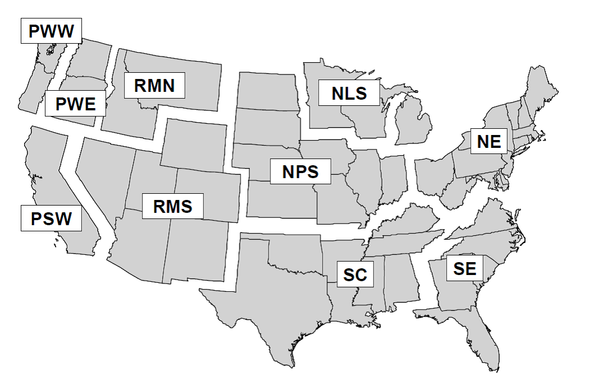

# Option 2: Upload and run your own data in the web application {#own}

## Overview      {#own-over}

Users may import their own data into the Shiny web application and have the application run the HWP model and Monte Carlo simulation using the template data input file which consists of several worksheets containing individual datasets. The user must supply annual timber harvest volumes in thousand board feet (MBF) by ownership and annual timber product ratios (TPR) that allocate harvest to different timber product classes. If the user has the data, it is also ideal for them to supply the annual primary product ratios (PPR) that allocate timber products to different primary products and residue uses. However, if the user does not have these data they can rely on defaults provided for California, Oregon, Washington, or the USFS regions. The user may rely on the defaults provided for the remaining datasets, though advanced users may supply their own values if desired. Details for all input data template file worksheets and datasets are provided in this chapter. 

Once the user has built their own input file for the harvest years of interest, the file can be uploaded to the Shiny web application (or read by the stand-alone version of the model; see Section \@ref(dnld-sa)).  A quality assurance (QA) check verifies that the data are correctly compiled.  Once this is done, the application can display the user’s data and the user can download figures and tables of model output.  Through Option 3 (Chapter \@ref(dnld)) the stand-alone model version can provide arrays and tables of model output.  

An input data set resides in a single MS Excel workbook (`.xlsx` extension).  The Excel file has many worksheets, described below.  Provided examples and templates may be modified by the user to construct their own data input file to import into the web application.  Sections \@ref(app-doc) and \@ref(dnld-files) describe how to access example and template files.  Users can customize the operation and outputs of the HWP C tool in the first worksheet of the input data template file. 

There are many values that the user should consider altering based on regional available and historic mill data, dump and landfill decomposition information, etc.  At a minimum users can provide yearly values of total harvested thousand board feet from their region, alter the rest of the worksheets to reflect their year values, and make use of all other available values from one of the examples or templates. 

### Data inputs   {#own-over-inputSum}
This section provides an overview of the types of data users can or need to provide.  These types of data are generally represented by worksheets in the template Excel files, and the worksheets are described in greater detail (including references) in Section \@ref(own-prov-input).  We anticipate that most users will provide three key datasets:  

* **Annual harvest data** – user provided (Section \@ref(own-prov-input-harvest).     
* **Timber products ratios (TPR)** – user provided (Section \@ref(own-prov-input-tpr)).   
* **Primary products ratios (PPR)** – best if user provides; defaults available (Section \@ref(own-prov-input-ppr)).  

Advanced users may consider adjusting the remaining datasets that further refine model estimates of carbon storage in HWP.   

* **Thousand board feet (MBF) to hundred cubic feet (CCF) volume conversion factors** – Values specific to California, Oregon and Washington provided in their respective template files; national defaults last updated through 2007, provided with the original USFS HWP C tool. Ideally these are provided with local or regional data and updated whenever mill surveys are completed (Section \@ref(own-prov-input-mbfccf)).  

* **Yearly end-use product ratios** – National dataset last updated through 2009. Unnecessary for user to modify these ratios unless the national dataset is updated or users want to explore hypothetical wood utilization scenarios (Section \@ref(own-prov-input-eur)).   

* **Ratio categories** – Unnecessary for the user to update unless the number of timber product, primary product, or end-use categories change either due to updated data or for wood utilization scenario exploration (Section \@ref(own-prov-input-rc)).   

* **Primary product CCF to carbon conversion factors** – National conversion factors last updated in 2005. Unnecessary for the user to update unless the national conversion factors are updated or local/regional factors are developed based on the harvest species mix in the area of analysis (Section \@ref(own-prov-input-ccfMTC)).     

* **End-use product half-lives** – National dataset. Unnecessary for the user to update unless the national datasets are updated or the user wants to explore hypothetical changes to the functional lifespan of products (Section \@ref(own-prov-input-euhl)).   

* **Discarded products disposition ratios** – National dataset last updated in 2005. Unnecessary for the user to update unless the national dataset is updated, data is developed at the regional or local level, or the user wants to explore hypothetical scenarios (Section \@ref(own-prov-input-discFates)).   

* **Ratios for wood and paper burned with energy capture** – Currently no data identified, defaults set to 0. Unnecessary to update unless national, regional, or local data is identified to develop this ratio or the user wants to explore hypothetical scenarios (Sections \@ref(own-prov-input-discFates) and \@ref(own-shiny)).   

* **Discarded products disposition half-lives and landfill fixed carbon ratios** – International datasets. Unnecessary for the user to update unless international datasets are updated or national, local, or regional data is identified, or the user wants to explore hypothetical scenarios. *Please note, current defaults for landfill fixed carbon ratios have not been updated to the current IPCC 2019 refinement defaults* (Section \@ref(own-prov-input-discHL)).   

* **Monte Carlo distribution parameters** – Unnecessary to update unless the user has more details on the range of uncertainty for various parameters used in HWP carbon estimation (Section \@ref(own-prov-input-mc)).   

* **Loss Factor** – This parameter is specified within the larger HWP_TOOL_OPTIONS worksheet (see Section \@ref(own-prov-input-options)). National default. Unnecessary to update, though user may want to explore different loss factors. Currently the tool only applies the loss factor to solid wood products, though literature supports a loss factor for paper.   

References for sources for all listed datasets are provided in the individual descriptions of each dataset below in Section \@ref(own-prov).    

Users that wish to update results from this tool annually must ensure that as new annual harvest data is added, an additional year(s) of data for all other worksheets within the template file are added. This step may be completed manually within each worksheet, or through the stand-alone R code which will automatically add the correct number of years to each worksheet.  See Section \@ref(dnld-add) for more details. For the model to run correctly, all datasets in each worksheet of the input template file must have the same number of years.   


## Providing your own data  {#own-prov}

### Select the template files {#own-prov-temp}

The `HWP Data/Templates` folder contains several United States based templates to work from.  These templates were derived from those offered with the HWP v1 tool [@stockmann2014], see Section \@ref(int-hist).  Each subfolder contains a different template, and figure \@ref(fig:template-map-fig) describes the geographic range for each template.  The `HWP Data\ExistingData` folder contains the California, Washington, and Oregon data sets along with other supporting data sets (generally modifications of the California or Oregon data).  The California, Washington, and Oregon data sets can additionally serve as templates.  All templates have the same information for end use ratios, cubic foot to metric ton conversion values, end use half lives, discard ratios, discard half-lives, and Monte Carlo parameters.    

```{r template-map-fig, echo = FALSE, fig.cap = "Definition of regions: Pacific Northwest, West (PWW); Pacific Northwest, East (PWE); Pacific Southwest (PSW); Rocky Mountain, North (RMN); Rocky Mountain, South (RMS); Northern Prairie States (NPS); Northern Lake States (NLS); Northeast (NE); South Central (SC); and Southeast (SE).  Note that regions are merged for some template files, these combiantions include: NLS and NPS as North Central, RMN and RMS as Rocky Mountain; and RMN, RMSE, PWE and PSW as West.", fig.asp = 0.7, fig.width= 6, out.width = '100%'}

```

Each template lacks harvest data and timber product ratios.  The user must provide these.  We recommend searching for references similar to the citations listed in the section above to revise or verify given values.  The `Natl_datasets` folder contains a (U.S.) national template that additionally lacks primary product ratios and the board foot to cubic foot conversion factors.  The other templates each have a unique primary products ratios data sheet (except for the Pacific Southwest which shares values with the California input file) that rely on @smith2006 which in turn depends on information from @adams2006, and therefore are likely based on mill surveys updated through 2005 at the latest. Generic board foot to cubic foot volume conversions are provided in the regional templates that are the same for each region. These values are only updated to 2007 and it is unclear what the data source is for these values.  We urge users to consider carefully whether they want to use the included values (see previous section) and especially urge this in relation to the primary product ratios.  Those ratios, as can be seen, are constant across years.  This is not the case for the California, Oregon, or Washington data sets which contain a more detailed set of primary product ratios that vary through time based on literature documenting historic and current wood utilization. If the user has the resources to construct more detailed primary product ratios for the area of analysis, that is ideal.   

When using a template to construct a data set, users may need to adjust yearly ranges or values in any of the worksheets that come before or after the target year values.  **In other words, all datasets in each worksheet of the template file must have the same number of years.**  For instance, the California harvest data begins in 1952.  If I used the Pacific Southwest template I would need to remove pre-1952 columns from the worksheets TimberProdRatios, PrimaryProdRatios, EndUseRatios, and DiscardFates, and adjust values on other worksheets.  Section \@ref(own-prov-input) can be used as a checklist to ensure the right changes are made to input data templates.


### Creation of the input file      {#own-prov-input}  
This explanation may work best if the user opens example files, such as CA_Inputs_HWP_Model.xlsx or Oregon_Inputs_HWP_Model.xlsx, and examines the files while reading the description of each worksheet.   

#### Model options   {#own-prov-input-options}  

Worksheet name: HWP_TOOL_OPTIONS  

The first worksheet in the input data template file, HWP_MODEL_OPTIONS, allows the user to customize the operation and output of the HWP model. The values in this worksheet affect the operation of the stand-alone model and/or the Shiny application.  Asterisks indicate options that all users should adjust if using the Shiny web application and/or the stand-alone version of the model, with the remainder as optional to adjust for advanced users:  

* \*DATASET.NAME (string): This value only affects the Shiny web application.  This name will appear as an option in the upper-left pulldown menu in the application.  Avoid using the names "California" or "Oregon" as the application is pre-loaded with these datasets and it will be difficult to distinguish these from the user’s dataset.    

* \*QA_TEST (TRUE, FALSE) – This value only affects the stand-alone model.  The default is TRUE.  If TRUE, the stand-alone code will complete the QA check of the input data file and examine all worksheets except HWP_MODEL_OPTIONS to ensure the input file is set up with the correct number of years and types of values in all worksheets.  See Section \@ref(own-qa) below.  If FALSE, the code will skip the QA step and attempt to load the worksheets without examining them.  Little system time is needed to conduct the QA test.   

* OUTPUT_ARRAYS (TRUE, FALSE) – This value only affects the stand-alone model.  If users would like the program to produce the analysis arrays so that they can trouble-shoot model issues or verify calculations, this value should be set to TRUE (default). Otherwise, FALSE.   There is a noticeable time  savings in code execution when this value is set to FALSE.    

* OUTPUT_TABLES (TRUE, FALSE) – This value only affects the stand-alone model.  This option allows users to select whether the code produces output tables for the base HWP analysis.  Default = TRUE.  

* SHIFTYEAR (TRUE, FALSE) – Affects both the Shiny web application and stand-alone model.  If the user wants tabular and figure outputs of emissions and pools reported as occurring the year after harvest as in the original USFS variants of the tool, this value should be TRUE.  If the user wants those outputs reported as occurring during the same year as harvest, select FALSE.  Note that outputs for intermediate arrays are not year-shifted.   

* PIU.WOOD.LOSS (Double, 0.00 to 1.00) – Affects both the Shiny web application and stand-alone model.  The current estimated loss factor specifying the quantity of carbon that is immediately discarded when solid wood products are placed into end-uses and enter the PIU pool is 0.08, or 8%.  The default value is set to 0.08; enter a different value if you wish to alter the amount.  The value cannot exceed 1.0 or fall below 0.  For reference, @skog2000 also cite a value of 5% for paper. 

* PIU.PAPER.LOSS (Double, 0.00 to 1.00) – Affects both the Shiny web application and stand-alone model.  Our default loss factor specifying the quantity of carbon that is immediately discarded when pulp wood products (paper) are placed into end-uses and enter the PIU pool is set to 0.0; enter a different value if you wish to alter the amount.  The value cannot exceed 1.0 or fall below 0.  

* ARRAYLOC (Text) – This value only affects the stand-alone model.  The default value is "HWP_Stand_Alone_Files/Arrays/".  If you wish to save arrays to a different folder, change the folder location value.  If you are using Windows, be sure to use the forward slash "/" between folder levels and not the back slash.  

* TABLELOC (Text) – This value only affects the stand-alone model.  The default value is "HWP_Stand_Alone_Files/Tables/".  If you wish to save tables to a different folder, change the folder location value.  If you are using Windows, be sure to use the forward slash "/" between folder levels and not the back slash.  

* \*RUN.MC (TRUE, FALSE) – This value only affects the stand-alone model.  If you would like to run the Monte Carlo simulation on your data set, ensure that this value is TRUE.  The main model code will run and then verify that this value is TRUE, at which time it will source the Monte Carlo R code and run it.  Note: running the Monte Carlo simulation is very time consuming.  Set this option to FALSE if you are running the stand-alone model and are not currently interested in the Monte Carlo output.    

* R (Numeric, between 0 to 1) – Affects both the Shiny web application and stand-alone model.  This value is the target Pearson’s correlation coefficient that will be used to correlate triangular distribution values in the Monte Carlo.  For instance, if the worksheet MonteCarloDistrParameters has three accuracy values for Harvest, depending on the year of harvest, the value for R will determine how correlated the three random draws are that are used to adjust the Harvest values for each iteration.   The default is 0.5, as was used in @stockmann2012.  

* OPT.START.VALUE (Numeric, between 0 and 1) – Affects both the Shiny web application and stand-alone model.  The MonteCarloDistrParameters states minimum and maximum 90% Confidence Intervals from which the Monte Carlo random variables are to be drawn.  However, when we transform random uniform values into values from a triangular distribution, we need to know the triangular distribution endpoints.  In the Monte Carlo code, the function "ab.boundaries.fcn" performs a search algorithm to find the triangular distribution end points given the confidence intervals provided in the MonteCarloDistrParameters worksheet.  The default start value for the algorithm is 0.5 and likely does not need to be altered for the Monte Carlo code to function adequately.  

* \*N.ITER (Integer, 1 or greater) – Affects both the Shiny web application and stand-alone model.  This value determines the number of iterations the Monte Carlo performs.  In the Shiny application, the Monte Carlo Estimates selection "Monte Carlo convergence estimation" produces convergence plots that track estimates for the last year examined in the model.  The plot shows the values for the mean, standard error, and 95% and 5% Confidence Intervals given the iterations performed.  Of the four, the Mean is most informative.  If the line is stable for many iterations (we seem to obtain fairly stable results with 2000 iterations) then you likely have a sufficient number of iterations.  The more iterations, the slower the code will run.  Too few iterations will provide unreliable results.  The default value is currently 100 runs which is likely too few but is sufficient to verify that the process works.  1000 to 2000 might be a recommended number for obtaining reliable estimates.  

* MC.ARRAY.OUT (TRUE, FALSE) – This value only affects the stand-alone model.  If TRUE, the Monte Carlo code will generate the (large) Microsoft Excel workbook MC_All.xlsx that contains all MMTC values for each year and each iteration of the Monte Carlo code.  There is a separate tab for Emitted with Energy Capture (eec), Emitted Without Energy Capture (ewoec), Solid Waste Disposal Sites carbon (swdsC), and Products in Use (pu).  The default is TRUE; if it is FALSE the code will run a bit faster and the large (~10 MB?) file will not be produced.  The file is provided for model assessment purposes.    


#### Harvest   {#own-prov-input-harvest} 

Worksheet name: HARV_MBF  

The worksheet Harvest_MBF contains a time series of total yearly harvest values in thousand board feet (MBF).  Annual harvest time series are provided for California, Oregon and Washington. Otherwise, *this worksheet must be populated by the user*.  

The yearly harvest is the total annual harvest from the region or owner of interest, entered in MBF.  The left column must contain the heading "Year" and have years listed in sequential order from least to greatest.  Ownership columns may follow, with a final column entitled "Total" that must equal the ownership values.  Users may omit all but the Year and Total columns.  Users may have ownership values appear at some point after the first year of total harvest values; however, leave the ownership cells prior to the first year of ownership values blank and not filled with zeros.  The QA check sums the values to determine if they equal the total value, so a series of zeros obviously will cause the QA check to fail.

Data sources used for California timber harvest include @bolsinger1976, [BLM Bureau Wide Timber Data](https://www.blm.gov/programs/natural-resources/forests-and-woodlands/timber-sales/bureau-wide-timber-data), @morgan2004, @morgan2012, @mciver2015, [USFS Cut-and-Sold-Reports](https://www.fs.fed.us/forestmanagement/products/cut-sold/index.shtml), and @warren2005.  Specific data sources for Oregon and Washington annual harvest time series are provided in @morgan2021 and @nichols2020.

#### MBF to CCF conversion factors  {#own-prov-input-mbfccf} 
Worksheet name: MBFCCF  

The worksheet MBFCCF contains the conversion factors between board feet and cubic feet for various time periods. Additional calculations are completed in the R code to account for harvest volumes being provided in thousand board feet (MBF) and subsequent model calculations occurring on units of hundred cubic feet (CCF).  Factors used to convert MBF to CCF vary by time and place.  Annual harvest time series are provided for California, Oregon and Washington, as well as the defaults from the original USFS version of the tool for the nine NFS regions. The source for the NFS region defaults is unidentified. Ideally these are provided with local or regional data, and updated whenever mill surveys are completed.  

The user may choose to change these conversion factors  when mill surveys are updated or if more detailed information is available by region spanning any given time series.  There are only three columns, Conversion, StartYear, and EndYear to specify the conversion value and the starting and ending year of harvest data the conversion applies to.  Ensure that the first Start Year begins with the minimum Harvest_MBF Year and that conversion time periods do not overlap.  When mill surveys are completed, ratios are applied from the year of the latest survey backwards to the last survey. For example, the MBF to CCF ratio from the California mill survey for 2012 is applied from 2012 backwards to 2007, as the previous mill survey was completed in 2006. The most recent California mill survey for 2016 results in a MBF to CCF ratio applied from 2016 backwards to 2013. This ratio is also applied forwards to the present until a new mill survey is completed and this ratio can be updated for 2017 forward. The final end year must be the same as the final year annual harvest data is provided for in the worksheet named "Harvest_MBF." The Conversion column values are formatted as doubles and StartYear and EndYear values are integers.  

Data sources for CA/USFS Pacific Southwest region ratios were obtained from @keegan2010 (1952 – 1989), @morgan2004 (1990 – 2000), @morgan2012 (2001 – 2006), @mciver2015 (2007 – 2016), and @marcille2020 (2013-present).  Specific data sources for Oregon and Washington annual harvest time series are provided in @morgan2021 and @nichols2020.  

Default MBF to CCF conversion factors are provided for the rest of the U.S. from the original USF HWP C versions of the tool up to 2007. The data sources is unclear for this dataset.   

#### Timber Product Ratios   {#own-prov-input-tpr}  

Worksheet name: TimberProdRatios  

The worksheet TimberProdRatios contain the timber product ratios, or TPR.  The yearly timber product ratios represent the portion of the annual harvest that is classified as specific timber products, such as sawtimber, pulpwood, posts, and fuelwood.  Default TPRs are provided for California, Oregon and Washington. **Otherwise, this worksheet must be populated by the user**.   

The first column must be TimberProductID, which is a numerical identifier of the timber product category name. Timber product category names are specified in the worksheet named "RatioCategories" (Section \@ref(own-prov-input-rc)).  The remainder of the columns are named after the sequential years of harvest data, from the earliest year to the final year.  The number of years in this dataset must match the number of years annual harvest data is provided for in the worksheet named "Harvest_MBF".  All year-column values must sum to one.  Row values may change over time.  When mill surveys are completed, ratios are applied from the year of the latest survey backwards to the last survey. Most recent available records may also need to be extended forwards if data for recent years of analysis do not yet exist. For example, the TPRs from the California mill survey for 2012 is applied from 2012 backwards to 2007, as the previous mill survey was completed in 2006. The most recent California mill survey for 2016 results in a set of TPRs applied from 2016 backwards to 2013. This ratio is also applied forwards to the present until a new mill survey is completed and this ratio can be updated for 2017 forward. 

Data sources for California TPR and PPR include @barrette1970, @hiserote1978, @howard1974, @marcille2020, @mciver2015, @morgan2004, @morgan2012, @ward1995, and @ward1997. The original model templates for NFS region (9) rely on @smith2006 which in turn depends on information from @adams2006, and therefore are likely based on mill surveys updated through 2005 at the latest.   


#### Primary Product Ratios   {#own-prov-input-ppr}

Worksheet name: PrimaryProdRatios  

The worksheet PrimaryProdRatios contain the primary product ratios, or PPR.  The yearly primary products ratios represent the portion of each yearly timber product that is used in specific primary products, such as lumber, wood pulp, plywood, and fuelwood.  Default PPRs are provided for California, Oregon and Washington, as well as the defaults from the original USFS version of the tool for the 9 NFS regions. Default PPRs for the 9 NFS regions are constant across the years, whereas the California, Oregon and Washington PPRs contain a more detailed set of primary product ratios that vary through time based on literature documenting historic and current wood utilization. **Otherwise, this worksheet must be populated by the user**. If the user has the resources to construct more detailed primary product ratios for the area of analysis, that is ideal.  The first column in the worksheet must be PrimaryProductID, which is a numerical identifier of the primary product category name. Primary product category names are specified in the worksheet named "RatioCategories" (Section \@ref(own-prov-input-rc)).  The remainder of the columns are named after the sequential years of harvest data, from the earliest year to the final year.  The number of years in this dataset must match the number of years annual harvest data is provided for in the worksheet named "Harvest_MBF".  All year-column values must sum to the number of TPR rows.  Row values may change over time.  

Data sources for California TPR and PPR include @barrette1970, @hiserote1978, @howard1974, @marcille2020, @mciver2015, @morgan2004, @morgan2012, @ward1995, and @ward1997. The original model templates for NFS Region 9 rely on @smith2006 which in turn depends on information from @adams2006, and therefore are likely based on mill surveys updated through 2005 at the latest.   


#### End Use Ratios   {#own-prov-input-eur}

Worksheet name: EndUseRatios  

The worksheet EndUseRatios contains end use ratios, or EUR.  End-use product ratios determine the annual distribution of primary wood products, such as lumber and non-structural panels, to end-uses, such as single family new housing and furniture manufacturing.  This is the amount of the primary product carbon that enters the Products in Use (PIU) pool.  National default EURs are provided. It is unnecessary for the user to modify these ratios unless the national dataset is updated or users want to explore hypothetical wood utilization scenarios.  

The distribution of each primary product among end-uses must sum to 1.0. The program will only work if each primary products end-use distribution sums to 1.0. The first column must be EndUseID, which is a numerical identifier for the end-use category name. End-use category names are specified in the worksheet named "RatioCategories" (Section \@ref(own-prov-input-rc)).  The remainder of the columns are named after the sequential years of harvest data, from the earliest year to the final year.  The number of years in this dataset must match the number of years annual harvest data is provided for in the worksheet named "Harvest_MBF".  All year-column values must sum to the number of PPR rows.  Row values may change over time.  *Currently values for the last year for which data are available (2009) are applied forward for all subsequent years to the present. However, 2009 was in the heart of the recession and may not be representative of more recent years. Users may want to use EURs from a year just prior to the recession, such as 2006, for more recent analysis years*.  

National end-use ratios were obtained from @mckeever2009 and @mckeever2011 and were last updated through 2009.  

#### Ratio Categories  {#own-prov-input-rc}  

Worksheet name: RatioCategories  

The worksheet RatioCategories acts as a link between TPR, PPR, and EUR categories specified numerically in the TPR, PPR and EUR worksheets.  The first three column labels, TimberProductID, PrimaryProductID, and EndUseID, must have the same names as the respective first columns of the previous three worksheets described.  The fourth through sixth column names are TimberProduct, PrimaryProduct, and EndUseProduct, and contain text describing what the categories contain.  Note that EndUseProduct is a subcategory of PrimaryProduct, and PrimaryProduct is a subcategory of TimberProduct.  The R code ignores columns 4 through 6; they are there for assisting users in identifying row values.   The user does not need to change these values unless they change the number of TPR, PPR, and/or EUR categories.  It is unnecessary for the user to update these categories unless the number of timber product, primary product, or end-use categories change either due to updated data or for hypothetical wood utilization scenario exploration.  

#### CCF to metric tons carbon  {#own-prov-input-ccfMTC}

Worksheet name: CCF_MT_Conversion

The worksheet CCF_MT_Conversion contains factors to convert CCF volumes of individual primary products to metric tons of carbon. National default values are provided. These factors were last updated in 2005. It is unnecessary for the user to update these values unless the national conversion factors are updated or local/regional factors are developed based on the harvest species mix in the area of analysis.   

The first column title must be PrimaryProductID, and the second column CCFtoMTconv.  The first column values must be integers and include all primary product ratio categories.  

The conversion factors were obtained from @smith2006 and @skog2008.  

#### End-use product half-lives    {#own-prov-input-euhl}

Worksheet: EU_HalfLives  

End-use product half-life values express the decay rate at which carbon in the products in use category passes into the Discarded Products category.  National default values are provided. It is unnecessary for the user to update these values unless the national conversion factors are updated or the user wants to explore hypothetical changes to the functional lifespan of products. The user may choose to change any half-life of the 224 primary product end-uses. The user may alter as few or as many half-lives as desired. Increasing end-use half-lives will result in carbon storage in the Products in Use pool for a longer time period, while decreasing half-lives will pass those end-use products into the Discarded Products category at a faster rate. It is unclear if or how often the end-use half life values should be updated.  

The worksheet EU_HalfLives contains half-life values (in years) for each of the end use categories.  The first column must be titled EndUseID, the second EU_HalfLife.  The values for EndUseID must be integers and include all end use ratio categories.  

References for end-use product half-lives are listed in and were obtained from @smith2006.  In turn, @smith2006 cites @skog1998, @skog2000 (which is identical to @skog1998), and @row1996.  Not all end-use half-lives used in the tool appear to have published half-lives. Some half-lives used for one product category were assumed to be sufficient for others that lacked data. A forthcoming general technical report from the USFS documents these apparent assumptions [@lucey202X].    

#### Discard products disposition ratios  {#own-prov-input-discFates}

Worksheet name: DiscardFates  

In any given inventory year wood and paper from every single vintage year passes from the Products in Use pool into the Discarded Products category. The worksheet DiscardFates contains values that apportions discarded carbon to different discard categories: DEC = Discard Energy Capture, BWoEC = Burned Without Energy Capture, Recovered, Composted, Landfills, and Dumps.  Paper (defined by the code as primary products where the column EndUseProduct in the worksheet RatioCategories contains the word "pulp") and solid wood products are allowed to have different discard ratio values.  The first two columns must be named DiscardType and DiscardDestination.  The remainder of the column titles are the years, in order, from longest ago to most recent.  The number of years in this dataset must match the number of years annual harvest data is provided for in the worksheet named "Harvest_MBF".   The sum of each year-column should be two (all wood and all paper values within a column should sum to one).  Row values may change over time.

All default wood and paper products discarded disposition ratios were obtained from @skog2008.  These data represent a (U.S.) nationwide dataset that has not been updated since 2005.  These data could be updated, from either national databases or local/regional datasets from relevant waste characterization studies.  @skog2008 cites HWP dump and landfill data from @freed2004 which is an unpublished spreadsheet that made use of data from @epa2006, @melosi1982, and @melosi1999.   It is unnecessary for the user to update unless the national dataset is updated, data is developed at the regional or local level for relevant waste characterization studies, or the user wants to explore hypothetical scenarios. The user may alter as few or as many discard ratios as desired. Altering ratios can affect the quantity of HWPs that are emitted with and without energy capture at the end of their functional lifespan.  

It should be noted that some of the HWP discarded into the SWDS may be burned for disposal in a boiler with energy capture (DEC; e.g., a trash incinerator). The proportion (values between 0 and 1) of discarded HWP with energy capture (DEC) guides what portion of discarded HWP is burned for energy capture for every year of the time series. There are no default proportions in the model; or rather, the default is 0. Values used for the DEC rows must be between 0 and 1 (e.g., 0.5 = 50% discarded wood is burned with energy capture). Adjusting proportions affect only HWP that have been discarded and is not related to the fuelwood component of HWP.  Currently, we only provide a test data set (CA_DiscardEnergyCapture_Test.xlsx, see Section \@ref(dnld-files)) that includes DEC proportions.   Users could update the values with national or regional waste characterization or other waste disposal data.  


#### Discarded products disposition half-lives and landfill fixed ratios {#own-prov-input-discHL}

Worksheet name: Discard_HalfLives  

Discarded products disposition half-lives are the half-lives of wood and paper, which vary between landfills, dumps, and recovered (recycled) products. These values determine the quantity and rate HWPs are emitted with and without energy capture at the end of their functional lifespan. The worksheet Discard_HalfLives provides half-life values in years for paper and wood in dumps (Dumps), recovered products (Recovered), and the decaying portion of landfills (Landfills_decay).   A single value is provided for each category.  It also, possibly confusingly, includes values for the proportion of wood and paper that end up in the non-decaying portion of landfills (Landfills_fixed).  The columns must be labeled Type, Dumps, Landfills_fixed, Landfills_decay, and Recovered.    

Discard ratios and landfill fixed carbon ratios are provided based on national or international defaults. It is unnecessary for the user to update the defaults unless international or national datasets are updated, local/regional data is identified, or the user wants to explore hypothetical scenarios.   

The user may choose to change any half-life of wood and paper products that are in landfills, dumps, or recovered (recycled) as well as the landfill fixed ratios. The user may alter as few or as many half-lives as desired. Increasing half-lives will result in slower carbon decay and will increase the recalcitrance time of carbon in Solid Waste Disposal Sites (SWDS). Decreasing half-lives will result in faster carbon decay and will decrease the recalcitrance time of carbon in SWDS. Increasing the landfill fixed carbon ratios will increase the amount of carbon that is not subject to decay and therefore decrease landfill emissions. Decreasing these ratios would have the opposite effect. *Please note, current defaults for landfill fixed carbon ratios have not been updated to the current, higher IPCC 2019 refinement defaults [@buendia2019].*  

Data sources for Landfill, dumps, and recovered (recycled) wood and paper half-lives are listed in @skog2008.   Information for dumps in @skog2008 cites Table 5.7 in @penman2000.  For landfills, @skog2008 cites Table 3.4 in @buendia2019.  For recovered products @skog2008 cites @pingoud2006.  

However, the value in @pingoud2006 is not what was included in the original USFS versions of the tool and the value that was included appears to match the paper half-life presented in @smith2006.  

For the landfill fixed carbon ratio information, @skog2008 which cites @freed2003 who in turn use data from @barlaz1998 and @eleazer1997.  Users may choose to update the ratios using information provided in the 2019 IPCC refinement [@ruter2019]. 

#### Monte Carlo values {#own-prov-input-mc}

Worksheet name: MonteCarloValues  

The worksheet MonteCarloValues allows users to define how much "noise" to introduce into the HWP model for the Monte Carlo simulation.  The outcomes of the simulation are summarized as statistical confidence intervals for carbon storage (PIU, SWDS pools, and both pools combined) and carbon emissions (with and without energy capture). This worksheet also allows the user  to specify aspects of the Monte Carlo that they would like to control.  The worksheet needs to be altered to conform to the user’s data structure for the Monte Carlo to run.  That is, if users have data from 1970 – 2018, they will need to change First_Year and Last_Year values for some of the rows.  Default distributions were obtained from @stockmann2012.  It is  unnecessary to change the defaults unless the user has more details on the range of uncertainty for the various parameters used in HWP carbon estimation.  Users can change First_Year, Last_Year, MinCI, MaxCI, and CI values. They may add or delete rows for Harvest, TimberProdRatios, and PrimaryProdRatios.  Each row of the worksheet represents a vector of random draws, with one random draw per iteration.  If our model had 100 iterations and this worksheet had 20 rows, the R script will obtain 2000 random uniform draws between zero and one, 100 random values per row.  (Please use more than 100 iterations for your final runs.)  The R script will change these values to triangular distributions with a peak at 1.0 (column Peak Value) and lower and upper confidence intervals as defined by the columns MinCI and MaxCI.  The resulting random numbers for a given parameter (row) will have values that are above or below 1.0.  In general, the parameter values associated with each of the parameters are multiplied by the random number for a single iteration.  If the random number is 0.86, the parameter value will be reduced to 86% of its original size.  Below we describe each of the columns and column values in this worksheet.  

* Parameter_ID: This column is included for the user’s information; the R script does not rely upon it.  Each of the parameters to be altered is listed here.  Some parameters (namely, those after Parameter ID number 13) may have more than one set of random numbers generated for it.  For instance, if we wish for Harvest values to be modeled as becoming more accurate through time, reflecting improvements in reporting and data collection, we may wish to indicate three periods of years with increasing estimate precision.  A series of random numbers will be drawn for each of the time periods, and then correlated (see above).  Within an iteration, this example would have three correlated random numbers that would be used for the three periods of years.  The parameter ID for Harvest would be the same number repeated three times (14, 14, 14).    
* Parameter_Name: The column name, "Parameter Name", is not used by the code.  However, the column values are names for specific parameters that are used by the code.  These must remain unchanged.  The names can be repeated as necessary (following on the example for Parameter ID, Parameter ID 14, 14, 14 would be associated with Parameter Name "Harvest", "Harvest", "Harvest").  Below are descriptions of which parameters and worksheets each relates to:  

    + CCFtoMTC: This name translates as "hundred cubic feet converted to metric tons carbon".  Each Monte Carlo iteration will alter the conversion values associated with the worksheet CCF_MT_Conversion to reflect the level of uncertainty in the primary product volume to carbon conversion factors.    
    
    + EndUse_HalfLives: Each Monte Carlo iteration’s random number for this parameter will adjust the end use half life values found in EU_halflives to reflect the level of uncertainty in the end-use half-lives.   
    
    + EndUseRatios: This variable refers to the end use ratio values found in the worksheet EndUseRatios.  Each iteration of the Monte Carlo will use one random value to change the end use ratio values.  See the discussion of the "Sum-To-One Constraint" in Section \@ref(model-mc-samphwp) to understand how the values are altered.   This is designed to reflect the uncertainty in the end-use ratios.   
    
    + DiscardedDispositionRatios, Paper: There are two rows in the Parameter Name column with the name DiscardedDispositionsRatios.  The adjacent column, "Paper", indicates whether these disposition ratios are for paper (1) or wood (0). The disposition ratios are from the worksheet DiscardFates.  They determine what fraction of paper or wood enter the categories of Discard Energy Capture, Burned Without Energy Capture, Recovered, Composted, Landfills, or Dumps.  Like End Use Ratios, these ratios are subject to the sum-to-one constraint.  Each Monte Carlo iteration alters the values of the discard ratios.  
    
    + LandfillDecayLimits: The wood and paper values represent the landfill decay limits, or the proportion of landfill material that is subject to decay.  The values are obtained from the worksheet Discard_HalfLives.  The adjacent column, “Paper”, indicates whether these disposition ratios are for paper (1) or wood (0). Each Monte Carlo iteration alters the values of the landfill fixed carbon ratios.  
    
    + Landfill_HalfLives, Dump_HalfLives, Recovered_HalfLives: The six rows with these parameter names are associated with wood and paper decomposition half-lives for materials subject to decay in landfills, dumps, and in recovered products.  The values are obtained from the worksheet Discard_HalfLives.    The adjacent column, “Paper”, indicates whether these disposition ratios are for paper (1) or wood (0). Each Monte Carlo iteration alters the values of these decay ratios. 
    
    + Harvest: This parameter references the cubic-foot volume amounts harvested each year.  The values are originally provided as board feet from the worksheet Harvest_MBF, but they are transformed to unis of CCF in the original (non-Monte Carlo) portion of the analysis and the transformed values are used in the Monte Carlo.  Each Monte Carlo iteration alters the values of the annual harvest volume estimates. There may be more than one row labeled as Harvest, reflecting different accuracies to be used for different year-ranges.    
    
    + TimberProdRatios: Like Harvest, there may be more than one entry for TimberProdRatios.  The original worksheet is TimberProdRatios.  Like EndUseRatios, a random value associated with a range of years will alter some, but not all, Timber Product Ratio values.  See the discussion of the "Sum-To-One Constraint" in Section \@ref(model-mc-samphwp).    Each Monte Carlo iteration alters the values of the timber product ratios.   
    
    + PrimaryProdRatios.  This type of parameter is altered much the same as TimberProdRatios and the original values may be found in the worksheet PrimaryProdRatios.  It too is subject to the "Sum-To-One Constraint".  Each Monte Carlo iteration alters the values of the primary product ratios.  
    
* Paper: As described above for DiscardedDispositionRatios and other parameters, some parameters represent paper (1) or wood (0) for their associated parameters.  

* First Year, Last Year: These are values that users must change.  The values in these columns represent the first year and last year of a given year period.  For instance, if our data set included harvest from 1906 to 2017 but we wanted to increase the precision of the Monte Carlo values in steps leading to the final year, then we need to indicate what years each level of precision refers to.  If only one level of precision is used, provide the first year of harvest (e.g., 1906) under the First Year column and the last year of harvest (2017) to the Last Year column. If there are three Harvest rows, we want the First Year to capture all beginning years for given year periods and Last Year to capture the terminal year.  For the first Harvest we might have First and Last Year values of 1906 and 1945, then in the second row the values 1946 and 1979, and finally the third row would contain a First Year of 1980 to 2017.   Crucially: the very first First Year must be the first year of your harvest values, whether for Harvest, TimberProdRatios, or PrimaryProdRatios.  There must not be overlap in years (e.g., if the first row had 1906 to 1945 and the next row had 1941 to 1955, the sets would overlap).  There must not be gaps (e.g., 1906 to 1945, then 1947 to 1955, leaving out 1946).  You do not have to have the same sets of years used among parameter types (e.g., Harvest year sets do not need to match TimberProdRatios year sets).  You do not need parameter types to have the same number of sets (Harvest could have two rows, PrimaryProdRatios could have three). You may have more or fewer than three year-sets per parameter type.   

* MinCI, Peak Value, MaxCI: As described above, these values are used to define the triangular distributions from which the random Monte Carlo values will be generated.  For these three columns, Peak Values should all be 1.0, with the MinCI and MaxCI symmetric around this value (the Monte Carlo code assumes symmetric triangular distributions).  That is, the MinCI and MaxCI must differ from the Peak Value by the same amount (e.g., MinCI = 0.85, Max CI = 1.15.  Both are 0.15 distant from 1.0).  The MinCI and MaxCI are the user-specified confidence intervals; e.g., the user states what they wish the confidence intervals should be around 1.0.    

* CI: This value allows the user to change what sort of a confidence interval is used. The default value is a 90% confidence interval, as was used in @stockmann2012.  The user could change this value to 0.95, or a 95% confidence interval.  This sort of adjustment will affect the spread of the triangular distribution, with a 90% confidence interval having a wider spread. 


 

## The quality assurance step  {#own-qa}

The Quality Assurance (QA) step is mandatory for data brought into the Shiny web application and optional for the stand-alone program (see above: QA_TEST = TRUE/FALSE).   The QA code, QA_Code_Shiny.r, assesses the imported Excel file data.  The QA step has over 55 checks it performs on the incoming data to help ensure that the program will run correctly.  As it runs through its checks, it populates the file Error_Report.csv in the QA folder with results.  It first verifies that it can load a worksheet and then conducts subsequent tests on it.  The code performs tasks such as verifying that column labels are correct and that years and TPR/PPR/EUR categories match among files.  If it finds an error, it will record a "1" in the Terminate column that matches the issue at hand and describe the problem in the Comments column.  If no problem is found the Comments column will indicate which checks it made and found correct.  A zero in the Comments column may be ignored.  If an error is found, the R session will terminate (stand-alone model) or an error message will be produced preventing further analysis (Shiny application). This is on purpose!  It prevents the code from attempting to proceed.  If termination occurs, check the error report to find out which worksheet was triggering the error and why.  Below we describe the attributes that are checked for each worksheet:

**All 10 worksheets**: The QA code verifies that each worksheet correctly loaded.  A misspelling of the worksheet name will trigger a terminal error.  
Havest_MBF:   

* The first and last column names must be \"Year\" and \"Total\".    
* Values are numeric.  
* The sum of ownership amounts must equal the sum of the total amounts.  These values can deviate from one another if a user saves the CSV file from an Excel file.  The decimal places may be lost with numbers rounded.  This rounding may cause ownership values to no longer sum to the Total amount.  Slight adjustments to the Total amount or an ownership category amount will be necessary to correct.   

**MBFCCF**:   

*	The first three column names must be \"Conversion\", \"StartYear\", and \"EndYear\".    
*	The final year value under Years must equal the last year value of Harvest_MBF.  
*	Values are numeric.  

**TimberProdRatios**:  

*	The number of TPR years equals the number of harvest years in Harvest_MBF.   
*	The year columns must be transformable to numeric values.  E.g., a text value of \"1952\" can become the integer 1952. A year column name such as \"X1952\" cannot be transformed into an integer, at least not with the code provided.   
*	The first column name must be \"TimberProductID\".  
*	The year columns must sum to 1.0.  
*	Table values are numeric.  

**PrimaryProdRatios**:  

*	The number of PPR years equals the number of harvest years in Harvest_MBF.  
*	The year columns must be transformable to numeric values.    
*	The first column name must be \"PrimaryProductID\".  
*	The year columns must sum to the number of Timber Product Ratios, the number of rows in TimberProductRatios.  
*	Table values are numeric.  

**CCF_MT_Conversion**:   

*	The two columns must be named \"PrimaryProductID\" and \"CCFtoMTconv\".  
*	The listed number of Primary Products matches the number in the file PrimaryProdRatios.  
*	Table values are numeric.   

**EndUseRatios**:  

*	The number of years for which there are End Use Ratios must match the number of harvest years.  
*	The year columns must be transformable to numeric values.    
*	The first column name must be \"EndUseID\".  
*	The year columns must sum to the number of Primary Product Ratios, the number of rows in PrimaryProdRatios.   
*	Table values are numeric.   

**RatioCategories**:   

*	The column names must be, in order, \"TimberProductID\", \"PrimaryProductID\", \"EndUseID\", \"TimberProduct\", \"PrimaryProduct\", \"EndUseProduct\".  
*	The word \"fuel\" must appear in some rows of column \"EndUseProduct\".  
*	The word \"pulp\" must appear in some rows of column \"EndUseProduct\".  
*	The number of Timber Product IDs must match the number in TimberProdRatios.  
*	The number of Primary Product IDs must match the number in PrimaryProdRatios.  
*	The number of End Use IDs must match the number in EndUseRatios.  

**EU_halflives**:  

*	The column names must be, in order, \"EndUseID\" and \"EU_HalfLife\".  
*	The number of EndUseID row numbers equals the number of rows in EndUseRatios.  
*	Table values are numeric.  

**DiscardFates**:  

*	The first two columns must be named \"DiscardType\" and \"DiscardDestination\".  
*	There must be the same number of years as in Harvest_MBF.    
*	The year column labels must be transformable to numeric values.  
*	Year column values must be numeric and sum to 2.0.    

**MonteCarloDistrParameters**:  

*	The column names must be, in order, \"Parameter_ID\", \"Parameter_Name\", \"Paper\", \"First_Year\", \"Last_Year\", \"MinCI\", \"Peak_Value\", \"MaxCI\", and \"CI\".   
*	The parameter names need to be labeled \"CCFtoMTC\", \"EndUse_HalfLives\", \"EndUseRatios\", \"DiscardedDispositionRatios\",  \"LandfillDecayLimits\", \"Landfill_HalfLives\", \"Dump_HalfLives\", \"Recovered_HalfLives\", \"Harvest\", \"TimberProdRatios\", and \"PrimaryProdRatios\".  Note that some row names can (and should) be duplicated as needed (see above).    
*	The values for the MinCI and MaxCI must be symmetric around 1.0.   
*	The parameters with multiple rows and First_Year/Last_Year values must have the years be in order and without overlap or gaps.   
*	The time series begins on the first year and the last year is within the final time series set.  
*	Table values aside from column Parameter_Name are numeric.   


## Uploading your data and running the model from the Shiny web app  {#own-shiny}

1. Once the user has created their data file, they can open the Shiny web app, either online or locally (see Running the Shiny App From Your Computer,  Section \@ref(dnld-shiny)), and navigate to the tab \"Upload Data\", under the navigation bar item Documentation and Data Upload.  

2. The user selects their Excel file by clicking the \"Browse\" button and navigating to their file and opening it.  The Shiny app will display the name chosen to represent the data set (DATASET.NAME, see above).   

3. The user then runs the QA procedure by clicking on the button \"Run data file quality assurance\".  

4. A button appears that allows the user to \"Download the QA output table\" and see what issues were found for the data set. If no errors are found, the user can move to the next step. 

5. The user then clicks on the button \"Run HWP Model\".  If the QA test failed, an error message will appear to that effect.  We recommend that the user download the QA output table to determine where the error occurred.  If the QA test was passed, the button should instead take a moment to process the data through the model, announce in Model Status that the model run was a success, and change the selected data set under the \"Select a data set\" option in the sidebar to the user’s uploaded data name.    

6. At this point the user can visit all figures in the Shiny application and view their data displayed in the figures.  They can also download tables summarizing the model run outputs by clicking on the now-appearing button \"Download HWP Tables\" on the right of the window.  


If the user only has Total harvest data (no ownership information) then certain figures will either not attempt to display ownership information or will provide pretty pictures instead.  Other figures will be unaffected.    

7. If the user wishes to run the Monte Carlo simulation, then once the HWP model has been run they click the \"Run Monte Carlo\" button.  A busy icon appears, letting the user know that the simulation is in progress.  The user is also informed of how long the simulation may take.  The Model Status box then has a message appear, \"Monte Carlo is complete!\".  At that point the user may download summary tables for the Monte Carlo.  The Monte Carlo Estimates tab under Carbon Storage and Emissions can now display the new simulation results.    

Note: If the user tried to view Monte Carlo simulation results after running the HWP model but before actually running the Monte Carlo simulation, they are presented with an image that explains that the Monte Carlo simulation data are not available.  If the user then runs the Monte Carlo simulation and returns to the Monte Carlo Estimates, the no-data image will remain until they switch to a previous data set (California or Oregon) and then back to their own data set.  At that time their Monte Carlo results should appear.  This feature may be improved in the future.

:::::: {.greybox data-latex=""}
::::: {.minipage data-latex="{.85\linewidth}"}
::: {.center data-latex=""}
**Try it!**
::: 

From the Shiny app, click on the Upload Data button.  

* To see the QA fail, navigate to `HWP Data\ExistingData\bogus.xlsx` and select the file.  Run the QA.  
* To run data from the state of Washington, navigate to `HWP Data\ExistingData\WA_Inputs_HWP_Model.xlsx` and select the file.  
* Run the Monte Carlo simulation for the Washington data. 
* To see what happens when there is no ownership data, navigate to `HWP Data\ExistingData\OR_no-owner.xlsx` and select the file.  Run the QA and then the HWP model.   
* To see how the Sankey diagram and other figures change if discarded products *were* burned for energy capture (DEC), navigate to the altered file 
`HWP Data\ExistingData\CA_DiscardEnergyCapture_Test.xlsx` and select.  

:::::
::::::

## What to know about running the Monte Carlo simulation   {#own-mc}
As described above, there are several controls in the worksheet HWP_MODEL_OPTIONS.  You can set the number of iterations that you would like the Monte Carlo simulation to run.  You can also set the parameters R and OPT.START if you wish.   

If you would like to see the Monte Carlo array, which includes all estimates from all iterations, you will need to run the stand-alone version of the model and set MC.ARRAY.OUT to TRUE.   

If you are trying to get the model to run or are playing around with data loading and execution on the Shiny App or stand-alone, I recommend setting the number of iterations to something small like 100.  You may find that the Monte Carlo estimates really aren’t that far off of from the standard deterministic HWP model run.  A small number of iterations will prevent you from waiting for several minutes while the simulation runs.  Running the simulations for 1000 iterations may demonstrate a reasonable number to enter into the input Excel file.  When you are ready to obtain a \"final\" estimate you can increase the number of iterations to 1500, 2000, or more.    

If you have ratio values that are close to boundaries (e.g., 0.03 and 0.98), you may notice that confidence intervals do not appear symmetrical around your mean estimate.  Please see the Section \@ref(model-mc-res).  The Monte Carlo simulation is encountering a \"sum-to-one\" boundary constraint that is frequently forcing one ratio value to its boundary (e.g., 1.0) and subsequently setting all related ratios to their opposite boundaries (e.g., 0.0).  This can result in a less continuous range of outputs, affecting the distribution of results.    


## Generated Tables        {#own-tables}
Whether using the online or downloaded Shiny application  or the downloaded stand-alone model, the user can obtain the same sets of output tables from the HWP model and the Monte Carlo simulation.  Previous sections describe how to download or save the tables.  This section describes the tables and their contents.  

T1.0.Annual_Harvest.csv: This table provides harvest amounts by ownership + Total if ownership data are available, and just Total if not.  The data are provided as annual input amounts or as cumulative sums.  Finally, the harvest volume is provided in the following metrics: BBF, TgC, and TgCO$_2$e.  These data should allow users to generate the **Annual Timber Harvest** figure in the Shiny application.   

T2.0.Harvest_Halflives.csv: This table should allow the user to create the Shiny application figure **Harvest by Functional Lifespan**.  For all years it provides the amount or proportion (pct) of harvested timber destined for fates with different half-lives.  Results are given in TgC, TgCO$_2$e, and as a proportion (pct) of the total.  Fuel has no half-life as it is burned immediately.  Short, Medium, and Long-lived uses have half-lives of 1-6 years, 7 – 30 years, and 31 or more years, respectively.   

T3.0.Cumulative.Ownership.Storage.Emissions.csv: If the user data does not contain ownership information then this table is empty.  Otherwise, this table can be used to generate the figure **Carbon Storage by Ownership** from the Shiny application.  The table provides cumulative values for each ownership in TgC.  Columns are generated for EEC (\"\_eec\_\"), EWOEC (\"\_ewoec\_\"), PIU (\"\_pu\_\"), and SWDS (\"\_swds\_\").  The figure does not use the emissions categories, but they are provided for the user’s interest.    

T3.5.Cumulative.Ownership.Storage.Emissions_CO2e.csv: If the user data does not contain ownership information then this table is empty.  This table provides the same information as T3.0 but in TgCO$_2$e instead of TgC.    

T4.0.CumulativeStorageEmissions_summary.csv: This table provides the cumulative amount of carbon stored in PIU and SWDS pools as well as the cumulative amount of carbon emitted as EEC or EWOEC.  The units are TgC and TgCO$_2$e.  These data can be used to reconstruct the Shiny application figure **Carbon Storage and Emissions: Summary pool and emissions categories**.    

T4.5.CumulativeStorageEmissions_detail.csv: This table provides a detailed version of T4.0, again with cumulative values in TgC and TgCO$_2$e.  It breaks out the overall PIU into PIU and Recovered, SWDS into a non-decaying portion of the landfill (Landfill_fixed), a decaying portion of the landfill (Landfill_available), and dumps.  For emissions we have burned with energy capture (Fuelwood), emissions from dumps, landfills, and recovered products (DumpsEmit, LandfillEmit, RecoveredEmit), compost, and burned waste with and without energy capture (DiscardEnergyCapture, BurnNoCapture).  These data can be used to reconstruct the Shiny application figure **Carbon Storage and Emissions: Pool and emission category components**.   

T4.8.CumulativeStorageEmissions_halflives.csv:  These data can be used to reconstruct the Shiny application figure **Carbon Storage and Emissions: Pools and emissions by halflife category**.  Aside from the year column, columns in this table depict the amount of carbon (TgC, TgCO$_2$e) that resides in pools or has been cumulatively emitted from sources with different halflives.  SWDS (swds), PIU (pu), and EWOEC (E) are broken into their halflife category components, short, medium, and long (st, md, lng).  Since EEC (eec) represents fuel wood that was burned immediately, it has no halflife components.    

T5.0.AnnualStorageEmissionsChange.csv:  These data can be used to reconstruct the Shiny application figures found under **Annual Net Change in Carbon Storage**.  Values are in TgC and TgCO$_2$e.  We subtracted the value of one year’s SWDS, PIU, EWOEC, and EEC values from the previous to determine what the annual change was.  NetStockChange is the sum of the stock, or pool, values of SWDS and PIU.  The figure for \"IPCC production approach – stock change\" relies on SWDSchange, PIUchange, and NetStockChange values.  The figure \"IPCC simple decay approach = net balance\" relies on the columns Harvest/Harvest_CO2, EECchange, EWOECchange, and NetStockChange.  NetStockChange is the same line as appeared in the \"IPCC production approach – stock change\" figure.  The column Harvest is in TgC and Harvest_CO2 is in TgCO$_2$e.  The value given for harvest is the amount of harvest the year prior to the one listed under column Year.  The harvest column also equals the sum of the changes in SWDS, PIU, EWOEC, and EEC.     

MC_ComponentsSummary.csv: This table provides the information necessary to produce the figure **Monte Carlo Estimates: Cumulative carbon in individual storage and emissions pools**.  There are values for each year and pool/emission type (Column: Type.M) such as eec (Emitted with Energy Capture), ewoec (Emitted Without Energy Capture), swdsC (Solid Waste Disposal Sites) and pu (Products in Use).  The figure is constructed using Means (yellow line), lci, and uci (lower and upper 90% confidence intervals).  The Means are calculated by finding the mean value for an emission or pool type among iteration values for a given year.  The columns lci and uci represent lower and upper 90% confidence intervals, derived directly from the distribution of iteration values for the pool or emissions type from a given years.  The two columns pct_lci and pct_uci represent a percentage of the mean for the lower and upper confidence intervals.  Pct_lci = lci / Means; pct_uci = uci / Means.  The values in this table are cumulative MTC; the Shiny application transforms them to TgC and TgCO$_2$e.    

MC_PIU_Plus_SWDS.csv: This table provides the information necessary to produce the figure **Monte Carlo Estimates: Cumulative carbon in storage pools combined (Products in Use + SWDS)**.  The values units are cumulative MTC which the Shiny application transforms to TgC and TgCO$_2$e.  The column Mean represents the mean value of SWDS plus PIU values for a given year across iterations.  The columns lci and uci represent lower and upper 90% confidence intervals, derived directly from the distribution of iteration values for given years.    

MC_All.xlsx: This file is only produced by the stand-alone code if the user sets Run.MC = TRUE and MC.ARRAY.OUT = TRUE. The file has four worksheets: eec, ewoec, swdsC, and pu, representing EEC, EWOEC, SWDS, and PIU.  Each column is an iteration while each row is a year.  The data are in MTC.  The figure **Monte Carlo Estimates: Monte Carlo convergence evaluation** is created using the last year (last row) of the swdsC and pu worksheets.  The \"mean\" value is the successive means of the SWDS + PIU iteration values summed, starting with only the first column and adding columns to consideration (represented by the Iterations axis at the bottom of the figure).  The se, ci05, and ci95 columns are the estimated standard error and empirical 5% and 95% confidence intervals based on the number of iterations.  If the user specifies 2000 iterations over 100 years of harvest data the resulting Excel file can be tens of megabytes in size.  


