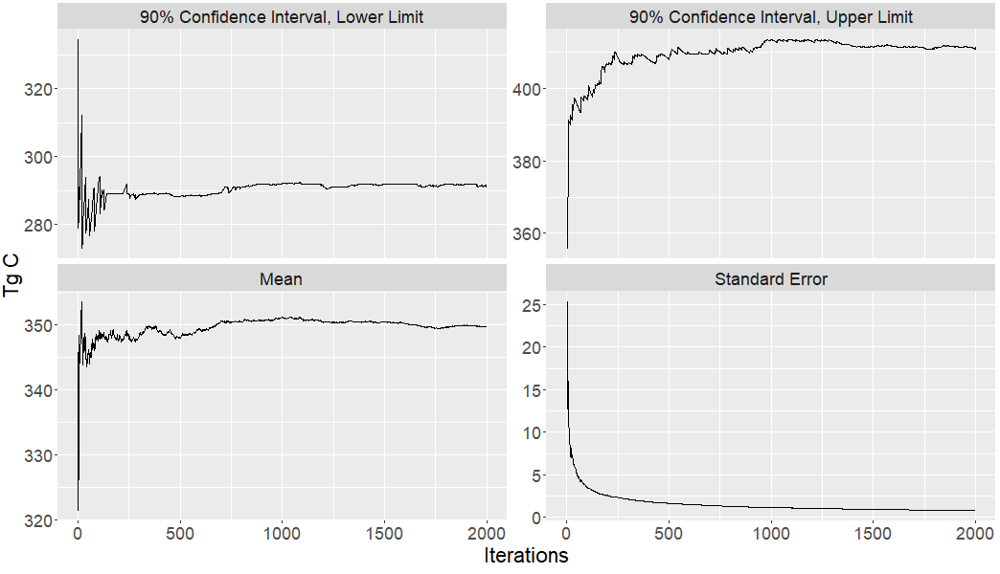

--- 
title: "Harvested Wood Products Carbon Model, Version R Documentation"
author: "| Jeremy Groom, Ph.D.\n| Groom Analytics, LLC \n| \n| Nadia Tase\n| California Department of Forestry and Fire Protection\n"
date: "`r paste('Date:',format(Sys.Date(), '%B %d, %Y'))`"
output: pdf_document
site: bookdown::bookdown_site
documentclass: book
classoption: openany
bibliography:
- book.bib
- packages.bib
description: "This HWP vR documentation was written in bookdown.  \nThe HTML output
  format for this document is bookdown::gitbook,\nset in the _output.yml file.\n"
link-citations: yes
github-repo: jeremygroom/HWP-vR-Documentation
language: "en"
lang: "en"
header-includes:
- \usepackage[fontsize=12pt]{scrextend}
- \usepackage{titling}
- \pretitle{\begin{center}\vspace{5cm}\LARGE}
- \posttitle{\end{center}}
- \preauthor{\begin{center}\vspace{1.5cm}\Large\textit}
- \postauthor{\end{center}}
- \predate{\begin{center}\vspace{1cm}\Large\textit}

---

```{r libraries, echo = FALSE, warning=FALSE}
library(readr)
library(kableExtra)


```


# Summary       {#sum}

The Harvested Wood Products (HWP) model calculates cumulative HWP carbon stocks and emissions using the [Tier 3 Production Approach](https://www.ipcc-nggip.iges.or.jp/public/2006gl/pdf/4_Volume4/V4_04_Ch4_Forest_Land.pdf) carbon estimation guidelines developed by the [Intergovernmental Panel on Climate Change](https://www.ipcc.ch/).  It is a deterministic model which relies on optional and required user-supplied information.  The model estimation methods are described in @stockmann2012.  There have been several builds of the model, originally created by the U.S. Forest Service (USFS), on platforms including Microsoft Excel and C++. Through partnership with the California Department of Forestry and Fire Protection (CAL FIRE), Oregon Department of Forestry (ODF) and Groom Analytics LLC, this version of the tool (deemed HWP-C vR) builds from the previous USFS versions on the R [@R-base] platform, for use in their state-level harvested wood product carbon inventories.  Another USFS effort is currently underway to construct an interactive version of the model in Python.  This version (HWP-C vR) is not intended to compete with or contradict the original or ongoing USFS work, but rather complement the work by being available in a different platform and coding language. This version also includes new data visualizations.    

Here we describe the HWP-C vR build of the model based on data from the U.S. west coast states of California, Oregon, and Washington.  Users may explore California and Oregon data via the [R Shiny web application](https://groomanalyticsllc.shinyapps.io/HWP-C-vR/).  Users from any state or ownership may also upload their own data onto the app, run their data through the HWP model and associated Monte Carlo simulation, view and interact with figures, and download figures and tables.    

Alternatively, users may access the full Shiny app R code as well as a stand-alone version of the R code for HWP model implementation. The stand-alone version allows users the opportunity to step through the code more easily, save intermediate outputs (i.e., arrays) for hand-calculation of outcomes, and alter the code to meet their own data needs.  Both versions allow users to download or generate the final output tables necessary to recreate figures to their own specifications.   

This document describes the model and structure of the code, explains how to generate input files, and provides instruction on accessing the code. 


## Acknowledgements    {#sum-ack}
Many thanks to Nadia Tase (California Department of Forestry and Fire Protection - CAL FIRE) and Andrew Yost (Oregon Department of Forestry - ODF) for supporting the development of this work through feedback, discussion, and their own efforts to dive into the code and understand the model at its core.  Jimmy Kagan (Oregon State University's Institute for Natural Resources) and Amanda Reynolds (CAL FIRE) provided administrative support.  This work would not be possible without the original work completed by Nate Anderson (United States Forest Service - USFS), Keith Stockmann (USFS), Dan Loeffler (University of Montana), and others. The information and feedback they shared has been invaluable.  Feedback and support for an earlier iteration of the R-version of the model from Todd Morgan (University of Montana, Bureau of Business and Economic Research) has also been indespensible.  

This project was funded by the California Department of Forestry and Fire Protection Purchase Order 3540-0000277546.  Earlier work on the project was funded by the Oregon Department of Forestry and supported by the Institute for Natural Resources, Oregon State University.  

## Abbreviations      {#sum-abb}

The following description uses many acronyms for brevity.  Here is a list of the most common:

BBF: Billion Board Feet     
BF: Board Feet       
BLM: Bureau of Land Management    
CCF: Hundred Cubic Feet      
CF: Cubic Feet    
DEC: Discard Energy Capture   
EEC: Emitted with Energy Capture   
EUR: End-use Product Ratios   
EWOEC: Emitted without Energy Capture   
HWP: Harvested Wood Products   
IPCC: Intergovernmental Panel on Climate Change  
MBF: Thousand Board Feet)   
MMT C: Million Metric Tons of Carbon       
MT: Metric Tons     
PIU; Products in Use   
PPR: Primary Product Ratios   
SWDS: Solid Waste Disposal Sites   
Tg C: Teragrams of Carbon: Tg C   
Tg CO2e: Teragrams of Carbon Dioxide Equivalent   
TPO: Timber Product Output   
TPR: Timber Product Ratios   
USFS: United States Forest Service   


A note about units for carbon:  
Publications from the United States have frequently described carbon storage and emissions using the metric million metric tons carbon, or MMT C.  We are using the equivalent metric, teragrams of carbon (Tg C) in the HWP model and this manual to align with common scientific reporting units.  Additionally, though the tool provides estimates for carbon emissions in both units of carbon and carbon dioxide equivalents, these estimates are for the biogenic carbon content in the wood only, and do not include other carbon-based greenhouse gas emissions with different global warming potentials, such as methane.  
  


 
```{r include=FALSE}
# automatically create a bib database for R packages
#knitr::write_bib(c(
#  .packages(), 'bookdown', 'knitr', 'rmarkdown', 'lhs', 'shiny'#, 'renv'
#), 'packages.bib')
```

<!--chapter:end:index.Rmd-->

# Introduction  {#int}

## Structure of this document {#int-struc}

We wish to provide users with a document that will enable users to step into the HWP-C vR model to the degree that they find comfortable and useful.  This could range from manipulating pre-loaded California and Oregon data from the web app to downloading all of the code onto their machine and modifying it to their purposes.  We laid out the sections to reflect this progression.

* Chapter \@ref(sum): This section provides a brief overview of the model, a list of abbreviations, an explanation of units used, and acknowledgements.  
* This chapter (Chapter \@ref(int)): Here we provide some background on the model including a bit of history and a description of how it functions.  We also discuss some of the model's assumptions and future work.  

The next three sections describe options for interacting with the model in progressively technical ways:  

* Option 1: Chapter \@ref(app). Basic - Users can explore and view pre-laoded HWP C data in the R Shiny web application.   
    + Users can view a, interact with, and download a variety of graphical outputs from the California and Oregon default data sets  and manipulate the figures to a degree.
    + Outputs that can be viewed in or downloaded from the web application are described in section 5.7.  
* Option 2: Chapter \@ref(own).  Intermediate - Users can provide their own data to run in the R Shiny web application to generate HWP C estimates.
    + Users can use the full functionality of the app on their own data, including generating HWP carbon storage and emissions estimates, producing, viewing, and downloading the same sorts of figures, and runing the Monte Carlo uncertainty analysis.  
    + This is a good option for users that would like to produce their own results but are unfamiliar with R or R Studio.
* Option 3: Chapter \@ref(dnld).  Advanced - Users can download the Shiny web application and R code to run the model on to their own computer.  
    + Allows the user to run the Shiny web app locally on their own machine.  
    + Also allows the user to operate the stand-alone version of the model using the R code in R or R Studio without needing to rely on the web app.
    + Users can use existing datasets for California, Oregon, and Washington or provide their own input datasets to generate cumulative estimates of harvested wood product carbon storage and emissions.

Chapter \@ref(model) describes in detail the operation of the HWP-C vR model as well as the Monte Carlo simulation.  Chapter \@ref(ft) contains frequently asked questions and troubleshooting advice. Following Chapter \@ref(ft) is the bibliography.  Although each HTML chapter contains a bibliography, the PDF version only has this final bibliography section.


## General purpose and utility of the HWP C model    {#int-purp}

The HWP C model was originally created for U.S. Forest Service (USFS) National Forest System Regional HWP carbon inventories, and later modified for state-level inventories in California, Oregon and Washington. The history of this model is described in more detail in Section \@ref(int-hist). The current iteration of this model supports state-level carbon inventories but could be used by any jurisdiction or landowner.   

This HWP C model (and associated visualizations) is a long-term accounting tool for carbon emissions and storage from harvested wood products. Users can easily understand how harvest levels have changed over time, by ownership and in total. Given changes in disposal methods and the assumed lifetime use of wood products, users can examine what proportion of harvested wood products remain in use, in disposal sites, or as biogenic carbon emitted to the atmosphere.   

The model may also be useful for planners and decision-makers to explore hypothetical wood utilization scenarios and understand the long-term storage and emissions consequences of differing harvest levels or promoting wood products with different use lifespans.  


## General description of the HWP C model    {#int-gen}

An overview schematic of the HWP model is provided in Figure \@ref(fig:overview-fig). The model estimates cumulative HWP carbon stocks and emissions from current and historic harvests using the [Tier 3 Production Approach](https://www.ipcc-nggip.iges.or.jp/public/2006gl/pdf/4_Volume4/V4_04_Ch4_Forest_Land.pdf) carbon estimation guidelines developed by the [Intergovernmental Panel on Climate Change](https://www.ipcc.ch/).  For each year of consideration, the model allocates annual harvest volumes in thousand board feet (MBF) to timber products (e.g., sawlogs, non-sawtimber, pulpwood, fuelwood, etc.) and primary products (e.g., lumber, plywood, panels, pulp, etc.) using timber product ratios (TPR) and primary product ratios (PPR). Total harvest volumes or volumes partitioned by ownership can be analyzed. Conversion factors are used to convert harvest volumes in thousand board feet (MBF) to cubic foot (CF) volumes. Primary product volumes in cubic feet are then converted to units of carbon using conversions from @smith2006. Primary products are then distributed to end-uses using ratios (EUR) from @mckeever2009 and @mckeever2011, such as lumber in single family homes versus lumber in packaging and shipping materials. The carbon associated with primary products in each end-use comprises the “products in use” (PIU pool) HWP carbon pool. Approximately 8% of the carbon immediately enters discard pathways to reflect a loss factor when primary products enter the PIU pool. Each end-use has a different functional lifespan, or half-life, which determines the amount and rate at which harvested wood products are retired from the PIU pool to various discard pathways each year.   

Retired HWPs are transferred to a solid waste disposal site (SWDS), recycled, composted, or burned with or without energy capture using discard disposition ratios. Discard emissions pathways with immediate oxidation include discarded products that are burned (with or without energy capture) or composted. Discard storage pathways include products that are recycled (products re-enter the in-use pool) or disposed into landfills and dumps, which comprise the SWDS pool. The landfill fixed carbon ratio determines the portion of carbon that remains permanently inert in the anaerobic environment of landfills. Decay half-lives are applied to carbon in dumps and the decaying portion in landfills of the SWDS pool to determine the quantity and rate at which carbon is emitted from this pool. All data sources for harvest volumes, timber and primary product ratios, board foot to cubic foot volume conversions, primary product volume to carbon conversions, loss factors, the distribution of HWPs to end-uses, the functional life span of wood products, distribution of HWPs to the various disposal pathways, landfill fixed carbon ratios and decay half-lives are provided in the individual state-level reports (e.g., @loeffler2019, @morgan2021, @nichols2020), and are also described in Section \@ref(own-prov-input). 

With each year of harvest more carbon enters the cycle. Some carbon is immediately oxidized as fuelwood, enters the products in use pool, or is discarded immediately. However, some carbon from the previous harvest year can remain stored as carbon in products in use, dumps, landfills, or recovered products, while some is emitted through decay from dumps, the decaying portion of landfills, compost, or waste incineration.  The model provides cumulative carbon storage and emissions for all harvest years analyzed. All carbon emission estimates from this model are for the biogenic carbon content of the harvested wood only and do not include emissions in the form of other carbon-containing greenhouse gasses such as methane. Intermediate outputs (i.e., arrays) and some figures allow users to explore outputs from single harvest years.  

Lastly, the model provides a Monte Carlo analysis of uncertainty in the estimates for carbon stored in both the PIU and SWDS pools and both pools combined, as well as carbon emitted with or without energy capture. 


```{r overview-fig, echo = FALSE, fig.cap = "General schematic for calculations to quantify HWP storage and emissions, based on Figure 7 in Stockmann et al. 2012.  Note that in this version Compost is not connected to SWDS, an arrow to SWDS has been added for emissions from Recovered, and that the code calculates end-use C distribution in one step after organizing TPO, PPR, EUR, and conversion factors.", fig.asp = 0.7, fig.width= 6, out.width = '100%'}
knitr::include_graphics("images/OverviewModelSchematic.png")
```


## HWP model assumptions    {#int-assump}

The HWP model follows the IPCC Production Approach for carbon estimation; therefore, HWPs exported from the area of analysis are included but imported HWPs are excluded. In this way, the model is closed and tracks only carbon harvested within a specified area. Therefore, at a state level, carbon storage in and emissions from HWP consumed within the state boundaries may be greater than expected from timber harvested within the state if the state imports timber or timber products. Currently, the model assumes timber or timber products exported to other jurisdictions or countries experience the same utilization parameters, disposal rates and pathways, and decay processes as those of the area of analysis. For example, California-origin harvest that is exported is subject to California parameters. If exported wood experiences different utilization parameters, disposal rates and pathways, or decay processes, results could be erroneous. The potential magnitude of errors depends on both the overall quantity exported as well as the magnitude of differences in the parameters. 

The model relies on many different data types. The model assumes that all underlying datasets, such as harvested timber volume and ratios such as timber product ratios (TPR), primary product ratios (PPR), end-use product ratios (EUR), discard ratios, end-use product half-lives, and decay rates are valid. Citations for all datasets are provided; however, there is inherently some level of uncertainty in the precision or accuracy of the datasets as they rely on a number of other analyses, datasets, are in areas of active research, are provided at national or international scales rather than local or regional, or have not been updated recently. Sections \@ref(own-prov-input-harvest) – \@ref(own-prov-input-discHL) describe in more detail the scale and sources of these datasets and when they were last updated.  The model results can be expected to be precise or accurate to the extent the underlying datasets are precise and accurate. 

The model also provides certain pathways, such as for recycling or disposal to landfills. These pathways are assumed to adequately represent reality. In the model, recycling is represented through a simplified process where a portion of PIU are recycled once and then subject to a single, very short half-life. In reality, products may be recycled multiple times into potentially long-lived uses. The representation of recycling in this model may result in an underestimation of the amount of recycling and continued storage of carbon in PIU that occurs and an overestimation of recycled products emissions. Similarly, PIU disposed to landfills enter a generic landfill pool with a single landfill decay rate, whereas in reality there are many types of landfills with varying landfill decay rates. Additionally, when primary products enter the PIU pool, the loss factor is currently only applied to solid wood products. However, literature supports a loss factor for paper as well [@skog1998]. Though paper is already a short lived product, this may result in an overestimation of emissions earlier than they might otherwise occur in reality. Several other pathways and processes in the model exist that have an unknown set of implications depending on how closely they mimic reality. For example, the model represents decay through a first order decay function while other decay functions may be more appropriate. The model also omits certain pathways that may result in additional carbon storage and emissions associated with harvested wood. For example, in some jurisdictions substantial bark utilization occurs. While bark is not considered a harvested wood product from an IPCC roundwood source [@buendia2019] and is rather considered a byproduct, utilization of this material typically results in additional fuelwood emissions.  @ipcc2014 recognizes that there are other sources of feedstock for commodities besides industrial roundwood or wood pulp and encourages countries to use country-specific data. In this way, it may be important for states like California where bark is utilized for energy production [@marcille2020] to consider additional measures to account for bark utilization. It is a goal to add functionality to estimate carbon storage and emissions associated with bark utilization to subsequent versions of this model.

The Monte Carlo analysis attempts to explore the range of possible outcomes given different levels of certainty in the data. There are potential limitations to the Monte Carlo analysis itself. As the degree of uncertainty has not currently been quantified for most datasets, uncertainty parameters have been provided for each variable based on expert opinion. Additionally, the Monte Carlo analysis takes a specific approach towards varying the ratios, constraining all ratios to sum to one. Given the selected range of possible values for each variable, the resulting randomly selected values may not be independent from one another and may be unintentionally biased. That is, within a ratio type that must sum to one and for a particular model iteration, if one value is randomly selected to equal 1.0, the remaining values for that ratio set must equal 0 (see Section \@ref(model-mc-res)). Lastly, the Monte Carlo analysis does not include a parameter for the accuracy of the processes and pathways represented in the model as a whole, for example, how recycling, or landfill disposal, or decay is represented. 

Currently, the model does not estimate emissions for other carbon-based greenhouse gases. For example, it does not differentiate between carbon in landfills that is emitted as methane vs. CO$_2$. Methane is a much more potent greenhouse gas than CO$_2$, albeit with a shorter residence time. Consequently, greenhouse emissions associated with HWPs are likely much higher than the estimates based only on the carbon-content of wood provided by this model. Though landfill methane emissions would be accounted in the IPCC Waste sector, this information is still valuable for determining the potential climate benefits, impacts and mitigation opportunities associated with HWPs.

For a full discussion on the underlying data sets, sources, represented HWP pathways and processes, and potential limitations, and implications, please refer to @lucey202X. 

Finally, this model does not include any method for overall model validation. Estimates for individual, underlying datasets feeding into the model, or certain pathways and processes can still be improved. But, like all models, the HWP model simplifies reality and hopefully provides users with useful insight by tracking and summarizing complicated calculation outputs in a reasonable way.


## Model history   {#int-hist}

The HWP model began as an Excel macro originally created by the U.S. Forest Service (USFS) to estimate an HWP carbon inventory for the Northern Region of the National Forest System [@stockmann2012; @anderson2013].  The Excel version was updated to one programmed in C++ for the remaining USFS Regional HWP carbon inventories (USFS HWP-C; e.g., @butler2014nw, @loeffler2014sr, @stockmann2014imr).  The model was then modified in 2017 by the USFS for use in the California Forest Ecosystem and Harvested Wood Product Carbon Inventory [@loeffler2019] and is given the label here as the CA USFS HWP-C variant.  This history is depicted in Figure \@ref(fig:hist-fig). Though names for the USFS versions of the model did not exist, they are given here for clarifying purposes. However, in 2020 when Oregon and California were trying to establish or update HWP C inventories, no version of the HWP C model was available publicly, as the USFS’s hosting partner’s server expired and older coding languages used in previous iterations of the model were no longer operational and being updated.     

Building from the previous USFS-led versions of the model, Groom Analytics LLC undertook programming the model in R for the Oregon Department of Forestry (ODF) and California Department of Forestry and Fire Protection (CAL FIRE), and subsequently deployed the R version as a [web application](https://groomanalyticsllc.shinyapps.io/HWP-C-vR/).  This version of the model (HWP-C vR) described in this document largely functions the same as the original USFS Excel-based model and the v1 tool.   A few changes exist and are described more fully in Christensen et al. [-@christensen2020; -@christensen2021]. These  changes include:  

* Modification of lag times built in the original tool, in order to allow users to more easily verify calculations.  
*	The CA USFS HWP-C variant of the tool used for the state-level inventory in California was not coded correctly to perform the uncertainty analysis. This tool has established a new Monte Carlo simulation that has succeeded in introducing variability into the HWP C estimates.  

The USFS is currently updating their original tool, including the improvements made in the CA USFS HWP-C variant, with public availability expected in 2022/2023. This version (HWP-C vR) is not intended to compete with or contradict the original or ongoing USFS work, but rather complement the original work by being available in a different platform and coding language. This version also includes new data visualizations.     


```{r hist-fig, echo = FALSE, fig.cap = "Schematic of the HWP model development pathway.  The version described here is the state-led HWP-C vR variant.", fig.asp = 0.7, fig.width= 6, out.width = '100%'}
knitr::include_graphics("images/ModelHistory.png")
```


## Future work    {#int-future}

HWP carbon estimation is an area of active research. Efforts currently underway to improve the functionality of this model include adding new data visualizations and improving upon existing ones. Efforts to provide a module to estimate carbon storage and emissions associated with bark utilization is also being explored.   

Other directly related research underway at the University of Massachusetts explores the representation of landfill disposal pathways in the model, estimation of landfill methane emissions, improvements to the recycling pathway, and improvements to disposal parameters specifically for California, with the hope of expanding these improvements more generally in the model. 

Users can improve the model’s utility by researching and altering model input datasets with their own regional information.  Updates and improvements to underlying international, national and regional or local datasets should be explored.

<!--chapter:end:01-intro.Rmd-->

# Option 1: Basic use of the R Shiny web application   {#app}

## Interacting with the HWP-C vR model  {#app-sum}

There are two approaches available to users for interacting with the HWP model.  The first way is to use the web application.  Users can view a variety of graphical outputs from the California and Oregon data sets and manipulate the figures to a degree (this chapter).  Users can also upload their own data (Chapter \@ref(own)), run the HWP-C vR model, and view the results using the same suite of figures.  Users can also download the model to their computer (Chapter \@ref(dnld)).  This option allows them to run the web app locally on their own machine.  It also lets them operate a stand-alone version of the model, which is a code-based environment that does not produce the web app.  

## Basic web interactivity – Shiny app   {#app-shiny}

The [web site](https://groomanalyticsllc.shinyapps.io/HWP-C-vR/) allows users to switch between two pre-loaded data sets, California and Oregon state-wide timber harvests.  The menu bar on the left also has some drop-down plotting and data upload options.  Plots include displays of **timber harvest summaries**, **harvested wood product carbon storage and emissions estimates**, and **Monte Carlo simulation** results.  

The app was designed to aid users by providing figures that could usefully be incorporated into reports.  To that end, all figures can be saved (with one exception) and the title for each figure can be customized.  

Below we describe the figures and options within each menu category

### Homepage {#app-shiny-home}
The only figure for the app homepage (**Home**) is an original drawing by Dr. Groom's child, Farren Groom.  This page offers a brief overview of the web app.

### Timber harvest summary figures    {#app-shiny-timber}
The three figure options under Timber Harvest Summaries are **Annual Timber Harvest**, **Fate of Harvest Carbon**, and **Harvest by Functional Lifespan**.  

*	**Annual Timber Harvest** shows the volume of harvest by year and ownership.  Users can toggle between seeing annual or cumulative versions of total harvest volumes, ownership volumes, or both simultaneously.  As in all figures, users can select seeing results by Tg C or Tg CO$_2$e.  This figure additionally allows users to see results by BBF.  Results can be displayed by the year or cumulatively over time.  

*	**Fate of Harvest Carbon**.  This tab has two figures, a Sankey diagram and a more static figure to the lower right.  The Sankey diagram depicts the fate, over time, of harvested carbon from a single year. In the bottom left portion of the screen, the user selects the harvest date of interest and the years post-harvest to track the fate of carbon in the system.  Users can, by mouse, manipulate the location of the vertical bars associated with the fate of the harvested carbon.  Mouse-overs of the diagram will also reveal the amount of carbon (Tg C / Tg CO$_2$e) in pools or transitioning to pools.  The same data are displayed in the lower-right figure, with the figure displaying over time the residence of carbon in different pools and emissions categories. The vertical line depicts the data slice displayed in the Sankey diagram.  The Sankey diagram’s html code can be downloaded but cannot be saved as a pdf (the stand-alone version of the model can provide a PNG-savable version).  The lower-right figure may be saved as a PNG file.  

* **Harvest by Functional Lifespan**.  The HWP model has different half-lives for products in use.  This figure bins the annual volume of harvest sent to different end use products by their associated half-lives.  Half-life groupings for “short,” “medium,” and “long” lifespan categories were determined through expert opinion in the Canadian Forest Service, the British Columbia Ministry of Forests, the California Department of Forestry and Fire Protection, the Oregon Department of Forestry, and the University of Montana Bureau of Business and Economic Research. The figure displays values by either the harvest volume or proportion of total harvest.  

### Carbon Storage and Emissions figures     {#app-shiny-cse}  
These four figures, under the Carbon Storage and Emissions menu option, track the size of pools and emissions categories in Tg C or Tg CO$_2$e over time.   

*	**Carbon Storage by Ownership**.  If harvest data by ownership are available, the figure plots the amount of carbon stored in products in use and SWDS.  Users can select which ownership values are displayed along with whether to display products in use data, SWDS data, or both.  
*	**Carbon Storage and Emissions**.  This selection allows viewers to access three similar figures of cumulative carbon states over time.  All three allow users to view any combination of products in use, SWDS, and emissions categories.
    +	Summary Pool and Emission Categories: This figure displays general storage (products in use, SWDS) and emissions (emissions with energy capture, emission without energy capture).
    +	Pool and emission category components: This figure allows users to visualize emissions (eg., fuelwood, landfill decay, etc.) and storage (e.g., products in use, landfill stock subject to decay, etc.) pool components.
    +	Pools and emissions by halflife category:  Storage and emissions categories are displayed by the contribution of immediate oxidation, short, medium, or long-lasting uses.  
* **Annual Net Change in Carbon Storage**.  These figures display annual change in stocks (products in use, SWDS; IPCC Production Approach – stock change) or net balance (annual harvest, and annual emissions with and without energy capture; IPCC Simple Decay approach - net balance). The option to add a “net” line displays the sum of the annual change in the products in use and SWDS storage pools. For the “IPCC Simple Decay approach - net balance” figure, the “net” line is comprised of the annual harvest minus the annual emissions equal the change in products in use plus SWDS.  The text accompanying this figure in the app explains the figure in greater depth.    

* **Monte Carlo Estimates**.  Two of these three figures display mean cumulative values from the Monte Carlo simulations with 90% confidence intervals.    
    +	Cumulative carbon in individual storage and emission pools: There are separate results for Emitted with Energy Capture, Emitted without Energy Capture, Products in Use, and Solid Waste Disposal Sites.   
    +	Cumulative carbon in storage pools combined (Products in use + SWDS): This figure sums the products in use + SWDS values within each iteration of the Monte Carlo and provides the mean plus 90% confidence interval.   
    +	Monte Carlo convergence evaluation: This figure displays sequential iteration results for the final year of the Monte Carlo simulation.  It shows values for the 5th and 95th percentiles of values (i.e., the boundaries of the 90% confidence intervals), the value for the mean and standard error (se) over time.  If Monte Carlo values appear unstable, more iterations may be needed to arrive at reasonable values. If they appeared to stabilize long before the final iteration, then the Monte Carlo may provide reliable results with fewer iterations.    

### Documentation and Data Upload     {#app-doc}
These items provide users with links to this documentation, which in turn describes aspects of the web application, the workings of the HWP model, and how users can upload their own data and download the source code.    

*	Documentation: The link to this document, which in turn describes aspects of the web application, the workings of the HWP tool, and how users can upload their own data and download the source code.

* Files and code: This is a link to the model's GitHub site where users can view and download code, including code for the app and the stand-alone version of the HWP-C vR model, along with other files.  For more about the site and ways to download the files, see Chapter \@ref(dnld).

*	Data Templates: Users can download a compressed folder containing existing data files for California, Oregon, and Washington, as well as USFS regional input data templates (these lie within the GitHub site) that users can alter when preparing their own data for entry into the Shiny app (see Section \@ref(own-prov-temp)) or stand-alone model version.  Or, once the users have downloaded the template files, they can load provided versions of the Oregon and California data sets, or even a data set for Washington state (see the Try It! box in Section \@ref(own-shiny)).  

*	Upload Data: This selection allows users to load their own Excel file of data, verify that the file is formatted completely, and run the model.  Once the model is run, the upper left “**Select a data set**” option will have a third option; namely, the **user's new data set**.  All of the Shiny figures (except for the Monte Carlo Estimates selection) will plot the new data accordingly.  The user must run the Monte Carlo separately from the page to populate the Monte Carlo figures with their data.  The Monte Carlo simulation is run separately because it may take a few minutes to run.  For details on preparing and uploading your own data, see Chapter \@ref(own).    

<!--chapter:end:02-run-app.Rmd-->

# Option 2: Upload and run your own data in the web application {#own}

## Overview      {#own-over}

Users may import their own data into the Shiny web application and have the application run the HWP model and Monte Carlo simulation using the template data input file which consists of several worksheets containing individual datasets. The user must supply annual timber harvest volumes in thousand board feet (MBF) by ownership and annual timber product ratios (TPR) that allocate harvest to different timber product classes. If the user has the data, it is also ideal for them to supply the annual primary product ratios (PPR) that allocate timber products to different primary products and residue uses. However, if the user does not have these data they can rely on defaults provided for California, Oregon, Washington, or the U.S. regions developed in @smith2006. The user may rely on the defaults provided for the remaining datasets, though advanced users may supply their own values if desired. Details for all input data template file worksheets and datasets are provided in this chapter. 

Once the user has built their own input file for the harvest years of interest, the file can be uploaded to the Shiny web application (or read by the stand-alone version of the model; see Section \@ref(dnld-sa)).  A quality assurance (QA) check verifies that the data are correctly compiled.  Once this is done, the application can display the user’s data and the user can download figures and tables of model output.  Through Option 3 (Chapter \@ref(dnld)) the stand-alone model version can provide arrays and tables of model output.  

An input data set resides in a single MS Excel workbook (`.xlsx` extension).  The Excel file has many worksheets, described below.  Provided examples and templates may be modified by the user to construct their own data input file to import into the web application.  Sections \@ref(app-doc) and \@ref(dnld-files) describe how to access example and template files.  Users can customize the operation and outputs of the HWP C tool in the first worksheet of the input data template file. 

There are many values that the user should consider altering based on regionally available and historic mill data, dump and landfill decomposition information, etc.  At a minimum users can provide yearly values of total harvested thousand board feet from their region or study area, alter the rest of the worksheets to reflect their year values, and make use of all other available values from one of the examples or templates. 

### Data inputs   {#own-over-inputSum}
This section provides an overview of the types of data users can or need to provide.  These types of data are generally represented by worksheets in the template Excel files, and the worksheets are described in greater detail (including references) in Section \@ref(own-prov-input).  We anticipate that most users will provide three key datasets:  

* **Annual harvest data** – user provided (Section \@ref(own-prov-input-harvest).     
* **Timber products ratios (TPR)** – user provided (Section \@ref(own-prov-input-tpr)).   
* **Primary products ratios (PPR)** – best if user provides; defaults available (Section \@ref(own-prov-input-ppr)).  

Advanced users may consider adjusting the remaining datasets that further refine model estimates of carbon storage in HWP.   

* **Board feet (BF) to cubic feet (CF) volume conversion factors** – Values specific to California, Oregon and Washington are provided in their respective data files. Regional templates provided with the original USFS HWP C tool contain the same set of conversions for all regions; the template defaults were last updated through 2007 and no datasource was provided, although values appear to match values developed for the California inventory provided with the original USFS HWP C tool. Recommended values from USFS Regional HWP C reports are provided in the templates; if using regional templates, users must decide which values to use. Ideally, users provide valkues derived from local or regional datasets and users updat the values whenever mill surveys are completed (Section \@ref(own-prov-input-bfcf)).  Harvest inputs in units of thousand board feet (MBF) are converted to board feet (BF), to which these ratios are then applied, with a final calculation in the code to convert from cubic feet (CF) to hundred cubic feet (CCF).

* **Yearly end-use product ratios** – National dataset last updated through 2009. Unnecessary for user to modify these ratios unless the national dataset is updated or users want to explore hypothetical wood utilization scenarios (Section \@ref(own-prov-input-eur)).   

* **Ratio categories** – Unnecessary for the user to update unless the number of timber product, primary product, or end-use categories change either due to updated data or for wood utilization scenario exploration (Section \@ref(own-prov-input-rc)).   

* **Primary product CCF to carbon conversion factors** – National conversion factors last updated in 2005. Unnecessary for the user to update unless the national conversion factors are updated or local/regional factors are developed based on the harvest species mix in the area of analysis (Section \@ref(own-prov-input-ccfMTC)).     

* **End-use product half-lives** – National dataset. Unnecessary for the user to update unless the national datasets are updated or the user wants to explore hypothetical changes to the functional lifespan of products (Section \@ref(own-prov-input-euhl)).   

* **Discarded products disposition ratios** – National dataset last updated in 2005. Unnecessary for the user to update unless the national dataset is updated, data is developed at the regional or local level, or the user wants to explore hypothetical scenarios (Section \@ref(own-prov-input-discFates)).   The national dataset is in the process of being updated with more recent data [@usepa2020] to cover the period from 2005-2020.   

* **Ratios for discarded wood and paper burned with energy capture** – Currently no data identified, defaults set to 0. Unnecessary to update unless national, regional, or local data is identified to develop this ratio or the user wants to explore hypothetical scenarios (Section \@ref(own-prov-input-discFates) and the "Try it!" box in Section \@ref(own-shiny)).   

* **Discarded products disposition half-lives and landfill fixed carbon ratios** – International datasets. Unnecessary for the user to update unless international datasets are updated or national, local, or regional data is identified, or the user wants to explore hypothetical scenarios. *Please note, current defaults for landfill fixed carbon ratios have not been updated to the current IPCC 2019 refinement defaults* (Section \@ref(own-prov-input-discHL)).  

* **Monte Carlo distribution parameters** – Unnecessary to update unless the user has more details on the range of uncertainty for various parameters used in HWP carbon estimation (Section \@ref(own-prov-input-mc)).   

* **Loss Factor** – This parameter is specified within the larger HWP_TOOL_OPTIONS worksheet (see Section \@ref(own-prov-input-options)). National default. Unnecessary to update, though user may want to explore different loss factors. Currently the tool only applies the loss factor to solid wood products, though literature supports a loss factor for paper.   

References for sources for all listed datasets are provided in the individual descriptions of each dataset below in Section \@ref(own-prov).    

Users that wish to update results from this tool annually must ensure that as new annual harvest data is added, an additional year(s) of data for all other worksheets within the template file are added. This step may be completed manually within each worksheet, or through the stand-alone R code which will automatically add the correct number of years to each worksheet.  See Section \@ref(dnld-add) for more details. For the model to run correctly, all datasets in each worksheet of the input template file must have the same number of years.   


## Providing your own data  {#own-prov}

### Select the template files {#own-prov-temp}

The `HWP Data/Templates/` folder contains several United States based templates to work from.  These templates were derived from those offered with the USFS HWP v1 tool, see Section \@ref(int-hist).  Each subfolder contains a different template, and Figure \@ref(fig:template-map-fig) describes the geographic range for each template.  Note that these geographic regions were determined by @smith2006 and differ slightly from U.S. Forest Service regions.    

The `HWP Data/ExistingData/` folder contains the California, Washington, and Oregon data sets along with other supporting data sets (generally modifications of the California or Oregon data).  The California, Washington, and Oregon data sets can additionally serve as templates.  All templates have the same information for end use ratios, cubic foot to metric tons of carbon conversion values, end use half-lives, discard ratios, discard half-lives, and Monte Carlo parameters.    

```{r template-map-fig, echo = FALSE, fig.cap = "Definition of regions: Pacific Northwest, West (PWW); Pacific Northwest, East (PWE); Pacific Southwest (PSW); Rocky Mountain, North (RMN); Rocky Mountain, South (RMS); Northern Prairie States (NPS); Northern Lake States (NLS); Northeast (NE); South Central (SC); and Southeast (SE).  Note that regions are merged for some template files, these combinations include: NLS and NPS as North Central, RMN and RMS as Rocky Mountain; and RMN, RMSE, PWE and PSW as West. Source: Smith et al. (2006)", fig.asp = 0.7, fig.width= 6, out.width = '100%'}
knitr::include_graphics("images/regions_map.png")
```

Each template lacks harvest data and timber product ratios.  The user must provide these.  We recommend searching for references similar to the citations listed in the section above to revise or verify given values.  The `Natl_datasets` folder contains a (U.S.) national template that additionally lacks primary product ratios and the board foot to cubic foot conversion factors.  The other original templates based on @smith2006 geographic regions each have a unique primary products ratios data sheet (except for the Pacific Southwest which shares values with the California input file) that rely on @smith2006 which in turn depends on information from @adams2006, and therefore are likely based on mill surveys updated through 2005 at the latest. We urge users to consider carefully whether they want to use these included values. These ratios, as can be seen, are constant across years. This is not the case for the California, Oregon, or Washington data sets which contain a more detailed set of primary product ratios that vary through time based on literature documenting historic and current wood utilization. If the user has the resources to construct more detailed primary product ratios for the area of analysis, that is ideal.     

Generic board foot to cubic foot volume conversions are provided in the original regional templates that are the same for each region. These values are only updated to 2007 and it is unclear what the data source is for these values, though they appear to match the values developed for the California inventory.  We urge users to consider carefully whether they want to use these included values. It is recommended instead that, in the absence of user-provided data for these values, users choose the board foot to cubic foot volume conversion provided in the appropriate U.S. Forest Service Regional HWP C report (D. Loeffler and K. Stockmann, personal communication, September 16, 2022). Some regions used in this model overlap more than one U.S. Forest Service region, as noted above. The original values and the recommended values for each state within the model region are provided as notes within each template. Users must decide which value to use and populate the necessary fields in the template themselves.   

We urge users to inspect the details and datasources provided in Section \@ref(own-prov-input) for each input parameter in the templates and decide whether they want to use the included values, provide their own values, or search for updated datasets.  

When using a template to construct a data set, users may need to adjust yearly ranges or values in any of the worksheets that come before or after the target year values.  **In other words, all datasets in each worksheet of the template file must have the same number of years.**  For instance, the California harvest data begins in 1952.  If I used the Pacific Southwest template I would need to remove pre-1952 columns from the worksheets TimberProdRatios, PrimaryProdRatios, EndUseRatios, and DiscardFates, and adjust values on other worksheets.  Section \@ref(own-prov-input) can be used as a checklist to ensure the right changes are made to input data templates.


### Creation of the input file      {#own-prov-input}  
This explanation may work best if the user opens example files, such as CA_Inputs_HWP_Model.xlsx or Oregon_Inputs_HWP_Model.xlsx, and examines the files while reading the description of each worksheet.   

#### Model options   {#own-prov-input-options}  

Worksheet name: HWP_TOOL_OPTIONS  

The first worksheet in the input data template file, HWP_MODEL_OPTIONS, allows the user to customize the operation and output of the HWP model. The values in this worksheet affect the operation of the stand-alone model and/or the Shiny application.  Asterisks indicate options that all users should adjust if using the Shiny web application and/or the stand-alone version of the model, with the remainder as optional to adjust for advanced users:  

* \*DATASET.NAME (string): This value only affects the Shiny web application.  This name will appear as an option in the upper-left pulldown menu in the application.  Avoid using the names "California" or "Oregon" as the application is pre-loaded with these datasets and it will be difficult to distinguish these from the user’s dataset.    

* \*QA_TEST (TRUE, FALSE) – This value only affects the stand-alone model.  The default is TRUE.  If TRUE, the stand-alone code will complete the QA check of the input data file and examine all worksheets except HWP_MODEL_OPTIONS to ensure the input file is set up with the correct number of years and types of values in all worksheets.  See Section \@ref(own-qa) below.  If FALSE, the code will skip the QA step and attempt to load the worksheets without examining them.  Little system time is needed to conduct the QA test.   

* OUTPUT_ARRAYS (TRUE, FALSE) – This value only affects the stand-alone model.  If users would like the program to produce the analysis arrays so that they can trouble-shoot model issues or verify calculations, this value should be set to TRUE (default). Otherwise, FALSE.   There is a noticeable time  savings in code execution when this value is set to FALSE.    

* OUTPUT_TABLES (TRUE, FALSE) – This value only affects the stand-alone model.  This option allows users to select whether the code produces output tables for the base HWP analysis.  Default = TRUE.  

* SHIFTYEAR (TRUE, FALSE) – Affects both the Shiny web application and stand-alone model.  If the user wants tabular and figure outputs of emissions and pools reported as occurring the year after harvest as in the original USFS variants of the tool, this value should be TRUE.  If the user wants those outputs reported as occurring during the same year as harvest, select FALSE.  Note that outputs for intermediate arrays are not year-shifted.   

* PIU.WOOD.LOSS (Double, 0.00 to 1.00) – Affects both the Shiny web application and stand-alone model.  The current estimated loss factor specifying the quantity of carbon that is immediately discarded when solid wood products are placed into end-uses and enter the PIU pool is 0.08, or 8%.  The default value is set to 0.08; enter a different value if you wish to alter the amount.  The value cannot exceed 1.0 or fall below 0.  For reference, @skog2000 also cite a value of 5% for paper. 

* PIU.PAPER.LOSS (Double, 0.00 to 1.00) – Affects both the Shiny web application and stand-alone model.  Our default loss factor specifying the quantity of carbon that is immediately discarded when pulp wood products (paper) are placed into end-uses and enter the PIU pool is set to 0.0; enter a different value if you wish to alter the amount.  The value cannot exceed 1.0 or fall below 0.  

* ARRAYLOC (Text) – This value only affects the stand-alone model.  The default value is "HWP_Stand_Alone_Files/Arrays/".  If you wish to save arrays to a different folder, change the folder location value.  If you are using Windows, be sure to use the forward slash "/" between folder levels and not the back slash.  

* TABLELOC (Text) – This value only affects the stand-alone model.  The default value is "HWP_Stand_Alone_Files/Tables/".  If you wish to save tables to a different folder, change the folder location value.  If you are using Windows, be sure to use the forward slash "/" between folder levels and not the back slash.  

* \*RUN.MC (TRUE, FALSE) – This value only affects the stand-alone model.  If you would like to run the Monte Carlo simulation on your data set, ensure that this value is TRUE.  The main model code will run and then verify that this value is TRUE, at which time it will source the Monte Carlo R code and run it.  Note: running the Monte Carlo simulation is very time consuming.  Set this option to FALSE if you are running the stand-alone model and are not currently interested in the Monte Carlo output.    

* R (Numeric, between 0 to 1) – Affects both the Shiny web application and stand-alone model.  This value is the target Pearson’s correlation coefficient that will be used to correlate triangular distribution values in the Monte Carlo.  For instance, if the worksheet MonteCarloDistrParameters has three accuracy values for Harvest, depending on the year of harvest, the value for R will determine how correlated the three random draws are that are used to adjust the Harvest values for each iteration.   The default is 0.5, as was used in @stockmann2012.  

* OPT.START.VALUE (Numeric, between 0 and 1) – Affects both the Shiny web application and stand-alone model.  The MonteCarloDistrParameters states minimum and maximum 90% Confidence Intervals from which the Monte Carlo random variables are to be drawn.  However, when we transform random uniform values into values from a triangular distribution, we need to know the triangular distribution endpoints.  In the Monte Carlo code, the function "ab.boundaries.fcn" performs a search algorithm to find the triangular distribution end points given the confidence intervals provided in the MonteCarloDistrParameters worksheet.  The default start value for the algorithm is 0.5 and likely does not need to be altered for the Monte Carlo code to function adequately.  

* \*N.ITER (Integer, 1 or greater) – Affects both the Shiny web application and stand-alone model.  This value determines the number of iterations the Monte Carlo performs.  In the Shiny application, the Monte Carlo Estimates selection "Monte Carlo convergence estimation" produces convergence plots that track estimates for the last year examined in the model.  The plot shows the values for the mean, standard error, and 95% and 5% Confidence Intervals given the iterations performed.  Of the four, the Mean is most informative.  If the line is stable for many iterations (we seem to obtain fairly stable results with 2000 iterations) then you likely have a sufficient number of iterations.  The more iterations, the slower the code will run.  Too few iterations will provide unreliable results.  The default value is currently 100 runs which is likely too few but is sufficient to verify that the process works.  1000 to 2000 might be a recommended number for obtaining reliable estimates.  

* MC.ARRAY.OUT (TRUE, FALSE) – This value only affects the stand-alone model.  If TRUE, the Monte Carlo code will generate the (large) Microsoft Excel workbook MC_All.xlsx that contains all MMTC values for each year and each iteration of the Monte Carlo code.  There is a separate tab for Emitted with Energy Capture (eec), Emitted Without Energy Capture (ewoec), Solid Waste Disposal Sites carbon (swdsC), and Products in Use (pu).  The default is TRUE; if it is FALSE the code will run a bit faster and the large (~10 MB?) file will not be produced.  The file is provided for model assessment purposes.    


#### Harvest   {#own-prov-input-harvest} 

Worksheet name: HARV_MBF  

The worksheet Harvest_MBF contains a time series of total yearly harvest values in thousand board feet (MBF).  Annual harvest time series are provided for California, Oregon and Washington. Otherwise, *this worksheet must be populated by the user*.  The user may choose to analyze an entire historic annual harvest time series dataset or only a subset of years. Analyzing a different number of years will provide a different picture of trends in storage and emissions than modeling the entire period. This is due both to the annual harvest quantities and utilization and disposal parameters, which vary over time.

The yearly harvest is the total annual harvest from the region or owner of interest, entered in MBF.  The left column must contain the heading "Year" and have years listed in sequential order from least to greatest.  Ownership columns may follow, with a final column entitled "Total" that must equal the ownership values.  Users may omit all but the Year and Total columns.  Users may have ownership values appear at some point after the first year of total harvest values; however, leave the ownership cells prior to the first year of ownership values blank and not filled with zeros.  The QA check sums the values to determine if they equal the total value, so a series of zeros obviously will cause the QA check to fail.

Data sources used for California timber harvest include @bolsinger1976, [BLM Bureau Wide Timber Data](https://www.blm.gov/programs/natural-resources/forests-and-woodlands/timber-sales/bureau-wide-timber-data), @morgan2004, @morgan2012, @mciver2015, [USFS Cut-and-Sold-Reports](https://www.fs.fed.us/forestmanagement/products/cut-sold/index.shtml), and @warren2005.  Specific data sources for Oregon and Washington annual harvest time series are provided in @morgan2021 and @nichols2020.

#### BF to CF conversion factors  {#own-prov-input-bfcf} 
Worksheet name: BFCF  

The worksheet BFCF contains the conversion factors between board feet and cubic feet for various time periods. Additional calculations are completed in the R code to account for harvest volumes being provided in thousand board feet (MBF) and subsequent model calculations occurring on units of hundred cubic feet (CCF).  Factors used to convert BF to CF vary by time and place. Conversions are based on Scribner log scale rather than lumber scale rules.   

Generic conversions are provided in the original regional templates that are the same for each region. These values are only updated to 2007 and it is unclear what the data source is for these values. We urge users to consider carefully whether they want to use these included values. It is recommended instead, that in the absence of user-provided data for these values, users choose the BF to CF volume conversion provided in the appropriate U.S. Forest Service Regional HWP C report (D. Loeffler and K. Stockmann, personal communication, September 16, 2022). Note that there is only a single value provided for the entire time series. Some regions used in this model overlap more than one U.S. Forest Service region, as noted above. The original values and the recommended values for each state within the model region are provided as notes within each template. Users must decide which value to use and populate the necessary fields in the template themselves.  Ideally the user provides local or regional values and updates the values whenever relevant mill surveys are completed. 

The user may choose to change these conversion factors  when mill surveys are updated or if more detailed information is available by region spanning any given time series.  There are only three columns, Conversion, StartYear, and EndYear to specify the conversion value and the starting and ending year of harvest data the conversion applies to.  Ensure that the first Start Year begins with the minimum Harvest_MBF Year and that conversion time periods do not overlap.  When mill surveys are completed, ratios are applied from the year of the latest survey backwards to the last survey (note that in the WA template, ratios are applied from the year of the latest survey *forwards* to the next survey). For example, the BF to CF ratio from the California mill survey for 2012 is applied from 2012 backwards to 2007, as the previous mill survey was completed in 2006. The most recent California mill survey for 2016 results in a BF to CF ratio applied from 2016 backwards to 2013. This ratio is also applied forwards to the present until a new mill survey is completed and this ratio can be updated for 2017 forward. The final end year must be the same as the final year annual harvest data is provided for in the worksheet named "Harvest_MBF." The Conversion column values are formatted as doubles and StartYear and EndYear values are integers.  

Data sources for CA/USFS Pacific Southwest region ratios were obtained from @keegan2010 (1952 – 1989), @morgan2004 (1990 – 2000), @morgan2012 (2001 – 2006), @mciver2015 (2007 – 2016), and @marcille2020 (2013-present).  Specific data sources for Oregon and Washington annual harvest time series are provided in @morgan2021 and @nichols2020.  

Default BF to CF conversion factors provided for the rest of the U.S. from the original USFS HWP C version of the tool only exist up to 2007 and are extrapolated beyond 2007.  Additionally, this data set's data sources are unclear.  The recommended regional defaults provided in each template were obtained from the following U.S. Forest Service Regional HWP C reports: @butler2014nw,  @butler2014sw, @loeffler2014er, @loeffler2014sr, @stockmann2014nr, @stockmann2014imr, @stockmann2014rmr 

#### Timber Product Ratios   {#own-prov-input-tpr}  

Worksheet name: TimberProdRatios  

The worksheet TimberProdRatios contain the timber product ratios, or TPR.  The yearly timber product ratios represent the portion of the annual harvest that is classified as specific timber products, such as sawtimber, pulpwood, posts, and fuelwood.  Default TPRs are provided for California, Oregon and Washington. **Otherwise, this worksheet must be populated by the user**.   

The first column must be TimberProductID, which is a numerical identifier of the timber product category name. Timber product category names are specified in the worksheet named "RatioCategories" (Section \@ref(own-prov-input-rc)).  The remainder of the columns are named after the sequential years of harvest data, from the earliest year to the final year.  The number of years in this dataset must match the number of years annual harvest data is provided for in the worksheet named "Harvest_MBF".  All year-column values must sum to one.  Row values may change over time.  When mill surveys are completed, ratios are applied from the year of the latest survey backwards to the last survey (note that in the WA template, ratios are applied from the year of the latest survey *forwards* to the next survey). Most recent available records may also need to be extended forwards if data for recent years of analysis do not yet exist. For example, the TPRs from the California mill survey for 2012 is applied from 2012 backwards to 2007, as the previous mill survey was completed in 2006. The most recent California mill survey for 2016 results in a set of TPRs applied from 2016 backwards to 2013. This ratio is also applied forwards to the present until a new mill survey is completed and this ratio can be updated for 2017 forward. 

Data sources for California TPR and PPR include @barrette1970, @hiserote1978, @howard1974, @marcille2020, @mciver2015, @morgan2004, @morgan2012, @ward1995, and @ward1997. The original model templates for the nine US regions (see Figure \@ref(fig:template-map-fig)) rely on @smith2006 which in turn depends on information from @adams2006, and therefore are likely based on mill surveys updated through 2005 at the latest.   


#### Primary Product Ratios   {#own-prov-input-ppr}

Worksheet name: PrimaryProdRatios  

The worksheet PrimaryProdRatios contain the primary product ratios, or PPR.  The yearly primary products ratios represent the portion of each yearly timber product that is used in specific primary products, such as lumber, wood pulp, plywood, and fuelwood.  Default PPRs are provided for California, Oregon and Washington, as well as the defaults from the original USFS version of the tool for the nine US regions (see Figure \@ref(fig:template-map-fig)). Default PPRs for the nine US regions are constant across the years, whereas the California, Oregon and Washington PPRs contain a more detailed set of primary product ratios that vary through time based on literature documenting historic and current wood utilization. **Otherwise, this worksheet must be populated by the user**. If the user has the resources to construct more detailed primary product ratios for the area of analysis, that is ideal.  The first column in the worksheet must be PrimaryProductID, which is a numerical identifier of the primary product category name. Primary product category names are specified in the worksheet named "RatioCategories" (Section \@ref(own-prov-input-rc)).  The remainder of the columns are named after the sequential years of harvest data, from the earliest year to the final year.  The number of years in this dataset must match the number of years annual harvest data is provided for in the worksheet named "Harvest_MBF".  All year-column values must sum to the number of TPR rows (e.g., 40 TPR categories for California and Oregon data).  Sets of PPR ratios sum to 1; most sets include only one ratio. For instance, California and Oregon data set PPR IDs 1-7, 8-14, 15-21, and 22-28 sum to 1. Row values may change over time.    

Note that sets of PPRs did not sum to 1 in some of the original regional templates. In some cases, these values were off by hundredths or thousandths and were manually updated. These rows are highlighted in yellow and comments are provided in the cells of the templates where these manual adjustments were made. In other cases some PPR set values were set to 0, likely because in those regions (i.e., PNW-E, Rocky Mountain, West) the timber product associated with those primary products did not exist (e.g., timber product hardwood sawtimber or hardwood pulpwood). However, in this case the TPRs should be set to 0 rather than the PPRs. For the model code to run correctly, the PPR sets must sum to 1. Where the discrepancy existed, these values were manually updated. These worksheets are highlighted in red and comments are provided in the cells of the templates where these manual adjustments were made.    

Data sources for California TPR and PPR include @barrette1970, @hiserote1978, @howard1974, @marcille2020, @mciver2015, @morgan2004, @morgan2012, @ward1995, and @ward1997. The original model templates for NFS Region 9 rely on @smith2006 which in turn depends on information from @adams2006, and therefore are likely based on mill surveys updated through 2005 at the latest.   


#### End Use Ratios   {#own-prov-input-eur}

Worksheet name: EndUseRatios  

The worksheet EndUseRatios contains end use ratios, or EUR.  End-use product ratios determine the annual distribution of primary wood products, such as lumber and non-structural panels, to end-uses, such as single family new housing and furniture manufacturing.  These ratios determine the end-use each primary product is associated with. The end-use is important to know because it will determine the time the carbon remains in the PIU pool prior to discard based on end-use product half-lives discussed in Section \@ref(own-prov-input-euhl).  National default EURs are provided. It is unnecessary for the user to modify these ratios unless the national dataset is updated or users want to explore hypothetical wood utilization scenarios.  

The distribution of each primary product among end-uses must sum to 1.0. The program will only work if each primary products end-use distribution sums to 1.0. The first column must be EndUseID, which is a numerical identifier for the end-use category name. End-use category names are specified in the worksheet named "RatioCategories" (Section \@ref(own-prov-input-rc)).  The remainder of the columns are named after the sequential years of harvest data, from the earliest year to the final year.  The number of years in this dataset must match the number of years annual harvest data is provided for in the worksheet named "Harvest_MBF".  All year-column values must sum to the number of PPR rows.  Row values may change over time.  *Currently values for the last year for which data are available (2009) are applied forward for all subsequent years to the present. However, 2009 was in the tail end of the Great Recession and may not be representative of more recent years. Users may want to use EURs from a year just prior to the recession, such as 2006, for more recent analysis years.  On the other hand, using 2006 EUR values would not reflect the changes in milling opportunities that may have occurred after the recession.*.  

National end-use ratios were obtained from @mckeever2009 and @mckeever2011 and were last updated through 2009.  

#### Ratio Categories  {#own-prov-input-rc}  

Worksheet name: RatioCategories  

The worksheet RatioCategories acts as a link between TPR, PPR, and EUR categories specified numerically in the TPR, PPR and EUR worksheets.  The first three column labels, TimberProductID, PrimaryProductID, and EndUseID, must have the same names as the respective first columns of the previous three worksheets described.  The fourth through sixth column names are TimberProduct, PrimaryProduct, and EndUseProduct, and contain text describing what the categories contain.  Note that EndUseProduct is a subcategory of PrimaryProduct, and PrimaryProduct is a subcategory of TimberProduct.  The R code ignores columns 4 through 6; they are there for assisting users in identifying row values.   The user does not need to change these values unless they change the number of TPR, PPR, and/or EUR categories.  It is unnecessary for the user to update these categories unless the number of timber product, primary product, or end-use categories change either due to updated data or for hypothetical wood utilization scenario exploration.  

#### CCF to metric tons carbon  {#own-prov-input-ccfMTC}

Worksheet name: CCF_MT_Conversion

The worksheet CCF_MT_Conversion contains factors to convert CCF volumes of individual primary products to metric tons of carbon. National default values are provided. These factors were last updated in 2005. It is unnecessary for the user to update these values unless the national conversion factors are updated or local/regional factors are developed based on the harvest species mix in the area of analysis.   

The first column title must be PrimaryProductID, and the second column CCFtoMTconv.  The first column values must be integers and include all primary product ratio categories.  

The conversion factors were obtained from @smith2006 and @skog2008.  

#### End-use product half-lives    {#own-prov-input-euhl}

Worksheet: EU_HalfLives  

End-use product half-life values express the decay rate at which carbon in the products in use category passes into the Discarded Products category.  National default values are provided. It is unnecessary for the user to update these values unless the national conversion factors are updated or the user wants to explore hypothetical changes to the functional lifespan of products. The user may choose to change any half-life of the 224 primary product end-uses. The user may alter as few or as many half-lives as desired. Increasing end-use half-lives will result in carbon storage in the Products in Use pool for a longer time period, while decreasing half-lives will pass those end-use products into the Discarded Products category at a faster rate. It is unclear if or how often the end-use half life values should be updated.  

The worksheet EU_HalfLives contains half-life values (in years) for each of the end use categories.  The first column must be titled EndUseID, the second EU_HalfLife.  The values for EndUseID must be integers and include all end use ratio categories.  

References for end-use product half-lives are listed in and were obtained from @smith2006.  In turn, @smith2006 cites @skog1998, @skog2000 (which is identical to @skog1998), and @row1996.  Not all end-use half-lives used in the tool appear to have published half-lives. Some half-lives used for one product category were assumed to be sufficient for others that lacked data. A forthcoming general technical report from the USFS documents these apparent assumptions [@lucey202X].    

#### Discard products disposition ratios  {#own-prov-input-discFates}

Worksheet name: DiscardFates  

In any given inventory year wood and paper from every single vintage year passes from the Products in Use pool into the Discarded Products category. The worksheet DiscardFates contains values that apportions discarded carbon to different discard categories: DEC = Discard Energy Capture, BWoEC = Burned Without Energy Capture, Recovered, Composted, Landfills, and Dumps.  Paper (defined by the code as primary products where the column EndUseProduct in the worksheet RatioCategories contains the word "pulp") and solid wood products are allowed to have different discard ratio values.  The first two columns must be named DiscardType and DiscardDestination.  The remainder of the column titles are the years, in order, from longest ago to most recent.  The number of years in this dataset must match the number of years annual harvest data is provided for in the worksheet named "Harvest_MBF".   The sum of each year-column should be two (all wood and all paper values within a column should sum to one).  Row values may change over time.

All default wood and paper products discarded disposition ratios were obtained from @skog2008.  These data represent a (U.S.) nationwide dataset that has not been updated since 2005.  These data could be updated, from either national databases or local/regional datasets from relevant waste characterization studies.  @skog2008 cites HWP dump and landfill data from @freed2004 which is an unpublished spreadsheet that made use of data from @epa2006, @melosi1982, and @melosi1999.   It is unnecessary for the user to update unless the national dataset is updated, data is developed at the regional or local level for relevant waste characterization studies, or the user wants to explore hypothetical scenarios. The national data set is in the process of being updated with more recent data (i.e., @usepa2020) to cover the period from 2005-2020.  The user may alter as few or as many discard ratios as desired. Altering ratios can affect the quantity of HWPs that are emitted with and without energy capture at the end of their functional lifespan.  

It should be noted that some of the HWP discarded into the SWDS may be burned for disposal in a boiler with energy capture (DEC; e.g., a trash incinerator). The proportion (values between 0 and 1) of discarded HWP with energy capture (DEC) guides what portion of discarded HWP is burned for energy capture for every year of the time series. There are no default proportions in the model; or rather, the default is 0. Values used for the DEC rows must be between 0 and 1 (e.g., 0.5 = 50% discarded wood is burned with energy capture). Adjusting proportions affect only HWP that have been discarded and is not related to the fuelwood component of HWP.  Currently, we only provide a test data set (CA_DiscardEnergyCapture_Test.xlsx, see Section \@ref(dnld-files)) that includes DEC proportions.   Users could update the values with national or regional waste characterization or other waste disposal data.  


#### Discarded products disposition half-lives and landfill fixed ratios {#own-prov-input-discHL}

Worksheet name: Discard_HalfLives  

Discarded products disposition half-lives are the half-lives of wood and paper, which vary between landfills, dumps, and recovered (recycled) products. These values determine the quantity and rate HWPs are emitted with and without energy capture at the end of their functional lifespan. The worksheet Discard_HalfLives provides half-life values in years for paper and wood in dumps (Dumps), recovered products (Recovered), and the decaying portion of landfills (Landfills_decay).   A single value is provided for each category.  It also, possibly confusingly, includes values for the proportion of wood and paper that end up in the non-decaying portion of landfills (Landfills_fixed).  The columns must be labeled Type, Dumps, Landfills_fixed, Landfills_decay, and Recovered.    

Discard ratios and landfill fixed carbon ratios are provided based on national or international defaults. It is unnecessary for the user to update the defaults unless international or national datasets are updated, local/regional data is identified, or the user wants to explore hypothetical scenarios.   

The user may choose to change any half-life of wood and paper products that are in landfills, dumps, or recovered (recycled) as well as the landfill fixed ratios. The user may alter as few or as many half-lives as desired. Increasing half-lives will result in slower carbon decay and will increase the recalcitrance time of carbon in Solid Waste Disposal Sites (SWDS). Decreasing half-lives will result in faster carbon decay and will decrease the recalcitrance time of carbon in SWDS. Increasing the landfill fixed carbon ratios will increase the amount of carbon that is not subject to decay and therefore decrease landfill emissions. Decreasing these ratios would have the opposite effect. *Please note, current defaults for landfill fixed carbon ratios have not been updated in the templates to the current, higher IPCC 2019 refinement defaults [@buendia2019].  The next state-level inventories for Oregon and California will reflect these updated values.*  

Data sources for Landfill, dumps, and recovered (recycled) wood and paper half-lives are listed in @skog2008.   Information for dumps in @skog2008 cites Table 5.7 in @penman2000.  For landfills, @skog2008 cites Table 3.4 in @buendia2019.  For recovered products @skog2008 cites @pingoud2006.  

However, the value in @pingoud2006 is not what was included in the original USFS versions of the tool and the value that was included appears to match the paper half-life presented in @smith2006.  

For the landfill fixed carbon ratio information, @skog2008 which cites @freed2003 who in turn use data from @barlaz1998 and @eleazer1997.  Users may choose to update the ratios using information provided in the 2019 IPCC refinement [@ruter2019]. 

#### Monte Carlo values {#own-prov-input-mc}

Worksheet name: MonteCarloValues  

The worksheet MonteCarloValues allows users to define how much variation to introduce into the HWP model for the Monte Carlo simulation.  The outcomes of the simulation are summarized as statistical confidence intervals for carbon storage (PIU, SWDS pools, and both pools combined) and carbon emissions (with and without energy capture). This worksheet also allows the user  to specify aspects of the Monte Carlo that they would like to control.  The worksheet needs to be altered to conform to the user’s data structure for the Monte Carlo to run.  That is, if users have data from 1970 – 2018, they will need to change First_Year and Last_Year values for some of the rows.  Default distributions were obtained from @stockmann2012.  It is  unnecessary to change the defaults unless the user has more details on the range of uncertainty for the various parameters used in HWP carbon estimation.  Users can change First_Year, Last_Year, MinCI, MaxCI, and CI values. They may add or delete rows for Harvest, TimberProdRatios, and PrimaryProdRatios.  Each row of the worksheet represents a vector of random draws, with one random draw per iteration.  If our model had 100 iterations and this worksheet had 20 rows, the R script will obtain 2000 random uniform draws between zero and one, 100 random values per row.  (Please use more than 100 iterations for your final runs.)  The R script will change these values to triangular distributions with a peak at 1.0 (column Peak Value) and lower and upper confidence intervals as defined by the columns MinCI and MaxCI.  The resulting random numbers for a given parameter (row) will have values that are above or below 1.0.  In general, the parameter values associated with each of the parameters are multiplied by the random number for a single iteration.  If the random number is 0.86, the parameter value will be reduced to 86% of its original size.  Below we describe each of the columns and column values in this worksheet.  

* Parameter_ID: This column is included for the user’s information; the R script does not rely upon it.  Each of the parameters to be altered is listed here.  Some parameters (namely, those after Parameter ID number 13) may have more than one set of random numbers generated for it.  For instance, if we wish for Harvest values to be modeled as becoming more accurate through time, reflecting improvements in reporting and data collection, we may wish to indicate three periods of years with increasing estimate precision.  A series of random numbers will be drawn for each of the time periods, and then correlated (see above).  Within an iteration, this example would have three correlated random numbers that would be used for the three periods of years.  The parameter ID for Harvest would be the same number repeated three times (14, 14, 14).    
* Parameter_Name: The column name, "Parameter Name", is not used by the code.  However, the column values are names for specific parameters that are used by the code.  These must remain unchanged.  The names can be repeated as necessary (following on the example for Parameter ID, Parameter ID 14, 14, 14 would be associated with Parameter Name "Harvest", "Harvest", "Harvest").  Below are descriptions of which parameters and worksheets each relates to:  

    + CCFtoMTC: This name translates as "hundred cubic feet converted to metric tons carbon".  Each Monte Carlo iteration will alter the conversion values associated with the worksheet CCF_MT_Conversion to reflect the level of uncertainty in the primary product volume to carbon conversion factors.    
    
    + EndUse_HalfLives: Each Monte Carlo iteration’s random number for this parameter will adjust the end use half life values found in EU_halflives to reflect the level of uncertainty in the end-use half-lives.   
    
    + EndUseRatios: This variable refers to the end use ratio values found in the worksheet EndUseRatios.  Each iteration of the Monte Carlo will use one random value to change the end use ratio values.  See the discussion of the "Sum-To-One Constraint" in Section \@ref(model-mc-samphwp) to understand how the values are altered.   This is designed to reflect the uncertainty in the end-use ratios.   
    
    + DiscardedDispositionRatios, Paper: There are two rows in the Parameter Name column with the name DiscardedDispositionsRatios.  The adjacent column, "Paper", indicates whether these disposition ratios are for paper (1) or wood (0). The disposition ratios are from the worksheet DiscardFates.  They determine what fraction of paper or wood enter the categories of Discard Energy Capture, Burned Without Energy Capture, Recovered, Composted, Landfills, or Dumps.  Like End Use Ratios, these ratios are subject to the sum-to-one constraint.  Each Monte Carlo iteration alters the values of the discard ratios.  
    
    + LandfillDecayLimits: The wood and paper values represent the landfill decay limits, or the proportion of landfill material that is subject to decay.  The values are obtained from the worksheet Discard_HalfLives.  The adjacent column, “Paper”, indicates whether these disposition ratios are for paper (1) or wood (0). Each Monte Carlo iteration alters the values of the landfill fixed carbon ratios.  
    
    + Landfill_HalfLives, Dump_HalfLives, Recovered_HalfLives: The six rows with these parameter names are associated with wood and paper decomposition half-lives for materials subject to decay in landfills, dumps, and in recovered products.  The values are obtained from the worksheet Discard_HalfLives.    The adjacent column, “Paper”, indicates whether these disposition ratios are for paper (1) or wood (0). Each Monte Carlo iteration alters the values of these decay ratios. 
    
    + Harvest: This parameter references the cubic-foot volume amounts harvested each year.  The values are originally provided as board feet from the worksheet Harvest_MBF, but they are transformed to unis of CCF in the original (non-Monte Carlo) portion of the analysis and the transformed values are used in the Monte Carlo.  Each Monte Carlo iteration alters the values of the annual harvest volume estimates. There may be more than one row labeled as Harvest, reflecting different accuracies to be used for different year-ranges.    
    
    + TimberProdRatios: Like Harvest, there may be more than one entry for TimberProdRatios.  The original worksheet is TimberProdRatios.  Like EndUseRatios, a random value associated with a range of years will alter some, but not all, Timber Product Ratio values.  See the discussion of the "Sum-To-One Constraint" in Section \@ref(model-mc-samphwp).    Each Monte Carlo iteration alters the values of the timber product ratios.   
    
    + PrimaryProdRatios.  This type of parameter is altered much the same as TimberProdRatios and the original values may be found in the worksheet PrimaryProdRatios.  It too is subject to the "Sum-To-One Constraint".  Each Monte Carlo iteration alters the values of the primary product ratios.  
    
* Paper: As described above for DiscardedDispositionRatios and other parameters, some parameters represent paper (1) or wood (0) for their associated parameters.  

* First Year, Last Year: These are values that users must change.  The values in these columns represent the first year and last year of a given year period.  For instance, if our data set included harvest from 1906 to 2017 but we wanted to increase the precision of the Monte Carlo values in steps leading to the final year, then we need to indicate what years each level of precision refers to.  If only one level of precision is used, provide the first year of harvest (e.g., 1906) under the First Year column and the last year of harvest (2017) to the Last Year column. If there are three Harvest rows, we want the First Year to capture all beginning years for given year periods and Last Year to capture the terminal year.  For the first Harvest we might have First and Last Year values of 1906 and 1945, then in the second row the values 1946 and 1979, and finally the third row would contain a First Year of 1980 to 2017.   Crucially: the very first First Year must be the first year of your harvest values, whether for Harvest, TimberProdRatios, or PrimaryProdRatios.  There must not be overlap in years (e.g., if the first row had 1906 to 1945 and the next row had 1941 to 1955, the sets would overlap).  There must not be gaps (e.g., 1906 to 1945, then 1947 to 1955, leaving out 1946).  You do not have to have the same sets of years used among parameter types (e.g., Harvest year sets do not need to match TimberProdRatios year sets).  You do not need parameter types to have the same number of sets (Harvest could have two rows, PrimaryProdRatios could have three). You may have more or fewer than three year-sets per parameter type.   

* MinCI, Peak Value, MaxCI: As described above, these values are used to define the triangular distributions from which the random Monte Carlo values will be generated.  For these three columns, Peak Values should all be 1.0, with the MinCI and MaxCI symmetric around this value (the Monte Carlo code assumes symmetric triangular distributions).  That is, the MinCI and MaxCI must differ from the Peak Value by the same amount (e.g., MinCI = 0.85, Max CI = 1.15.  Both are 0.15 distant from 1.0).  The MinCI and MaxCI are the user-specified confidence intervals; e.g., the user states what they wish the confidence intervals should be around 1.0.    

* CI: This value allows the user to change what sort of a confidence interval is used. The default value is a 90% confidence interval, as was used in @stockmann2012.  The user could change this value to 0.95, or a 95% confidence interval.  This sort of adjustment will affect the spread of the triangular distribution, with a 90% confidence interval having a wider spread. 


 

## The quality assurance step  {#own-qa}

The Quality Assurance (QA) step is mandatory for data brought into the Shiny web application and optional for the stand-alone program (see above: QA_TEST = TRUE/FALSE).   The QA code, QA_Code_Shiny.r, assesses the imported Excel file data.  The QA step has over 55 checks it performs on the incoming data to help ensure that the program will run correctly.  As it runs through its checks, it populates the file Error_Report.csv in the QA folder with results.  It first verifies that it can load a worksheet and then conducts subsequent tests on it.  The code performs tasks such as verifying that column labels are correct and that years and TPR/PPR/EUR categories match among files.  If it finds an error, it will record a "1" in the Terminate column that matches the issue at hand and describe the problem in the Comments column.  If no problem is found the Comments column will indicate which checks it made and found correct.  A zero in the Comments column may be ignored.  If an error is found, the R session will terminate (stand-alone model) or an error message will be produced preventing further analysis (Shiny application). This is on purpose!  It prevents the code from attempting to proceed.  If termination occurs, check the error report to find out which worksheet was triggering the error and why.  Below we describe the attributes that are checked for each worksheet:

**All 10 worksheets**: The QA code verifies that each worksheet correctly loaded.  A misspelling of the worksheet name will trigger a terminal error.  
Havest_MBF:   

* The first and last column names must be \"Year\" and \"Total\".    
* Values are numeric.  
* The sum of ownership amounts must equal the sum of the total amounts.  These values can deviate from one another if a user saves the CSV file from an Excel file.  The decimal places may be lost with numbers rounded.  This rounding may cause ownership values to no longer sum to the Total amount.  Slight adjustments to the Total amount or an ownership category amount will be necessary to correct.   

**BFCF**:   

*	The first three column names must be \"Conversion\", \"StartYear\", and \"EndYear\".    
*	The final year value under Years must equal the last year value of Harvest_MBF.  
*	Values are numeric.  

**TimberProdRatios**:  

*	The number of TPR years equals the number of harvest years in Harvest_MBF.   
*	The year columns must be transformable to numeric values.  E.g., a text value of \"1952\" can become the integer 1952. A year column name such as \"X1952\" cannot be transformed into an integer, at least not with the code provided.   
*	The first column name must be \"TimberProductID\".  
*	The year columns must sum to 1.0.  
*	Table values are numeric.  

**PrimaryProdRatios**:  

*	The number of PPR years equals the number of harvest years in Harvest_MBF.  
*	The year columns must be transformable to numeric values.    
*	The first column name must be \"PrimaryProductID\".  
*	The year columns must sum to the number of Timber Product Ratios, the number of rows in TimberProductRatios.  
*	Table values are numeric.  

**CCF_MT_Conversion**:   

*	The two columns must be named \"PrimaryProductID\" and \"CCFtoMTconv\".  
*	The listed number of Primary Products matches the number in the file PrimaryProdRatios.  
*	Table values are numeric.   

**EndUseRatios**:  

*	The number of years for which there are End Use Ratios must match the number of harvest years.  
*	The year columns must be transformable to numeric values.    
*	The first column name must be \"EndUseID\".  
*	The year columns must sum to the number of Primary Product Ratios, the number of rows in PrimaryProdRatios.   
*	Table values are numeric.   

**RatioCategories**:   

*	The column names must be, in order, \"TimberProductID\", \"PrimaryProductID\", \"EndUseID\", \"TimberProduct\", \"PrimaryProduct\", \"EndUseProduct\".  
*	The word \"fuel\" must appear in some rows of column \"EndUseProduct\".  
*	The word \"pulp\" must appear in some rows of column \"EndUseProduct\".  
*	The number of Timber Product IDs must match the number in TimberProdRatios.  
*	The number of Primary Product IDs must match the number in PrimaryProdRatios.  
*	The number of End Use IDs must match the number in EndUseRatios.  

**EU_halflives**:  

*	The column names must be, in order, \"EndUseID\" and \"EU_HalfLife\".  
*	The number of EndUseID row numbers equals the number of rows in EndUseRatios.  
*	Table values are numeric.  

**DiscardFates**:  

*	The first two columns must be named \"DiscardType\" and \"DiscardDestination\".  
*	There must be the same number of years as in Harvest_MBF.    
*	The year column labels must be transformable to numeric values.  
*	Year column values must be numeric and sum to 2.0.    

**MonteCarloDistrParameters**:  

*	The column names must be, in order, \"Parameter_ID\", \"Parameter_Name\", \"Paper\", \"First_Year\", \"Last_Year\", \"MinCI\", \"Peak_Value\", \"MaxCI\", and \"CI\".   
*	The parameter names need to be labeled \"CCFtoMTC\", \"EndUse_HalfLives\", \"EndUseRatios\", \"DiscardedDispositionRatios\",  \"LandfillDecayLimits\", \"Landfill_HalfLives\", \"Dump_HalfLives\", \"Recovered_HalfLives\", \"Harvest\", \"TimberProdRatios\", and \"PrimaryProdRatios\".  Note that some row names can (and should) be duplicated as needed (see above).    
*	The values for the MinCI and MaxCI must be symmetric around 1.0.   
*	The parameters with multiple rows and First_Year/Last_Year values must have the years be in order and without overlap or gaps.   
*	The time series begins on the first year and the last year is within the final time series set.  
*	Table values aside from column Parameter_Name are numeric.   


## Uploading your data and running the model from the Shiny web app  {#own-shiny}

1. Once the user has created their data file, they can open the Shiny web app, either online or locally (see Running the Shiny App From Your Computer,  Section \@ref(dnld-shiny)), and navigate to the tab \"Upload Data\", under the navigation bar item Documentation and Data Upload.  

2. The user selects their Excel file by clicking the \"Browse\" button and navigating to their file and opening it.  The Shiny app will display the name chosen to represent the data set (DATASET.NAME, see above).   

3. The user then runs the QA procedure by clicking on the button \"Run data file quality assurance\".  

4. A button appears that allows the user to \"Download the QA output table\" and see what issues were found for the data set. If no errors are found, the user can move to the next step. 

5. The user then clicks on the button \"Run HWP Model\".  If the QA test failed, an error message will appear to that effect.  We recommend that the user download the QA output table to determine where the error occurred.  If the QA test was passed, the button should instead take a moment to process the data through the model, announce in Model Status that the model run was a success, and change the selected data set under the \"Select a data set\" option in the sidebar to the user’s uploaded data name.    

6. At this point the user can visit all figures in the Shiny application and view their data displayed in the figures.  They can also download tables summarizing the model run outputs by clicking on the now-appearing button \"Download HWP Tables\" on the right of the window.  


If the user only has Total harvest data (no ownership information) then certain figures will either not attempt to display ownership information or will provide pretty pictures instead.  Other figures will be unaffected.    

7. If the user wishes to run the Monte Carlo simulation, then once the HWP model has been run they click the \"Run Monte Carlo\" button.  A busy icon appears, letting the user know that the simulation is in progress.  The user is also informed of how long the simulation may take.  The Model Status box then has a message appear, \"Monte Carlo is complete!\".  At that point the user may download summary tables for the Monte Carlo.  The Monte Carlo Estimates tab under Carbon Storage and Emissions can now display the new simulation results.    

Note: If the user tried to view Monte Carlo simulation results after running the HWP model but before actually running the Monte Carlo simulation, they are presented with an image that explains that the Monte Carlo simulation data are not available.  If the user then runs the Monte Carlo simulation and returns to the Monte Carlo Estimates, the no-data image will remain until they switch to a previous data set (California or Oregon) and then back to their own data set.  At that time their Monte Carlo results should appear.  This feature may be improved in the future.

:::::: {.greybox data-latex=""}
::::: {.minipage data-latex="{.85\linewidth}"}
::: {.center data-latex=""}
**Try it!**
::: 

From the Shiny app, click on the Upload Data button.  

* To see the QA fail, navigate to `HWP Data\ModelExploration\bogus.xlsx` and select the file.  Run the QA.  
* To run data from the state of Washington, navigate to `HWP Data\ExistingData\WA_Inputs_HWP_Model.xlsx` and select the file.  
* Run the Monte Carlo simulation for the Washington data. 
* To see what happens when there is no ownership data, navigate to `HWP Data\ModelExploration\OR_no-owner.xlsx` and select the file.  Run the QA and then the HWP model.   
* To see how the Sankey diagram and other figures change if discarded products *were* burned for energy capture (DEC), navigate to the altered file 
`HWP Data\ModelExploration\CA_DiscardEnergyCapture_Test.xlsx` and select.  

:::::
::::::

## What to know about running the Monte Carlo simulation   {#own-mc}
As described above, there are several controls in the worksheet HWP_MODEL_OPTIONS.  You can set the number of iterations that you would like the Monte Carlo simulation to run.  You can also set the parameters R and OPT.START if you wish.   

If you would like to see the Monte Carlo array, which includes all estimates from all iterations, you will need to run the stand-alone version of the model and set MC.ARRAY.OUT to TRUE.   

If you are trying to get the model to run or are playing around with data loading and execution on the Shiny App or stand-alone, I recommend setting the number of iterations to something small like 100.  You may find that the Monte Carlo estimates really aren’t that far off of from the standard deterministic HWP model run.  A small number of iterations will prevent you from waiting for several minutes while the simulation runs.  Running the simulations for 1000 iterations may demonstrate a reasonable number to enter into the input Excel file.  When you are ready to obtain a \"final\" estimate you can increase the number of iterations to 1500, 2000, or more.    

If you have ratio values that are close to boundaries (e.g., 0.03 and 0.98), you may notice that confidence intervals do not appear symmetrical around your mean estimate.  Please see the Section \@ref(model-mc-res).  The Monte Carlo simulation is encountering a \"sum-to-one\" boundary constraint that is frequently forcing one ratio value to its boundary (e.g., 1.0) and subsequently setting all related ratios to their opposite boundaries (e.g., 0.0).  This can result in a less continuous range of outputs, affecting the distribution of results.    


## Generated Tables        {#own-tables}
Whether using the online or downloaded Shiny application  or the downloaded stand-alone model, the user can obtain the same sets of output tables from the HWP model and the Monte Carlo simulation.  Previous sections describe how to download or save the tables.  This section describes the tables and their contents.  

T1.0.Annual_Harvest.csv: This table provides harvest amounts by ownership + Total if ownership data are available, and just Total if not.  The data are provided as annual input amounts or as cumulative sums.  Finally, the harvest volume is provided in the following metrics: BBF, TgC, and TgCO$_2$e.  These data should allow users to generate the **Annual Timber Harvest** figure in the Shiny application.   

T2.0.Harvest_Halflives.csv: This table should allow the user to create the Shiny application figure **Harvest by Functional Lifespan**.  For all years it provides the amount or proportion (pct) of harvested timber destined for fates with different half-lives.  Results are given in TgC, TgCO$_2$e, and as a proportion (pct) of the total.  Fuel has no half-life as it is burned immediately.  Short, Medium, and Long-lived uses have half-lives of 1-6 years, 7 – 30 years, and 31 or more years, respectively.   

T3.0.Cumulative.Ownership.Storage.Emissions.csv: If the user data does not contain ownership information then this table is empty.  Otherwise, this table can be used to generate the figure **Carbon Storage by Ownership** from the Shiny application.  The table provides cumulative values for each ownership in TgC.  Columns are generated for EEC (\"\_eec\_\"), EWOEC (\"\_ewoec\_\"), PIU (\"\_pu\_\"), and SWDS (\"\_swds\_\").  The figure does not use the emissions categories, but they are provided for the user’s interest.    

T3.5.Cumulative.Ownership.Storage.Emissions_CO2e.csv: If the user data does not contain ownership information then this table is empty.  This table provides the same information as T3.0 but in TgCO$_2$e instead of TgC.    

T4.0.CumulativeStorageEmissions_summary.csv: This table provides the cumulative amount of carbon stored in PIU and SWDS pools as well as the cumulative amount of carbon emitted as EEC or EWOEC.  The units are TgC and TgCO$_2$e.  These data can be used to reconstruct the Shiny application figure **Carbon Storage and Emissions: Summary pool and emissions categories**.    

T4.5.CumulativeStorageEmissions_detail.csv: This table provides a detailed version of T4.0, again with cumulative values in TgC and TgCO$_2$e.  It breaks out the overall PIU into PIU and Recovered, SWDS into a non-decaying portion of the landfill (Landfill_fixed), a decaying portion of the landfill (Landfill_available), and dumps.  For emissions we have burned with energy capture (Fuelwood), emissions from dumps, landfills, and recovered products (DumpsEmit, LandfillEmit, RecoveredEmit), compost, and burned waste with and without energy capture (DiscardEnergyCapture, BurnNoCapture).  These data can be used to reconstruct the Shiny application figure **Carbon Storage and Emissions: Pool and emission category components**.   

T4.8.CumulativeStorageEmissions_halflives.csv:  These data can be used to reconstruct the Shiny application figure **Carbon Storage and Emissions: Pools and emissions by halflife category**.  Aside from the year column, columns in this table depict the amount of carbon (TgC, TgCO$_2$e) that resides in pools or has been cumulatively emitted from sources with different halflives.  SWDS (swds), PIU (pu), and EWOEC (E) are broken into their halflife category components, short, medium, and long (st, md, lng).  Since EEC (eec) represents fuel wood that was burned immediately, it has no halflife components.    

T5.0.AnnualStorageEmissionsChange.csv:  These data can be used to reconstruct the Shiny application figures found under **Annual Net Change in Carbon Storage**.  Values are in TgC and TgCO$_2$e.  We subtracted the value of one year’s SWDS, PIU, EWOEC, and EEC values from the previous to determine what the annual change was.  NetStockChange is the sum of the stock, or pool, values of SWDS and PIU.  The figure for \"IPCC production approach – stock change\" relies on SWDSchange, PIUchange, and NetStockChange values.  The figure \"IPCC simple decay approach = net balance\" relies on the columns Harvest/Harvest_CO2, EECchange, EWOECchange, and NetStockChange.  NetStockChange is the same line as appeared in the \"IPCC production approach – stock change\" figure.  The column Harvest is in TgC and Harvest_CO2 is in TgCO$_2$e.  The value given for harvest is the amount of harvest the year prior to the one listed under column Year.  The harvest column also equals the sum of the changes in SWDS, PIU, EWOEC, and EEC.     

MC_ComponentsSummary.csv: This table provides the information necessary to produce the figure **Monte Carlo Estimates: Cumulative carbon in individual storage and emissions pools**.  There are values for each year and pool/emission type (Column: Type.M) such as eec (Emitted with Energy Capture), ewoec (Emitted Without Energy Capture), swdsC (Solid Waste Disposal Sites) and pu (Products in Use).  The figure is constructed using Means (yellow line), lci, and uci (lower and upper 90% confidence intervals).  The Means are calculated by finding the mean value for an emission or pool type among iteration values for a given year.  The columns lci and uci represent lower and upper 90% confidence intervals, derived directly from the distribution of iteration values for the pool or emissions type from a given years.  The two columns pct_lci and pct_uci represent a percentage of the mean for the lower and upper confidence intervals.  Pct_lci = lci / Means; pct_uci = uci / Means.  The values in this table are cumulative MTC; the Shiny application transforms them to TgC and TgCO$_2$e.    

MC_PIU_Plus_SWDS.csv: This table provides the information necessary to produce the figure **Monte Carlo Estimates: Cumulative carbon in storage pools combined (Products in Use + SWDS)**.  The values units are cumulative MTC which the Shiny application transforms to TgC and TgCO$_2$e.  The column Mean represents the mean value of SWDS plus PIU values for a given year across iterations.  The columns lci and uci represent lower and upper 90% confidence intervals, derived directly from the distribution of iteration values for given years.    

MC_All.xlsx: This file is only produced by the stand-alone code if the user sets Run.MC = TRUE and MC.ARRAY.OUT = TRUE. The file has four worksheets: eec, ewoec, swdsC, and pu, representing EEC, EWOEC, SWDS, and PIU.  Each column is an iteration while each row is a year.  The data are in MTC.  The figure **Monte Carlo Estimates: Monte Carlo convergence evaluation** is created using the last year (last row) of the swdsC and pu worksheets.  The \"mean\" value is the successive means of the SWDS + PIU iteration values summed, starting with only the first column and adding columns to consideration (represented by the Iterations axis at the bottom of the figure).  The se, ci05, and ci95 columns are the estimated standard error and empirical 5% and 95% confidence intervals based on the number of iterations.  If the user specifies 2000 iterations over 100 years of harvest data the resulting Excel file can be tens of megabytes in size.  


<!--chapter:end:03-own-data.Rmd-->

# Option 3: Operating the model from your own machine   {#dnld}

The Shiny [@R-shiny] web application and stand-alone R code for implementation of the HWP model are available on [GitHub](https://github.com/) for download.  To run the files you will need to have [R](https://www.r-project.org/) and [RStudio](https://www.rstudio.com/products/rstudio/) installed on your computer.  Both are free.  R is the base program that executes the code; RStudio is an IDE, or Integrated Development Environment, that brings ease and power to using R.  You will operate R through RStudio.  

This chapter explains how to download or clone the GitHub repository and then describes all of the files in the repository.  It then provides direction for running the Shiny app directly from your machine, followed by instructions for running the stand-alone R code from your computer.  Finally, it describes how to use some downloaded code for appending extra harvest data to your input file. 

## R, RStudio, GitHub, and downloading the files {#dnld-git}

There are two ways to download all of the code and associated files.  You can either download a zip file (~ 20MB) or clone the GitHub repository.  If you clone the repository you can easily update the code from the GitHub site in the future.  

### Compressed file download    {#dnld-git-zip}
To obtain the compressed file, go to the [GitHub repository](https://github.com/jeremygroom/HWP-C-vR.git), click the green "Code" button above the list of files, and then select the "Download Zip" option (see Figure \@ref(fig:zip-fig)).  Unzip the folder on your machine and then [check out the file structure](https://jeremygroom.github.io/HWP-vR-Documentation/run.html#dnld-files) and follow [these directions](https://jeremygroom.github.io/HWP-vR-Documentation/run.html#dnld-shiny) for running the Shiny code and [these](https://jeremygroom.github.io/HWP-vR-Documentation/run.html#dnld-sa) for running the stand-alone version.  

```{r zip-fig, echo = FALSE, fig.cap = "GitHub repository location for downloading the compressed files.", fig.asp = 0.7, fig.width= 6, out.width = '100%'}
knitr::include_graphics("images/zip.png")
```

### Clone the GitHub repository   {#dnld-git-git}
To successfully clone the repository, you will need to have a program called Git installed on your computer.  It may already be installed.  There is a bit of a learning curve to getting Git up and going, as well as connecting to GitHub through RStudio.  However, there are helpful websites that can smooth the way:   

* [Happy Git and GitHub for the useR](https://happygitwithr.com/index.html)  
* [Using Git within RStudio](https://cfss.uchicago.edu/setup/git-with-rstudio/).    

If you are not already using GitHub or similar, getting Git/GitHub/RProject set up may take an hour or two.  I recommend reading through Happy Git website carefully and following its instructions.  Going slowly is going quickly.  You will also need to [create a GitHub account](https://github.com/signup?ref_cta=Sign+up&ref_loc=header+logged+out&ref_page=%2F&source=header-home).

Once you have Git set up on your machine and have verified that it is doing what you want you are ready to clone the repository.  The following is based on Chapter 16 in Happy Git and Github (specifically 16.2), and assumes that your RStudio can connect to GitHub:   
1. Select a location on your computer where you would like a folder containing the code to be placed.   
2. Start R studio.  
3. Select the following menu options: File > New Project > Version Control > Git  
4. In the “repository URL” paste the URL of the HWP model's GitHub repository: <https://github.com/jeremygroom/HWP-C-vR.git>    
This will automatically populate the blank below the URL with the project name (HWP-C-vR).    
5. Click “Create Project”  

RStudio will now open the HWP-C-vR.Rproj file for you.  You are ready to run the code.  But first, we describe the files you've downloaded.

## File structure         {#dnld-files}

*/HWP-C-vR/*  
This folder contains all files associated with the model, including template data, the Shiny application, the stand-alone code and folders, R environment controls, and the RStudio project that runs it all.  

HWP-C-vR.Rproj: Open this to operate the Shiny app or stand-alone from your computer.    

app.r: This is the main code file that runs the Shiny application.  

HWP_Stand_Alone_Code.R: This is the main code file for running the stand-alone HWP model.  

Append_Harvest_Data.R: This code will append new harvest data to your existing data file.   

README.md: This file may contain some information about the GitHub version.  

renv.loc: R environment information.    

*/HWP-C-vR/HWP Data/*  
This folder contains Oregon, California, and Washington data that may be uploaded into the app, test data for exploring the model's functionality, and templates for constructing input files for elsewhere in the United States.  

*/HWP-C-vR/HWP Data/ExistingData/*  
This folder contains data files that may be loaded into the app or into the stand-alone model.  The files include a harvest time series and timber and primary product ratios developed for these state-level inventories

* CA_Inputs_HWP_Model.xlsx, Oregon_Inputs_HWP_Model.xlsx: These file contains the California and Oregon data already loaded in the app.  

* WA_Inputs_HWP_Model.xlsx: This file contains data for Washington State.    


*/HWP-C-vR/HWP Data/ModelExploration/*  
This folder contains files that allow the user to experience the app under different data scenarios (e.g., no ownership data) and practice appending additional data to existing files.    

* bogus.xlsx: This file will cause the QA check to halt the processing of the data and produce a warning.  

* CA_DiscardEnergyCapture_Test: This file contains the California data.  The worksheet for discard fates (Section \@ref(own-prov-input-discFates)) is altered from 1980 and beyond to include a fraction of Discard Energy Capture (DEC).  

* OR_no_owner.xlsx: This file contains only total data for Oregon and lacks any ownership information.  
 
* Oregon_MBF_2019.xlsx: This file is not an input file.  It contains two rows of additional Oregon harvest data for 2018 and 2019.  Users may practice appending this harvest data to the current Oregon harvest data (1906 - 2017) with provided code (Section \@ref(dnld-add)).     

* Oregon_MBF_2019v2.xlsx: Same as above, but this version includes all available Oregon harvest data (1906 - 2019).

*/HWP-C-vR/HWP Data/Templates/*  
This folder contains sub-folders that direct users to Excel templates that they can use when building their input file.

*/HWP-C-vR/HWP Data/HWP Data.zip/*  
This file contains compressed versions of the ExistingData and Templates folders for user download from the app.   

*HWP_Shiny_App/www/*  
This file only contains the Groom Analytics LLC logo for the application.

*HWP_Shiny_App/R_code_data/*  
Most of the code that the Shiny application and stand-alone HWP model depend upon is in this folder:    

*	dl_module.R: Shiny module that allows figures to be downloaded.  

*	global.r: Initial code for reading in data for the Shiny application.  

*	HWP.CA.output.rds, HWP.OR.output.rds: prepared data files that the Shiny application automatically imports to populate its figures.

*	HWP_Model_Function.r: This is the raw code for the HWP model, as is run by the stand-alone and the Shiny application.  Note that simplified versions of this code are used for the Sankey diagram (located in PlotFunctions1.r) and the Monte Carlo simulation (see MC_Code.R).  

*	HWP_Model_Prep.R: Code that extracts values from imported data and prepares them for entry into the HWP model functions.  

*	HWP_Output_Prep.R: Code that simplifies variable names from HWP model function output.  

*	HWP_Tables_Code.R: Generates output tables (CSV files) that the user can use to recreate plots.  The Shiny application has a button that will appear on the Upload Data selection that allows users to download the tables. The stand-alone code also uses this code to populate its own folder for tables (see below).  

*	LakePic_MC2.png, ShrubPic3.png: Pretty pictures for populating figure space when user data are not available.   

*	MC_Code.R: This code runs the Monte Carlo simulation using user data.  It is used by the Shiny application and the stand-alone model.    

*	ModelRunPage.R: This module produces the Upload Data page for the Shiny application.  

*	Plot modules.  Each of these provides the code to run individual Shiny figure tabs:  
    +	Plot_AnNetChCStor_Module.R: Produces the Annual Net Change in Carbon Storage tab underneath the header Carbon Storage and Emissions.  
    +	Plot_AnnTimHarvest_Module.R:  Produces the Annual Timber Harvest tab underneath the header Timber Harvest Summaries.  
    +	Plot_CStorEm_Module.R: Produces the Carbon Storage and Emissions tab underneath the header Carbon Storage and Emissions.  
    +	Plot_CStorOwn_Module.R: Produces the Carbon Storage by Ownership tab underneath the header Carbon Storage and Emissions.  
    +	Plot_FateHarvC_Module.R: Produces the Fate of Harvested Carbon tab underneath the header Timber Harvest Summaries.  
    +	Plot_MCest_Module.R: Produces the Monte Carlo Estimates tab underneath the header Carbon Storage and Emissions.  
    +	Plot_HarvFuncLS_Module.R: Produces the Harvest by Functional Lifespan tab underneath the header Timber Harvest Summaries.  
    
*	PlotFunctions1.r: This code contains many of the functions used repeatedly by figures and the HWP model variants (standard HWP, Monte Carlo, and Sankey).  It also contains the Sankey HWP model function.  This code is source by the Shiny application and the stand-alone model.  

*	QA_Code_Shiny.r:  This code runs a Quality Assurance procedure on imported data.  It verifies that the data are formatted correctly for entry into the HWP and Monte Carlo models.  For more detail on the quality assurance procedure, see Section \@ref(own-qa).    

*/HWP_Stand_Alone_Files/Arrays/*  
This folder serves as a destination for the arrays generated by the stand-alone code, given that the user’s data file indicates that arrays should be generated.  The .gitignore file prevents the source code from uploading the arrays to GitHub.    

*/HWP_Stand_Alone_Files/QAQC_Reports/*  
This folder contains the error report (Error_Report.csv) generated by the stand-alone code’s call to QA_Code_Shiny.r.   The .gitignore file prevents the source code from uploading any error reports in this folder to GitHub.    

*/HWP_Stand_Alone_Files/Standalone_R_files/*  
This folder contains two code files, MC_Tables.R and Sankey_Code.r.  If the user indicates that the stand-alone code should generate tables of the Monte Carlo outcome, the MC_Tables.R file generates the tables.  If the user indicates that the stand-alone code should generate a Sankey figure the Sankey_Code.r file will do so.    

*/HWP_Stand_Alone_Files/Tables/*  
This folder serves as a destination for tables generated by the stand-alone code, given that the user’s data file indicates that arrays should be generated.  The tables are the same as those generated by the Shiny application after the user has run the HWP model on their own data and then selected the button that generates the tables.  The .gitignore file prevents the source code from uploading any tables in the folder to GitHub.   

*/renv/*  
This folder contains R environment variables that the Shiny application (app.r) and stand-alone model (HWP_Stand_Alone_Code.R) rely upon.  The environmental variables include version information for R and the libraries used. The user can ignore this folder.  

*/rsconnect/*  
This folder contains shinyapps.io deployment information. The user can ignore this folder.   

## Running the Shiny app from your computer     {#dnld-shiny}

1. Open the code in RStudio.  Launch the RStudio project by opening the project file **HWP-C-vR.Rproj** from within its folder.  Within RStudio select from the menu File > Open File… .  Select the file **app.r** and click on the Open button.  

2. Run the code in RStudio.  Here we run all of the code in the **app.r** file.  There are several ways to do this.  One way is to click on the code itself inside the code window, select all of the code (ctrl+A on a PC, apple+A on a Mac), and then ctrl+Enter (or apple+Enter) to run everything. Or, go to the menu item and select Code > Source.  

Once you have run the Shiny application code, RStudio will display the application in its own window.  A button at the top of the window will allow you to open the application in your own browser, but this isn’t necessary.  The application should function as it does online when run from the Shinyapps.io server.  

### Details on running and editing the code  {#dnld-shiny-details}  

Users can run one or more lines of code by highlighting them and pressing ctrl-Enter or apple-Enter, or from the RStudio menu selecting Code > Run Selected Line(s).    

The first line of the app.r or HWP_Stand_Alone_Code.R is: `renv::restore()`.  The first time you run this line on its own or when running all of the code, the project file will (with your permission) download all versions of all libraries and the R instance used to run the app [@R-renv].  It takes a little while, but you’ll only need to do it once.  This version control step hopefully helps prevent conflicts between your newer or older versions of previously-installed R libraries and the code.    

The stand-alone code relies heavily upon functions and code chunks located in the Shiny app code folder (HWP_Shiny_app/R_code_data/).  Updates to these code files can affect both the app and stand-alone code.  For instance, the guts of the HWP model are in the file HWP_Model_Function.r, which both the Shiny app and the stand-alone code rely upon.  

The user can alter the Shiny code to produce different figures or to extract intermediary or final data frames used for figure generation.  As a warning, if the user alterations cause an error, the Shiny application can break. Troubleshooting in a Shiny application is not as straightforward as it is in standard R code (In the online book [Mastering Shiny](https://mastering-shiny.org/index.html) by @wickham2021, see [Chapter 5 Section 2, Debugging](https://mastering-shiny.org/action-workflow.html)).   I will not discuss the workings of Shiny to any extent here (if interested, see the previous link for more information), but if the user inserts the code `browser()` immediately after an item of interest, saves the change to the code, re-runs the Shiny app from their computer, and selects the figure or item of interest from the application, the code will halt at the `browser()` call and the user can inspect all elements created to that point. 

## The Stand-alone model: benefits, utility, and how to operate  {#dnld-sa}
The stand-alone model provides the user with little additional utility over the web-based Shiny application.  It will produce arrays used by the model, and these can be useful for reconstructing analysis results and understanding how the model operates.  It can also produce the Sankey diagram, showing the flow of harvested carbon from a single year to various storage and emission pools at various points in time, but within RStudio.  The RStudio Plots window has an Export option that will save the Sankey figure as a PNG file, an option that the Shiny application cannot provide.  However, the PNG resolution is not much greater than a screen shot of the Sankey diagram from the web application.  The PNG version also does not reflect any manipulation of the figure by the user after the figure was produced (e.g., if the user slides the categories around to better separate them, the PNG will only show the figure as initially produced).

The main advantage of the stand-alone model code is that the user can step through it line by line to better understand what the code is doing.  The code is arranged in a much more readable way than it is for the Shiny application.  The user can step through the code piece wise or run all of the code at once after placing their data file in the HWP Data folder and entering their file name into the code as described below.  

To run the stand-alone code, open the file “HWP-C-vR.Rproj”.  This will open the R Project using the program R Studio.  Open the file “HWP_Stand_Alone_Code.R”.  Then, run the `renv::restore()` line plus the library load code.  If this is the first time you are running the `renv::restore()` call, the process may take a few minutes to complete.  

The next few lines select whether you wish to generate the Sankey diagram, which year you would like to generate it for, and for how many years the decay process should be run.  Change `GENERATE.SANKEY = TRUE` to  `GENERATE.SANKEY = FALSE` if you do not wish to generate the Sankey diagram.  Change the year in `SANKEY.HARVEST.YEAR` and `SANKEY.YEARS.OF.HARVEST` to your year of interest and the number of years of decay, respectively.  It would probably be most efficient to figure out these years/decay times beforehand by using the Shiny application.   

The `### Folder locations` lines should mostly remain unchanged unless you would like to move files about for some reason.  The `IMPORT.DATA.FOLDER` will change depending on whether you wish to access existing input files, altered template data, or any input files you have saved elsewhere.  The `IMPORT.DATA.FILE` value should be changed to the file name that you would like to import.  Be sure your file is in the HWP Data folder (unless you’ve redefined the `IMPORT.DATA.FOLDER` location accordingly).   Run these lines.   

Run the lines for loading the data, including those for the QA test (approximately lines 50 through 85).  The code, given your file name, will open your file and extract worksheets.  If the user data prescribes that the QA test to be run, this code will source the QA_Code_Shiny.r file. Otherwise, it will skip the QA test and load the files automatically.  The QA test takes little computation time, so omitting this step does not speed up the code greatly.  

Run lines 90 – 111.  These lines source code that prepares the data for entry into the model and extracts certain options from the user data, like whether to save tables and arrays, and the locations where they should be saved.   The code also sources the PlotFunctions1.r code to obtain some functions used by the HWP model, and the HWP model function itself.    

Running lines 112 – 128 causes the code to run the HWP model and extract the model function’s outputs.    

Running lines 130 – 148 enact a year-shift in the data if the user wishes.  The year-shift causes all fates from harvest (waste from processing, placement of carbon in products in use, etc.) to occur the year after harvest, as in the original USFS versions of the model.    

Running lines 150 – 164 will generate table CSV files in the Tables folder if the user’s data defines `OUTPUT_TABLES` to be `TRUE`.   Otherwise the code is skipped.  

Lines 165 – 200 will generate array Excel files in the Arrays folder if the user’s data defines `OUTPUT_ARRAYS` to be `TRUE`.   Otherwise the code is skipped. Note that array generation does take some noticeable time; it may be useful to set this option in the data to FALSE when running the overall code set frequently.    

Lines 200 – 210 cause the Monte Carlo to run.  The Monte Carlo can be very time-consuming to run.  Consider setting the data option to `FALSE` if only outputs from the regular HWP model are needed.  

Lines 211 – 220 run the Sankey code if the user selected for the generation of the Sankey diagram to take place (`TRUE`).    


#### Generated array files  {#dnld-sa-arrays}

If the user's data input file indicates that the stand-alone model code should generate arrays (Section \@ref(own-prov-input-options)), the arrays will be deposited in the folder HWP_Stand_Alone_Files/Arrays/. The arrays all occur and operate within the file **HWP_Model_Functions.r** and have the dimensions of rows = EUR categories, columns = years, workbook tabs = ownerships.  The following arrays will be generated, with their working names that may be found in the schematics of Section \@ref(model-func-schem): 

* **bwoec_array.xlsx** - Working name in the code: bwoec.input_array. This is the amount of all discarded material (see dp.total_array.xlsx) that is burned without energy capture.  

* **compost_array.xlsx** - Working name in the code: compost.input_array.  This is the amount of all discarded material (see dp.total_array.xlsx) that is composted.  

* **dec_array.xlsx** - Working name in the code: dec.input_array.  This is the amount of all discarded material (see dp.total_array.xlsx) that is burned with energy capture.    

* **dp.total_array.xlsx** - Working name in the code: dp.total_array.  The amount of carbon discarded each year. This includes byproduct of harvested wood products (see PIU.WOOD.LOSS and PIU.PAPER.LOSS, Section \@ref(own-prov-input-options)) and the annual amount of products in use that become discarded material.     

* **dumps.discard_array.xlsx**  - Working name in the code: dumps.discard_array.  The amount of carbon in dumps each year that decays.      

* **dumps_array.xlsx**  - Working name in the code: dumps_array.  The amount of carbon residing in dumps.  

* **eec_array.xlsx**  - Working name in the code: eec_array.  The amount of carbon that is emitted with energy capture each year.  This consists of carbon directly burned as fuel (fuel_array.xlsx) and discarded carbon that is burned for energy (dec_array.xlsx).  

* **eu.reduced_array.xlsx**  - Working name in the code: eu.reduced_array.  This array contains all carbon in Tg C serving as input to the model after the "products in use" loss occurs.

* **eu_array.xlsx**  - Working name in the code:  eu_array.  This array contains all carbon in Tg C serving as input to the model.               

* **ewoec_array.xlsx**  - Working name in the code: ewoec_array.  This is the amount of all discarded material (see dp.total_array.xlsx) that is burned without energy capture.               

* **fuel_array.xlsx**  - Working name in the code: fuel_array.  The amount of harvested wood products that directly serves as fuel.  

* **lf.decaying_array.xlsx**  - Working name in the code:  landfill_array.  This is the amount of discarded products that resides in the portion of landfills that is subject to decay.  

* **lf.discard_array.xlsx**  - Working name in the code:   landfill.discard_array.    This array captures the quantity of the decaying landfill that decays each year.       

* **lf.fixed.cumsum_array.xlsx**  - Working name in the code:  lf.fixed.cumsum_array.   The cumulative sum across years of the amount of carbon in the non-decaying portion of landfills.  

* **lf.fixed.input_array.xlsx**  - Working name in the code:   lf.fixed_array.  The amount of discarded products that is sent to the non-decaying portion of landfills each year.  

* **pu.final_array.xlsx**  - Working name in the code: pu.final_array.  This is the total amount of carbon in Products in Use, including recovered (recycled) products (recov_array.xlsx) + and the not-yet-recovered Products in Use pool (pu_array.xlsx).

* **pu_array.xlsx**  - Working name in the code: pu_array.  This is the pool of carbon in Products in Use.  It is subject to decay.                 

* **recov.discard_array.xlsx**  - Working name in the code: recov.discard_array.  This array captures the quantity of recovered material that decays each year.       

* **recov_array.xlsx**  - Working name in the code: recov.input_array.  This is the amount of all discarded material (see dp.total_array.xlsx) that is recovered (recycled).             

* **swds.total_array.xlsx**  - Working name in the code:  swdsCtotal_array.  Total amount of carbon in solid waste disposal sites.  This is the amount of carbon residing in the non-decaying portion of landfills (lf.fixed.cumsum_array.xlsx) + carbon in the decaying portion of landfills (landfill_array.xlsx) and in dumps (dumps_array.xlsx)


## How to add new data years to your data set       {#dnld-add}
Users may wish to generate model outputs annually or every few years with new harvest values.  However, they may not want to alter all of the worksheets in their data file by hand to account for the newly added harvest years.  The file **Append_Harvest_Data.R** takes, as input, an Excel file with a single worksheet of harvest by thousand board feet, formatted in the same way as their earlier Harvest_MBF worksheet.  The user points the code toward their original data file, the new Harvest_MBF Excel file, and provides a name for the output Excel file.  They also provide a location for the new file to be written.  The code will make all necessary changes to the original file and append the new years.  Importantly, where needed, the code will read values used for the year prior and duplicate them in the new data set.  Therefore, if the user wishes to update Timber Product Ratios, Primary Product Ratios, End Use Ratios, or any other dataset, they will need to do so by hand, possibly after this procedure is run.    

As an example, say we wish to add 2018 and 2019 harvest levels to Oregon’s data.  We open the Append_Harvest_Data.R file in the `HWP-C-vR.Rproj` RStudio project, run the first few lines that load the needed libraries, and then alter the following lines to read:   

`ORIG.DATA.FILE <- "Oregon_Inputs_HWP_Model.xlsx"`    
`NEW.DATA.FILE <- "Oregon_MBF_2019.xlsx"`             
`OUT.DATA.FILE <- "Oregon_Inputs_HWP_Modelv2.xlsx"`       

`ORIG.DATA.FOLDER <- "HWP Data/ExistingData/"`         
`NEW.DATA.FOLDER <- "HWP Data/ModelExploration/"`      
`OUT.DATA.FOLDER <- "HWP Data/ModelExploration/"`   

The first of those lines identifies the name of the original data, the second the name of the file with the Harvest_MBF data for the new years, and the third line assigns the name of the output data file.  Lines 4-6 identify the folder locations of the original, updated, and output data set Excel files.    

The new data file can provide data for just the new years (e.g., `Oregon_MBF_2019.xlsx`); or, the user can provide all of the original harvest data in addition to the more recent harvest data (e.g., `Oregon_MBF_2019v2.xlsx`).  Once those six lines are correct the user can select and run all of the code from the file.  The code will attempt to generate a new Excel file with the desired updates.  The code also performs some QA checks:    

*	Verifies that data are numeric    

*	Verifies that the original and new data do not duplicate or skip years    

*	If ownership data are present in the original data, the code verifies that ownership data exist in the new data too, and that the Total column equals the sum of other ownership columns.     

The code will print error messages if any of those tests are not passed.    

If errors are encountered and the files are altered to correct those errors, be sure to close the newly generated file before running the code again.  Otherwise, R will generate an error message.    


<!--chapter:end:04-download-model.Rmd-->

# HWP Model Operations   {#model}

## HWP model function   {#model-func}

### Model inputs  {#model-func-inp}

The HWP model is a deterministic model which relies on optional and required user-supplied information.  The user must supply annual timber harvest volumes in board feet (MBF) by ownership, annual timber product ratios (TPR) that allocate harvest to different timber product classes, annual primary product ratios (PPR) that allocate timber products to different primary products and residue uses, and annual end-use product ratios (EUR) which are subcategories of PPR that represent the final products produced.    

The user may, at a minimum, provide timber harvest volumes and then rely on default California and Oregon values.  These include a board foot to cubic foot conversion factors for sets of years and conversion factors between hundred cubic feet (CCF) and metric tons of carbon (MT C) or teragrams of carbon (Tg C) for the primary products.  The model uses end-use half-life values to determine how long carbon resides in Products in Use (PIU) before becoming discarded.    

The user may also provide ratios for discard fates.  These ratios determine, by year, what fraction of discarded paper and wood are channeled into one of six discard categories: burned (Emitted without Energy Capture, EWOEC), discard energy capture (DEC), composted, sent to a dump, enter the non-decaying portion of a landfill, or become landfill subject to decay.  Users may also adjust half-life values for paper and wood discards in landfills and dumps and the fraction of material entering landfills that is subject to decay or remains permanently. 

### Summary of model operations    {#model-func-opp}

In the next section we provide a detailed schematic of how the HWP model code operates.  A more general schematic of the process, very similar to Figure 7 in @stockmann2012, is presented in Figure \@ref(fig:overview-fig).  Here we provide a written description of the code’s actions.  We start out with data sets and variable information that are arranged by different combinations of year, ownership, and ratio types.  First the code converts harvest data in units of MBF to CCF using BF to CF conversion ratios and other standard unit conversion factors.  The model combines Primary Product Ratios (PPR) with Timber Product Ratios (TPR) and then joins those with the timber harvest volume in CCF by year.  These are then joined with conversion values for CCF to metric tons of carbon, and the End Use Ratios (EUR).  The result is a data set called eu_ratios, and values for EUR, TPR, PPR, the harvest amount, and the CCF to metric tons of carbon conversion factor are multiplied together to produce a variable called MTC for Metric Tons of Carbon.  One million MTC (MMT C) = one Tg C.  This variable serves as the carbon input into the model and has the correct units of carbon input per year for each EUR category.    

For each year, some of the carbon, fuel wood, is immediately burned and is Emitted with Energy Capture (EEC).  A certain percentage (8% for California and Oregon data) of the carbon allocated to each of the remaining EUR categories is discarded and enters the Discarded Products process and the remaining 92% become the annual carbon addition to the Products in Use (PIU) process.  The provided data input and template files by default assume that 100% of pulp wood becomes paper with no loss.  However, users may adjust this percentage if they wish (Section \@ref(own-prov-input-options)).    

The Products in Use process calculates, for every year, the amount of carbon remaining from the year prior and the amount of carbon entering the process as new PIU.  A decay function considers the previous year’s carbon amounts in each EUR/ownership category, applies a decay calculation, adds the result to the amount of incoming PIU carbon, and saves the value as the amount of PIU carbon for that year.  It also records the amount of carbon that was discarded from the process and sends that carbon to the Discarded Products process.  

The Discarded Products process uses proportions to divide incoming discarded products among six fates: burn without energy capture, burn with energy capture, compost, dump, landfill, and recovered (recycled).  Burned without energy capture and composted proportions are treated as EWOEC.  The proportion of discarded products that are burned for energy capture (DEC) will be treated as EEC (for California and Oregon all carbon is currently modeled as BWOEC).  Discarded Products that are recovered or sent to dumps are processed with the same decay function used for Products in Use, but with different half-life values.  Decay from recovered products does not re-enter the Discarded Products process but instead is treated as EWOEC.  The outputs that do not decay in a given year are treated either as Products in Use (recovered) or Solid Waste Disposal Site (SWDS) material (dumps).  Discarded Products that are sent to Landfill are treated like Dumps, except that a proportion of the landfill is not subject to decay.  That amount will become one of the carbon pools that comprise SWDS.  The remainder of carbon in the landfill decays and is treated as EWOEC or remains in the landfill and is counted as another SWDS carbon pool: landfill material subject to decay.    

The HWP code’s outputs are EEC and combined versions of EWOEC, PIU, and SWDS.  The final EEC values are the original EEC values for fuel wood plus the fraction of the discarded materials that are burned with energy capture (DEC).  The final EWOEC amounts are combinations of emissions from dumps, recovered materials, landfill decay, burnt refuse, and compost materials.  PIU is the combination of the original PIU values plus recovered carbon that has not decayed.  SWDS is the non-decaying and decaying carbon in landfills plus remaining carbon in dumps.

### Model schematic description  {#model-func-schdesc}

Below we provide a schematic of how the HWP model operates.  The schematic color codes items and flows from the top to bottom of each page.  Inputs, such as worksheets from the Excel data file, are yellow.  Calculated matrices or arrays are blue.  Final output, which may be manipulated to produce tables and figures, are purple.  Calculations or data transformations are peach colored.   

The file and object names listed in the schematic may be found in the provided model code.  My intent is to provide a written description (above) that assists readers with understanding the schematic, which in turn can be used to interpret how the R code (HWP_Model_Function.R) works.  The R code itself is annotated.  Readers may alter the code to incorporate their own files or improve upon the model (see Chapter \@ref(dnld)).    

Transformations include database functions such as pivots and joins.  A pivot in this case usually involves lengthening a matrix by taking several columns of data and stacking them into one column, with a second column identifying which of the original columns they came from.  This format is useful for combining data with different levels of information.  For instance, we might have data with rows = different ownerships and columns = years.  We can pivot those data such that there is a column of ownership, a column for the years (years will be repeated for each block of ownerships), and a column for the values.  Say we have another pivoted data set that has data for ownership, years, and Timber Product Ratios.  We can join the two data sets by matching years and ownership values and duplicating the data values from the first data set across all of the Timber Product Ratios for each year/ownership combination.  A somewhat more complicated version of this example is described in the Model Start page of the schematic.    

Ultimately, the code may produce a final pivot length of well over 100,000 rows.  This is equal to the number of End Use Ratio values * number of ownerships (including a Total column) * number of years.  For instance, the eu_ratio matrix has this many rows and several useful variables that are used to calculate metric tons of carbon from harvest as distributed across EURs, years, and ownerships.  This value is then placed in a three-dimensional array with row number = number of EUR rows, depth = ownership number, and column number = number of years of data.  The HWP code frequently uses arrays of these dimensions for storing values from many types of calculated data.    

Each page of the following schematic has a title.  These titles may be referred to within the schematic, as certain program products are used in later pages.  If a calculated data set’s boarders have thick black dashes, the data set is from a previous page.  If a calculated data set lies within some white space with a thick black dashed boarder, the white space includes information on which page that product is destined for.   

The HWP program has a decay function that is used repeatedly.  The same function operates on Products in Use and the decaying portion of landfill, dumps, and recovered (recycled) products.  As an example, for PIU, the function iterates through years for a given ownership/EUR combination.  It calculates the amount of PIU carbon carried over from a previous year by subjecting that carbon to its appropriate half-life value.  Then it adds that carbon to the incoming PIU carbon for that year.  Then it moves forward one year and repeats.  

\newpage

### Model Schematic    {#model-func-schem}

Model Dimensions Key:   
Y = number of years (California = 68, from 1952 to 2019)  
y = particular year  
I = ownerships including Total (California = 6)  
i = particular ownership  
T = Timber product ratio number (California = 40)  
P = Primary product ratio number (California = 64)  
E = End use ratio number (California = 224)  
e = particular EUR  
piu.wood.loss = Loss percentage for wood products entering PIU (California = 8%)  
piu.paper.loss = Loss percentage for paper products entering PIU (California = 0%)  


```{r schem-0-fig, echo = FALSE, fig.asp = 0.7, fig.width= 6, out.width = '100%', fig.alt = "Key for model schematic."}
knitr::include_graphics("images/schematic-0.png")
```


\newpage

```{r schem-1-fig, echo = FALSE, fig.asp = 0.7, fig.width= 6, out.width = '100%', fig.alt = "Model Start, the flow diagram for harvested wood as it is converted into CCF and sent to the Carbon Distribution Page figure, next. "}
knitr::include_graphics("images/schematic-1.png")
```


\newpage
```{r schem-2-fig, echo = FALSE, fig.asp = 0.7, fig.width= 6, out.width = '100%', fig.alt = "Carbon Distribution, a flow diagram that takes the carbon from Model Start, creates the array eu_array with carbon values in Tg C, sends carbon burned for energy capture to the Final Fates page as fuel_array, and sends the discarded products array, dp_array, and the carbon entering Products in Use, eu.reduced_array, into the Products in Use Page."}
knitr::include_graphics("images/schematic-2.png")
```

\newpage

```{r schem-3-fig, echo = FALSE, fig.asp = 0.7, fig.width= 6, out.width = '100%', fig.alt = "Products in Use page of the flow diagram.  Incoming carbon from the eu.reduced_array is combined with existing and decomposing Products in Use carbon to stay in the Products in Use array, pu_array, sent to the Final Fates page or to the Discarded Products page as the Total Discarded Products array, dp.total_array."}
knitr::include_graphics("images/schematic-3.png")
```


\newpage
```{r schem-4-fig, echo = FALSE, fig.asp = 0.7, fig.width= 6, out.width = '100%', fig.alt = "Discarded Products Fates - Burned, Composted, Discard with Energy Capture page.  The Total Discarded Products Array, dp.total_array, sends some carbon to terminal endpoints at the Final Fates Page, such as Discard Energy Capture (dec.input_array), compost (compost.input_array), and Burned without Energy Capture (bwoec.input_array)."}
knitr::include_graphics("images/schematic-4.png")
```

\newpage

```{r schem-5-fig, echo = FALSE, fig.asp = 0.7, fig.width= 6, out.width = '100%', fig.alt = "Discarded Products Fates - Recovered and Dumps.  This flowchart tracks discarded carbon that enters or decays in dumps (dumps_array, dumps.discard_array) or as recovered material (recov_array, recov.discard_array), all of which are on the Final Fates page."}
knitr::include_graphics("images/schematic-5.png")
```


\newpage
```{r schem-6-fig, echo = FALSE, fig.asp = 0.7, fig.width= 6, out.width = '100%', fig.alt = "Discarded Products Fates - Landfill.  This flowchart describes how discarded material entering landfills ends up as the portion of the landfill carbon subject to decay (landfill_array), not subject to decay (lf.fixed_array), or the emitted carbon from landfill decay (landfill.discard_array), all of which are on the Final Fates page."}
knitr::include_graphics("images/schematic-6.png")
```


\newpage

```{r schem-7-fig, echo = FALSE, fig.asp = 0.7, fig.width= 6, out.width = '100%', fig.alt = "Final Fates page.  The previously-mentioned arrays are combined into the Emitted with Energy Capture array (eec_array), Emitted without Energy Capture (ewoec_array), Total Products in Use (pu.final_array), or the Total SWDS Carbon (swdsCtotal_array)."}
knitr::include_graphics("images/schematic-7.png")
```

### Model Outputs    {#model-func-out}

The model described above treats timber harvest, product manufacture, and disposal as processes that occur within the same year.  To match other reports, outputs are altered (SHIFTYEAR = TRUE; see Section \@ref(own-prov-input-options)).  All trees harvested in a given year are treated as processed within that year and the carbon is distributed according to the end use product ratios of that same year. Most of the carbon is immediately burned or turned into Products in Use. A fraction (the default 8%) is immediately discarded and distributed to the different discard fates using the discarded disposition ratios for the same year. The carbon fate for a given year is reported for the following year. Carbon that enters the model in a given year does not undergo a half-life decay until the following year. For example, the model uses the Timber Production Output for 1906 and all product and discard ratios for 1906 to distribute the carbon in Products in Use, Discard Energy Capture, and the discard fates. The sum of those fates for 1906 is recorded in tables as occurring by January 1, 1907. Any carbon from 1906 that was distributed to Products in Use, Landfill, or Dumps was subject to a half-life decay or disposal in 1907.  

When users upload their data to the Shiny application or run the stand-alone model, they have the opportunity to download or generate summary tables of the model output.  The provided tables should allow, with effort, the user to reproduce all Shiny application figures except for those associated with the Sankey diagram.    

The stand-alone code can optionally save the arrays used to generate the tables in the folder “Arrays”. Unlike the table outputs for stocks and emissions the arrays are not year-shifted. The arrays are provided for results-checking and data exploration. The arrays are three dimensional but are saved as Excel workbooks. Excel worksheet rows represent the end use ratios, columns represent years, and each worksheet tab is an ownership with the final tab representing the “Total” carbon value. Some arrays are combinations of other arrays, described below. File “eu_array.xslx” is the distribution of carbon (metric tons) to end uses. Values are used to convey how harvested wood in each ownership category translates to Tg C for each of the end use products. This array is effectively the starting point for all C fates.    

Users are encouraged to generate the arrays (OUTPUT_ARRAYS = TRUE) in the stand-alone model and verify calculations.  The above flow diagram provides array names and a general description of how they are used.  The code file HWP_Model_Function.r provides more detail about how they are used.  

## Monte Carlo simulation  {#model-mc}

### Simulation specifications    {#model-mc-spec}

The Monte Carlo (MC) simulation alters the values of at least 16 different parameters, listed in Table \@ref(tab:mc-table).  The columns Min Value, Peak Value, and Max Value describe the desired 90% confidence interval for the range of random proportions against which the parameters of interest will be adjusted.  In Table \@ref(tab:mc-table) harvest, timber product ratios and primary product ratios each have two parameters with confidence intervals.  These parameters represent different year sets.  The Oregon data have three year sets for harvest, timber production, and primary product ratios.  Each parameter requires a separate MC random variable.  Finally, parameters for timber product ratios and end use product ratios have a sum-to-one characteristic.  For instance, timber product ratios (TPRs) represent the proportion of total harvest for a given year that is allocated to each of the timber product ratio values. While the proportions change during the time series the full set of TPR proportions will always sum to one.   

```{r mc-table, echo = F, message=FALSE}
c1 <- read_csv("images/MC_Parameters.csv")
c1 <- data.frame(c1)

knitr::kable(c1, 
             col.names = gsub("[.]", " ", names(c1)),
             booktabs = TRUE, 
             caption = 'Monte Carlo simulation target parameters and ranges for provided California data.'
) %>%
  kable_styling(latex_options = "scale_down")
```

### Simulation Sampling     {#model-mc-samp}

As in other HWP publications such as @stockmann2012 and @anderson2013, the random variables in the Monte Carlo simulations are drawn from triangular distributions.  The distributions all have a peak value of 1.0 (Table \@ref(tab:mc-table)) and symmetrically taper to given 90% confidence interval bounds.  The values from the triangular distribution are used as proportions for adjusting parameter values.  

Drawing random variables from triangular distributions is a multi-step process.  The first step involves drawing random variables from a standard uniform (0, 1) distribution using a Latin Hypercube Sampling (LHS) process.  The standard uniform distribution is an excellent starting place for randomly selecting points along other distributions.  The random uniform points can be translated as locations along some other distribution’s Cumulative Distribution Function (CDF).  However, with unorganized, truly random draws of random uniform variables for more than one distribution (we are using at least 16 separate distributions, with one to three distributions per parameter) there is a strong probability that samples will by chance generally fall in the same local region for several of the distributions.  In other words, a purely random sample may be inefficient.  Many iterations are needed to obtain a full suite of the possible MC values across distributions.  LHS offers a method for partitioning the uniform distributions and forcing the random selections across distributions to avoid clumping.  As a result, many fewer iterations are needed to achieve stable estimates from the MC simulation.  

For this analysis we used the function “randomLHS” in the package “lhs” [@R-lhs] to conduct a random LHS sample.  When we obtain random draws for a given distribution, the package divides the uniform distribution into as many partitions as there are iterations and then randomly selects a value from within that range.  The partitions themselves are randomly ordered.  

Once we have a matrix from the LHS (rows = number of iterations, columns = desired number of distributions) we can transform the cell values into draws from triangular distributions [Wikipedia: Triangular Distribution](https://en.wikipedia.org/wiki/Triangular_distribution).  


$$   \text{TRV} =
  \begin{cases}
    if 0 < U < F(c)       & a + \sqrt{U(b-a)(c-a)}\\
    else  & b - \sqrt{(1-U)(b-a)(c-a)}
  \end{cases} $$

In this equation $TRV$ is the triangular random variable, $U$ is the random uniform variable (the LHS draw), $F(c)=(c-a)/(b-a), a$ is the minimum value for the triangle, $b$ is the maximum value, and $c$ is the midpoint.  Note that the specifications require 90% confidence intervals and do not state what the endpoints for the triangular distributions should be.  We derived the endpoints that corresponded with the desired 90% confidence intervals (Table \@ref(tab:triang-tab)) using an optimization algorithm.   


```{r triang-tab, echo = F}

tri.tab <- data.frame(CI90 = c("0.7, 1.3", "0.8, 1.2", "0.85, 1.15", "0.95, 1.05"),
                      EP = c("0.57, 1.43", "0.71, 1.29", "0.78, 1.22", "0.93, 1.07"))

knitr::kable(tri.tab, 
             col.names = c("90\\% Confidence Interval Range",	"Endpoints Used"),
             escape = FALSE,   # Need this if I'd like the "90%" in col.names (but not caption??) to work in pdf.
             booktabs = TRUE, 
             align = "c", 
             caption = 'Translation of 90\\% Confidence Intervals to endpoints for triangular distributions.'
) #%>%
  #kable_styling(latex_options = "scale_down")
```


Each random draw from a triangular distribution was used to adjust an MC parameter (Table \@ref(tab:mc-table)) for all years in a single iteration.  The next iteration would use the subsequent random draw.  The only exception occurs when the 90% confidence intervals changed within the year set for an iteration.  In those instances (i.e., for Harvest, Timber Production Ratios, and Primary Production Ratios) we simulate random draws for three random variables if there were three sets of years identified for each parameter.  For each iteration we use the appropriate random triangular variable draw for the given year set (e.g., 1906 to 1945).  

There is a final complication: we would like some random variables to be correlated with one another (e.g., @stockmann2012).  For instance, Harvest has diminishing confidence intervals for annual timber production over time.  We have a separate random variable for each of those three sets of years.  In a given iteration we can imagine that, had a practitioner developed those values, the intervals would likely have been constructed in similar ways and therefore would have been correlated (biased).  Therefore, we force a correlation among the three Harvest variables.  Timber Product Ratios and End Use Product Ratios can each have sets of correlated variables and we created pairs of correlated random triangular variables for all paper/wood discard disposition ratios.  

We used a Pearson’s correlation of 0.5 for all correlations.  This was also done by @anderson2013 and @stockmann2012.  We used the Pearson’s correlation to create a Pearson’s correlation matrix, with the number of columns and rows corresponding to the number of random variables to correlate.  For a three-variable correlation we would use the following matrix and create a Choleski decomposition from it:

$$ \text{Pearson's Correlation Matrix} = \begin{bmatrix}
       1 & 0.5 & 0.5           \\
       0.5 & 1  & 0.5 \\
       0.5 & 0.5 & 1
     \end{bmatrix}
$$

$$ \text{Choleski Decomposition} = \begin{bmatrix}
       1 & 0.5 & 0.5           \\
       0 & 0.866  & 0.289 \\
       0 & 0 & 0.816
     \end{bmatrix}
$$

Linear multiplication of the three variables against the Choleski decomposition alters the second and third variables such that they are correlated to the first.  We create the correlated triangular random variables by first transforming an iteration’s three LHS random uniform variables into values from a standard normal distribution by treating the random uniform variables as probability quantiles from a standard normal distribution.  The three standard normal values are then altered and become correlated by linearly multiplying them by the Choleski decomposition.  The values are transformed back to a standard uniform distribution by finding the normal cumulative distribution function values of the three normally distributed and correlated random variables.   These random variables are then ready to be processed as described above into draws from a triangular distribution.  

### Sampling and the HWP program   {#model-mc-samphwp}

The MC code operates by first running the original HWP program. This creates many values and arrays that the MC simulation relies upon and which we do not want to duplicate with each simulation iteration.  I simplified the MC simulation code by moving several functions outside of the code and removing specific outputs and their precursors that were no longer needed.  The goal of the MC simulation was to produce estimates and confidence intervals for overall values for SWDS, PIU, EWOEC, EEC, and their combinations. 

Before entering the MC loop, the program performs all LHS draws, forces correlations among specific variables, and transforms the random draws into draws from triangular distributions.  Many of the parameter values are then manipulated so that they may be combined into the MC loop’s creation of the eu_ratio matrix.  Several of the parameters adjusted for each MC iteration affect calculations of the values for the matrix eu_ratios.  Specifically, the eu_ratios value for MTC is calculated as follows:

MTC = Harvest * CCF to MTC conversion * TPR * PPR * EUR

This matrix, in the original version of the HWP program, is used to create the eu_array, which distributes all HWP inputs for a given year into PIU, discarded products (EWOEC, SWDS), and EEC.  The eu_array object has a dimension for the ownership categories.   Since the MC loop only focuses on total values across ownerships (the final category), the eu_array item becomes a two-dimensional matrix with EUR categories for rows and years for the columns.    

Below we describe how each parameter is altered. 

$\textit{CCF to MgC Conversion Factors}$  
This is a simple alteration.  Within a single iteration, one random triangular variable value is multiplied across the conversion factor CCFtoMTconv values for all years.  

$\textit{Harvest}$  
For Harvest we use one or more correlated random variables for every MC iteration.  Each random variable is used to adjust its corresponding range of years.  Subsequent iterations use a different draw of correlated random variables.  The matrix of random triangular variables, with years = rows, iterations = columns, is multiplied by a vector of the harvest volume per year.  For each iteration in the MC loop a different vector of these altered values is used.  

$\textit{Timber Product Ratios}$  
This parameter is more complicated than Harvest because the values within a year must sum to one.  It relies on three correlated random variables which are processed as described above.  California and Oregon have 40 TPR categories.  For each iteration, the code examines all 40 proportion values and determines which one, for a given year, is the maximum value.  It finds the product of the random triangular variable value and the maximum proportion.  If the resulting value is $\geq$ 1 then the maximum proportion is set to 1.0 and all of the other 39 values are set to 0.0.  If it is < 1 then the code calculates the ratio of (1 – new maximum proportion) / (1 – old maximum proportion) and multiplies this proportion against all of the remaining proportions.  All 40 altered values should sum to 1.0.  

The result is that for each year there are 40 altered TPR values.  When the MTC variable is calculated for each iteration, the altered values are effectively propagated across all PPR and EUR categories per year.  This MC sum-to-one approach does have some substantial drawbacks.  For instance, Timber Product Ratio 2 is Softwood Sawtimber.  It accounts for 77% to 97% of harvest in a given year.   Multiplying the triangular distribution value by Timber Product Ratio 2 frequently results in values that are $\geq$ 1.0.  Therefore, the alteration of this variable frequently results in the same value, and the distribution of Timber Product Ratio 2 is triangular until the distribution crosses the 1.0 boundary, at which point the remainder of the distribution is stacked at 1.0.  

$\textit{Primary Product Ratios}$  
Three correlated random variables were used to alter PPR for each MC iteration, as was done for TPR.  California and Oregon have 64 Primary Product Ratios (PPRs).  The 64 PPRs differ from the TPR values in that they sum by year to 40, not 1.  Sets of PPR ratios sum to 1; most sets include only one ratio.  The PPRs were altered in the same fashion as TPR values with one difference.  The code found, for each PPR set with more than one value, the maximum proportion and then adjusted that proportion with the random triangular parameter value.  It adjusted the remainder of the values in the PPR set as described for TPR.  If there was only one value in the set, it was always equal to 1.0 and the code never adjusted it.   These 1.0 values allowed the TPR value to be carried through PPR.  Similarly, if the maximum ratio in a set was already 1.0, no alteration occurred.  

These values are propagated across all EUR categories per year so that they may be multiplied against other values in the eu_ratio matrix to create the altered MTC values.  

$\textit{End Use Product Ratios}$   
End Use Product ratios were altered as described for PPRs.  One difference is that the EUR alterations only used one random triangular variable value for all years in an iteration (i.e., not three correlated variables) because the triangular distribution confidence intervals were held constant across years (Table \@ref(tab:mc-table)).  California and Oregon EUR values for a given year summed to 64.  The code therefore examined sets of EUR values for each PPR category.  The values were combined with other values in the eu_ratio matrix to assist in altering the MTC variable.   

$\textit{Product Half Lives}$  
This was a straightforward alteration.  California and Oregon have 224 half-life values, one per EUR.  The same random triangular random variable value was multiplied by all 224 values per iteration.  Each iteration of the MC loop used a different vector of those 224 values in the decay function that is used to determine PIU over time.  

$\textit{Decay and Half-Life Limits for Landfills, Dumps, and Recovered Pools}$  
Description of these parameters is combined because they relied on the same process.  Each one has two correlated random triangular variables, for paper and wood.  A function inputs the original 224 ratios for each, where most of the 224 ratios are for wood and a few are for paper.  The function also obtains the two vectors of correlated random variables.  Each iteration has a single random variable value multiplied by the paper ratio and another for the wood ratio.  The altered vectors are then combined into a matrix.  When the MC loop runs, each iteration obtains a differently altered vector of 224 values to enter into the decay function.  

$\textit{Discarded Disposition Ratios for Wood and Paper}$  
These ratios control what fraction of waste ends up as burned, burned with energy capture (DEC), recycled, composted, placed in a landfill, or sent to a dump (the six fates).  The values can differ by year.  We wrote a function that operated on the ratios for wood and paper separately.  The function performed the sum-to-one approach on the six ratios for either wood or paper.  The original HWP analysis process relied on a function for each of these six fates that was time consuming.  This function was removed for the MC simulation.  Prior to the MC loop we created a matrix that contained altered values for wood and paper across all years and for each iteration for the six fates.  The MC loop calls, for each iteration, a different subset of the matrix to use for calculations involving the six fates.   

### Monte Carlo results and development    {#model-mc-res}
It appears that the full version of the MC simulation for Oregon reaches convergence with 2000 iterations (Figure \@ref(fig:mc-conv-fig)).  Convergence was assessed visually by examining, over the iterations, the estimated values for the mean, standard error, and the lower and upper empirical 90% confidence interval limits.  All four values appear to have reached their stable values by 1500 iterations, as verified with iterations 1501 - 2000.  (Note: the calculated SE values are not used beyond this figure.)

```{r mc-conv-fig, echo = FALSE, fig.cap = "Monte Carlo convergence assessment for the upper and lower limits of the empirical 90\\% confidence interval, the mean, and the standard error for the full model.", fig.asp = 0.7, fig.width= 6, out.width = '100%'}

```

The Monte Carlo outputs are summarized in Figures \@ref(fig:mc-all4-fig) and \@ref(fig:mc-piu-swds-fig).  In Figure \@ref(fig:mc-all4-fig) we see the mean Tg C value for emissions (Emitted with Energy Capture, Emitted Without Energy Capture) and pools (Products in Use, SWDS) along with the empirical 90% confidence intervals.  Figure \@ref(fig:mc-piu-swds-fig) combines Products in Use and SWDS into a single carbon pool.  The four carbon fates in Figure \@ref(fig:mc-all4-fig) were obtained by calculating, for each iteration, the cumulative sum of carbon for each fate across all years.  Each fate has 2000 MC iterations for each year.  In Figure \@ref(fig:mc-piu-swds-fig), it is difficult to tell, but the confidence interval range between 1906 and 1920 are between -37% and + 42% of the mean.  In 2017 the range is between -17% and +17% of the mean.  

The correlation procedure described above appeared to work.  Table \@ref(tab:ppr-cor-tab) contains the estimated correlation coefficients for the three triangular distribution random variables used for Primary Products Ratios.  The target correlation coefficient was 0.5. 


```{r ppr-cor-tab, echo = F}

c.r.var.names <- c("Variable 1", "Variable 2", "Variable 3")
ppr.tab <- data.frame(Variables = c.r.var.names,
                      V1 = c(1, 0.505, 0.508),
                      V2 = c(0.505, 1, 0.521),
                      V3 = c(0.508, 0.521, 1))
#row.names(ppr.tab)[2:4] <- c.r.var.names
knitr::kable(ppr.tab, 
             col.names = c("Variables", c.r.var.names),
             booktabs = TRUE, 
             align = "c", 
             caption = 'Correlation matrix for Primary Products Ratios random variables, 2000 draws.'
)# %>%
#  kable_styling(latex_options = "scale_down")
```


```{r mc-all4-fig, echo = FALSE, fig.cap = "Monte Carlo simulation mean (yellow) and 90\\% confidence interval ranges for four HWP carbon fates across years.", fig.asp = 0.7, fig.width= 6, out.width = '100%'}

```


```{r mc-piu-swds-fig, echo = FALSE, fig.cap = "Monte Carlo simulation mean (yellow) and 90\\% confidence interval ranges for the total Tg C value for SWDS and Products in Use.", fig.asp = 0.7, fig.width= 6, out.width = '100%'}

```


Histograms of the three vectors of Primary Products Ratios triangular random variables are presented in Figure \@ref(fig:mc-tri1-fig).  The values are correlated (Table \@ref(tab:ppr-cor-tab)) and the histogram distributions correspond to 90% confidence intervals and endpoints (see Table \@ref(tab:triang-tab) for triangular distribution endpoints for 0.7-1.3, 0.8-1.2, and 0.85-1.15 90% confidence intervals).  Although Variables 2 and 3 do not evidence as tight a triangular distribution as Variable 1, their distributions appear approximately triangular and do not appear skewed.

Figures \@ref(fig:mc-tri2-fig) and \@ref(fig:mc-tri3-fig) examine triangular distribution changes on sum-to-one ratio sets.  In Figure \@ref(fig:mc-tri2-fig), PPR.21 is the largest proportion in its sum-to-one group of proportions and was directly adjusted by the random triangular variable draws.  PPR.17 was adjusted to ensure that it and the other variables in the group still summed to one.  Note that although PPR.21 was the only one directly altered, PPR.17 evidences a triangular distribution as well.  The percentage range of PPR.17 values was broader, however, than the percentage range of values for PPR.21.  

Figure \@ref(fig:mc-tri3-fig) shows the consequences of altering a sum-to-one ratio beyond 1.0, in this case using TPR.2 during the year 2002.  The code truncates the value at 1.0, forcing TPR.1 to become zero.  The two ratio sets appear to otherwise conform to triangular distributions.   


```{r mc-tri1-fig, echo = FALSE, fig.cap = "Histograms of correlated triangular distribution random variables for Primary Product Ratios.", fig.asp = 0.7, fig.width= 6, out.width = '100%'}

```


```{r mc-tri2-fig, echo = FALSE, fig.cap = "Histograms of sum-to-one Primary Product Ratios variables PPR.17 and PPR.21 that do not overlap with 0.0 or 1.0.  Both variables are for the year 1994.", fig.asp = 0.7, fig.width= 6, out.width = '100%'}

```


```{r mc-tri3-fig, echo = FALSE, fig.cap = "Histograms of sum-to-one Timber Product Ratios variables TPR.1 and TPR2; the values for TPR.2 were truncated at 1.0.  Both variables are for the year 2002.", fig.asp = 0.7, fig.width= 6, out.width = '100%'}
knitr::include_graphics("images/triang3.png")
```

The MC simulation was developed in pieces.  We first altered the values for the non-sum-to-one variables: CCF to MgC conversion factors, annual harvest amounts, product half-lives, landfill decay limits, and the half-lives of decaying paper and wood in landfill, dumps, and recovered products.  These alterations should affect all categories, since harvest amounts and the conversion factors control all carbon input into the model, product half-lives affect PIU residence and SWDS input, and the SWDS decay limits and half lives affect residency in SWDS.  

We next introduced Timber Production Ratios as the first sum-to-one MC alterations, then Primary Production Ratios, then End Use Ratios.  Finally, we added the Discarded Disposition Ratios (DDR).  These additions did not affect MC results for all carbon fates (Emitted with Energy Capture, Emitted without Energy Capture, Solid Waste Disposal Sites, and Products in Use) equally.   

Figure \@ref(fig:mc-tests-fig) provides results for Emitted with Energy Capture.  We can see that the MC 90% confidence intervals increase between the first (No Sum-to-One MC Variables) and second (TPR) versions of the model.  When we introduced variation into the Timber Production Ratios and then Primary Product Ratios the ratios for fuel wood were altered.  Those fuel wood ratios are not altered by changes to EUR, as EUR in this case effectively serves as a “pass-through” category for fuel wood where the ratios remain 1.0 and are not altered by the simulation.   

```{r mc-tests-fig, echo = FALSE, fig.cap = "Monte Carlo simulation outputs for Emitted with Energy Captured for different Monte Carlo construction stages.  See text for acronym definitions.", fig.asp = 0.7, fig.width= 6, out.width = '100%'}

```

Figure \@ref(fig:mc-tests2-fig), Emitted without Energy Capture, is interesting because graphically there does not appear to be a large change between MC construction iterations.  However, the confidence interval ranges do increase across all versions.  Each version differs by between 1 and 4% of the previous version.  Therefore, most of the gain in variability was achieved by altering the first set of variables.  All other variable alterations did affect the amount of carbon emitted without energy capture, be it affecting the discard dispositions or the End Use Product Ratios (which would in turn be affected by EUR product half-lives and all other variables affecting the next steps of disposal and decay).  The effect was not large, however.

Figure \@ref(fig:mc-tests3-fig), depicting the MC results for carbon stored in Solid Waste Disposal Sites, really does not evidence an increase in the MC confidence interval until the final iteration when Discarded Disposition Ratios are changed.  Changing the DDR affects where disposed carbon winds up.  The initial version of the model is already altering carbon entering the system and product half-lives.  These are likely the two major drivers of variation for SWDS.  Altering the ratios of which products carbon goes to affects things relatively slightly.  

```{r mc-tests2-fig, echo = FALSE, fig.cap = "Monte Carlo simulation outputs for Emitted without Energy Captured for different Monte Carlo construction stages.  See text for acronym definitions.", fig.asp = 0.7, fig.width= 6, out.width = '100%'}

```

Products in Use (Figure \@ref(fig:mc-tests4-fig)) outcomes for the different MC model versions has similar results as EWOEC.  Subsequent additions of sum-to-one variables do increase the confidence intervals, by about 1 to 2%.  Therefore, adding the sum-to-one variables did not affect the model much.  As we might expect, including the DDR variable changes did not affect PIU confidence intervals at all since those changes only interact with discarded carbon.  


```{r mc-tests3-fig, echo = FALSE, fig.cap = "Monte Carlo simulation outputs for Solid Waste Disposal Sites for different Monte Carlo construction stages.  See text for acronym definitions.", fig.asp = 0.7, fig.width= 6, out.width = '100%'}
knitr::include_graphics("images/MC_tests3.png")
```

The simulation also did not use different random triangular variable values within a parameter for a given iteration.  For instance, the California and Oregon have 224 product decay ratios. In a single iteration they were all multiplied by the same draw value from a triangular distribution.  Conceivably, there could be a separate random draw for every product decay ratio, and every other sort of parameter subset.  This could result in creating a LHS procedure with hundreds of separate random variables instead of the number used here.


```{r mc-tests4-fig, echo = FALSE, fig.cap = "Monte Carlo simulation outputs for Products in Use for different Monte Carlo construction stages.  See text for acronym definitions.", fig.asp = 0.7, fig.width= 6, out.width = '100%'}

```

<!--chapter:end:05-model-function.Rmd-->

# Frequently Asked Questions and Troubleshooting   {#ft}

## Frequently Asked Questions         {#ft-faqs}

*Q: Why can't I access the code on the GitHub page?  I'm getting a 404 error screen.*  
A: To access the files you will need to create a GitHub account.  

*Q: I'm creating an input file.  Do I have to have harvest ownership data?  All I have are totals.*  
A: The model can run well without ownership data.  Just have two columns for the harvest data: Year and Total.  The ownership-focused Shiny app figures will not display data, and a few of the tables will not include data either.  Everything else should work fine.    

*What if I only want to view California and Oregon data and do not want to run the tool for my own data?*  
The Shiny app is pre-loaded with California and Oregon data.  For details about each of the app displays, take a look at Chapter \@ref(app).   

*What are the steps to create my own input data file?*  
Chapter \@ref(own) describes how to obtain template input files and what components of those files need to be modified so that you will have a working input file.  

*What are the steps to upload my own input data file to the R Shiny web application?*   
See Section \@ref(own-shiny) as well as the steps on the app's **Upload Data** page.  

*What are the details to ensure I’ve set up my input data file correctly? *  
The quality assurance (QA) step will check your file for you.  However, the details of what to include are in Section \@ref(own-prov-input) and the specific QA checks are listed in section \@ref(own-qa).  

*What do I need to know about running the Monte Carlo Simulation? *  
You will need to set the number of iterations you would like the simulation to use (see Section \@ref(own-prov-input-options)).  Section \@ref(own-mc) describes other aspects of running the Monte Carlo simulation.  Details on what the simulation is doing may be found in Section \@ref(model-mc).  

*I only have timber harvest data in hundred cubic feet (CCF).  Can I still use these data in the model?*  
Yes!  But the model needs to think that it transformed your harvest data into cubic feet all on its own.  Here is how you fool it, using a template file:  

1. Create the BFCF worksheet values.  For Conversion, use the value 1.  StartYear = your earliest data year or earlier. EndYear = your last harvest data year.  That's right, only one row of input values.  
2. Create bogus (yet usable) Harvest_MBF worksheet values.  Simply multiply each of your ownership and Total CCF values by 10.  Place them in this table.    
3. Everything else is the same.  Fill in your TimberProdRatios and change any other values you need (see Chapter \@ref(own)).    


## Troubleshooting        {#ft-trbl}

1. When uploading data, there can be an error message that appears in red right below the Browse button:   
`<!DOCTYPE HTML><html lang=”en”><head>`  

If this appears it is best to rebuild the excel file.  There does not appear to be a way to circumvent this issue aside from constructing a new file (the file name is probably irrelevant so long as it does not contain weird characters).  We recommend that users cut-copy-paste from the excel file into a blank file.  


<!--chapter:end:06-faq-trouble.Rmd-->

`r if (knitr::is_html_output()) '
# References {-}
'`

<!--chapter:end:07-references.Rmd-->

